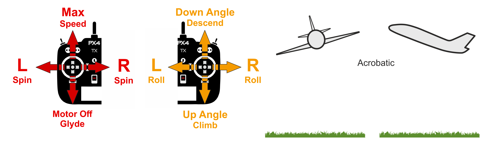

# Flight Modes (Fixed Wing)

Flight modes provide autopilot support to make it easier to manually fly the vehicle, to automate common tasks such as takeoff and landing, to execute autonomous missions, or to defer flight control to an external system.

This topic provides an overview of the available flight modes for fixed-wing vehicles (planes).

## Overview

Flight Modes are either _manual_ or _autonomous_.
Manual modes provide different levels of autopilot support when flying manually (using RC control sticks or a joystick), while _autonomous_ modes are fully controlled by the autopilot.

Manual-Easy:

- [Position](#position-mode) - Easiest and safest manual mode for vehicles that have a position fix/GPS.
  Releasing sticks levels the vehicle and locks it to a straight flight path, even against wind.
- [Altitude](#altitude-mode) - Easiest and safest _non-GPS_ manual mode.
  Releasing sticks levels the vehicle and maintain heading (unlike with position mode, wind can move the vehicle off the original track).
- [Stabilized](#stabilized-mode) - Releasing the sticks levels the vehicle and maintains the horizontal posture.

Manual-Acrobatic

- [Acro](#acro-mode) - Manual mode for performing acrobatic maneuvers e.g. rolls, flips, stalls and acrobatic figures.
  Releasing the sticks stops the vehicle rotating in the roll, pitch, yaw axes, but does not otherwise stabilise the vehicle.
- [Manual](#manual-mode) - Hardest manual flight mode.
  This sends stick input directly to control allocation for "fully" manual control.

Autonomous:

- [Hold](#hold-mode) - Vehicle circles around the GPS hold position at the current altitude.
- [Return](#return-mode) - Vehicle flies a clear path to a safe location. The return behaviour depends on parameter settings, and may follow a mission path and/or mission landing pattern (if defined).
  This requires a global position estimate (GPS).
- [Mission](#mission-mode) - Vehicle executes a [predefined mission/flight plan](../flying/missions.md) that has been uploaded to the flight controller.
  This requires a global position estimate (GPS).
- [Takeoff](#takeoff-mode) - Vehicle initiates the takeoff sequence using either _catapult/hand-launch mode_ or _runway takeoff mode_ (in the current direction).
- [Land](#land-mode) - Vehicle initiates the [fixed-wing landing sequence](./flight_modes_fw/mission.md#mission-landing).
- [Offboard](#offboard-mode) - Vehicle obeys attitude setpoints provided via MAVLink or ROS 2.

Pilots transition between flight modes using switches on the remote control or with a ground control station (see [Flight Mode Configuration](../config/flight_mode.md)).
Some flight modes make sense only under specific pre-flight and in-flight conditions (e.g. GPS lock, airspeed sensor, vehicle attitude sensing along an axis).
PX4 will not allow transitions to those modes until the right conditions are met.

An high level description of the modes is provided below (select the mode-specific sidebar topics for detailed technical information).

## Easy Manual Modes

In the easy manual modes, roll and pitch sticks set the vehicle angle, resulting in left-right and forward-back movement _in the horizontal plane_ (respectively).
Not only does this make movement predictable, but because angles are controlled, the vehicle is impossible to flip.

### Position Mode

[Position mode](../flight_modes_fw/position.md) is the easiest and safest manual mode.
It is supported on vehicles that have a position estimate (e.g. GPS).

The roll stick controls left/right horizontal movement and the pitch stick is used to ascend/descend.
The throttle determines airspeed — at 50% throttle the aircraft will hold its current altitude with a preset cruise speed.

When all sticks are released/centered (no roll, pitch, yaw, and ~50% throttle) the aircraft will return to straight, level flight, and keep its current altitude and flight path irrespective of wind.
This makes it easy to recover from any problems when flying.
Roll, pitch and yaw are all angle-controlled (so it is impossible to roll over or loop the vehicle).

### Altitude Mode

[Altitude mode](../flight_modes_fw/altitude.md) is the safest and easiest non-GPS manual mode.

:::note
_Altitude mode_ is similar to [Position mode](#position-mode).
Both modes level the vehicle and maintain altitude and course when sticks are released, but position mode holds the actual flight path steady against wind, while altitude just holds the heading.
:::

The roll stick controls left/right horizontal movement and the pitch stick controls the rate of ascent/descent.
The throttle determines airspeed — at 50% throttle the aircraft will hold its current altitude with a preset cruise speed.

When all sticks are released/centered (no roll, pitch, yaw, and ~50% throttle) the aircraft will return to straight, level flight (subject to wind) and keep its current altitude.
This makes it easy to recover from any problems when flying.
Roll, pitch and yaw are all angle-controlled (so it is impossible to roll over or loop the vehicle).

### Stabilized Mode

[Stabilized mode](../flight_modes_fw/stabilized.md) is a manual mode were centering the sticks levels the vehicle attitude (roll and pitch) and maintains the horizontal posture.

:::note
_Stabilized mode_ is similar to [Altitude mode](#position-mode) in that releasing the sticks levels the vehicle, but unlike altitude mode it does not maintain altitude or heading.
It is much easier to fly than [Manual mode](#manual-mode) because you can't roll or flip it, and if needed it is easy to level the vehicle (by centering the control sticks).
:::

The vehicle climb/descends based on pitch input and performs a [coordinated turn](https://en.wikipedia.org/wiki/Coordinated_flight) if the roll/pitch sticks are non-zero.
Roll and pitch are angle controlled (you can't roll upside down or loop).

The vehicle will glide if the throttle is lowered to 0% (motor stops).
In order to perform a turn the command must be held throughout the maneuver because if the roll is released the plane will stop turning and level itself (the same is true for pitch and yaw commands).

## Acrobatic Manual Modes

In acrobatic manual modes vehicles are more maneuverable and can flip.
They are much harder to fly than the easy modes.

RC sticks control the rate of angular rotation (around the respective axis).

### Acro Mode

[Acro mode](../flight_modes_fw/acro.md) is the RC mode for performing acrobatic maneuvers e.g. rolls, flips, stalls and acrobatic figures.

The roll, pitch and yaw sticks control the rate of angular rotation around the respective axes and throttle is passed directly to control allocation.
When sticks are centered the vehicle will stop rotating, but remain in its current orientation (on its side, inverted, or whatever) and moving according to its current momentum.

### Manual Mode

[Manual mode](../flight_modes_fw/manual.md) sends manual stick input directly to control allocation for "fully" manual control.

This is the hardest mode to fly, because nothing is stabilised.
Unlike [Acro Mode](#acro-fw) if the RP stick is centered the vehicle will not automatically stop rotating around the axis — the pilot actually has to move the stick to apply force in the other direction.

:::note
This is the only mode that overrides the FMU (commands are sent via the safety coprocessor).
It provides a safety mechanism that allows full control of throttle, elevator, ailerons and rudder via RC in the event of an FMU firmware malfunction.
:::

## Automatic Modes

Automatic or _autonomous_ modes are fully controlled by the autopilot.
The don't _require_ manual input from a pilot, but may use it some cases.
Most automatic modes require a local position estimate.
Some, like [Return mode](#return-mode) and [Mission mode](#mission-mode) need a global position estimate (i.e. GPS).

### Hold Mode

[Hold](../flight_modes_fw/hold.md) causes a fixed-wing vehicle to start circling around the current position at its current altitude.
The mode can be used to pause a mission or to help regain control of a vehicle in an emergency.
It can be activated with a pre-programmed RC switch or the _QGroundControl_ **Pause** button.

### Return Mode

[Return mode](../flight_modes_fw/return.md) causes the vehicle to fly a clear path to a safe location.
The mode may be activated manually (via a pre-programmed RC switch) or automatically (i.e. in the event of a [failsafe](../config/safety.md) being triggered).

The return behaviour depends on parameter settings, and may follow a mission path and/or mission landing pattern (if defined).
By default a fixed-wing vehicle will ascend to a safe height and use a mission landing pattern if one exists, otherwise it will fly to the home position and circle.

### Mission Mode

[Mission mode](../flight_modes_fw/mission.md) causes the vehicle to execute a predefined autonomous [mission](../flying/missions.md) (flight plan) that has been uploaded to the flight controller.
The mission is typically created and uploaded with a Ground Control Station (GCS) application, such as [QGroundControl](https://docs.qgroundcontrol.com/master/en/).

### Takeoff Mode

[Takeoff mode](../flight_modes_fw/takeoff.md) initiates the vehicle takeoff sequence.
The specific launch behaviour depends on the configured takeoff mode (catapult/hand-launch mode or runway takeoff mode).

### Land Mode

[Land mode](../flight_modes_fw/land.md) causes the vehicle to turn and land at the location at which the mode was engaged.
Fixed-wing landing logic and parameters are explained in the topic: [Mission > Fixed-wing Mission Landing](../flight_modes_fw/mission.md#mission-landing).

### Offboard Mode

[Offboard mode](../flight_modes/offboard.md) causes the fixed-wing vehicle to obey attitude setpoints provided over MAVLink.

:::note
This mode is intended for vehicle control from companion computers and ground stations!
:::

## Further Information

- [Basic Configuration > Flight Modes](../config/flight_mode.md) - How to map RC control switches to specific flight modes
- [Flight Modes (Multicopter)](../flight_modes_mc/README.md)