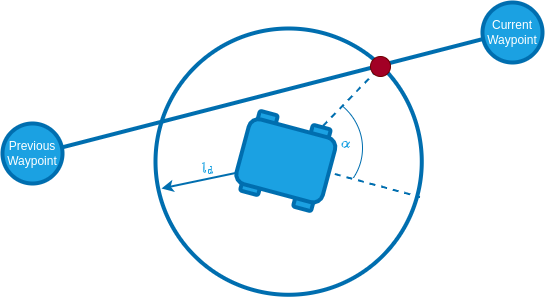

# Auto Modes (Rover)

In auto modes the autopilot takes over control of the vehicle to perform autonomous navigation tasks.

## Mission Mode

_Mission mode_ is an automatic mode that causes the vehicle to execute a predefined autonomous [mission](../flying/missions.md) plan that has been uploaded to the flight controller.
The mission is typically created and uploaded with a Ground Control Station (GCS) application, such as [QGroundControl](https://docs.qgroundcontrol.com/master/en/).

### Mission commands

Following is the list of currently implemented and tested mission related commands:

| QGC mission item    | Command                                                                                                                     | Description                                         |
| ------------------- | --------------------------------------------------------------------------------------------------------------------------- | --------------------------------------------------- |
| Mission start       | [MAV_CMD_MISSION_START](https://mavlink.io/en/messages/common.html#MAV_CMD_MISSION_START)                                   | Starts the mission.                                 |
| Waypoint            | [MAV_CMD_NAV_WAYPOINT](https://mavlink.io/en/messages/common.html#MAV_CMD_NAV_WAYPOINT)                                     | Navigate to waypoint.                               |
| Return to launch    | [MAV_CMD_NAV_RETURN_TO_LAUNCH](https://mavlink.io/en/messages/common.html#MAV_CMD_NAV_RETURN_TO_LAUNCH)                     | Return to the launch location.                      |
| Delay until         | [MAV_CMD_NAV_DELAY](https://mavlink.io/en/messages/common.html#MAV_CMD_NAV_DELAY)                                           | The rover will stop for a specified amount of time. |
| Change speed        | [MAV_CMD_DO_CHANGE_SPEED](https://mavlink.io/en/messages/common.html#MAV_CMD_DO_CHANGE_SPEED)                               | Change the speed setpoint                           |
| Set launch location | [MAV_CMD_DO_SET_HOME](https://mavlink.io/en/messages/common.html#MAV_CMD_DO_SET_HOME)                                       | Changes launch location to specified coordinates.   |
| Jump to item        | [MAV_CMD_DO_JUMP](https://mavlink.io/en/messages/common.html#MAV_CMD_DO_JUMP) (and other jump commands)                     | Jump to specified mission item.                     |
| Loiter (all)        | [MAV_CMD_NAV_LOITER_UNLIM](https://mavlink.io/en/messages/common.html#MAV_CMD_NAV_LOITER_UNLIM) (and other loiter commands) | This will simply stop the rover.                    |

## Return Mode

This mode uses the [pure pursuit guidance logic](#pure-pursuit-guidance-logic) with the launch position as goal.
Return mode can be activated through the respective [mission command](#mission-commands) or through the ground station UI.

## Pure Pursuit Guidance Logic

The desired yaw setpoints are generated using a pure pursuit algorithm:
The controller takes the intersection point between a circle around the vehicle and a line segment. In mission mode this line is usually constructed by connecting the previous and current waypoint:

The radius of the circle around the vehicle is used to tune the controller and is often referred to as look-ahead distance.

The look ahead distance sets how aggressive the controller behaves and is defined as $l_d = v \cdot k$.
It depends on the velocity $v$ of the rover and a tuning parameter $k$ that can be set with the parameter [PP_LOOKAHD_GAIN](#PP_LOOKAHD_GAIN).

::: info
A lower value of [PP_LOOKAHD_GAIN](#PP_LOOKAHD_GAIN) makes the controller more aggressive but can lead to oscillations!
:::

The lookahead is constrained between [PP_LOOKAHD_MAX](#PP_LOOKAHD_MAX) and [PP_LOOKAHD_MIN](#PP_LOOKAHD_MIN).

If the distance from the path to the rover is bigger than the lookahead distance, the rover will target the point on the path that is closest to the rover.

To summarize, the following parameters can be used to tune the controller:

| Parameter                                                                                                | Description                             | Unit |
| -------------------------------------------------------------------------------------------------------- | --------------------------------------- | ---- |
| [PP_LOOKAHD_GAIN](../advanced_config/parameter_reference.md#PP_LOOKAHD_GAIN) | Main tuning parameter                   | -    |
| [PP_LOOKAHD_MAX](../advanced_config/parameter_reference.md#PP_LOOKAHD_MAX)    | Maximum value for the look ahead radius | m    |
| [PP_LOOKAHD_MIN](../advanced_config/parameter_reference.md#PP_LOOKAHD_MIN)    | Minimum value for the look ahead radius | m    |

::: note
Both [Ackermann](../frames_rover/ackermann_rover.md#mission-parameters) and [differential](../frames_rover/differential_rover.md#auto-modes) rovers have further tuning parameters that are specific to the respective modules.
:::