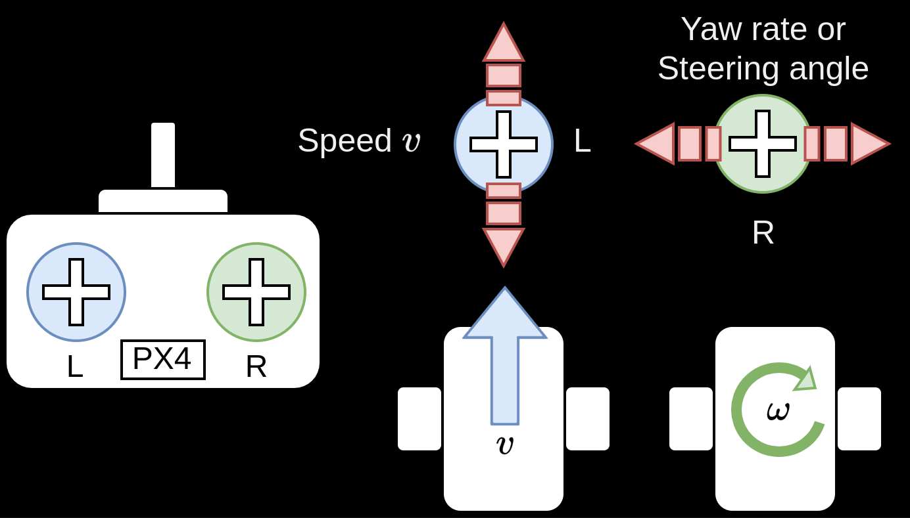

# Drive Modes (Rover)

Flight modes (or more accurately "Drive modes" for ground vehicles) provide autopilot support to make it easier to manually drive the vehicle or to execute autonomous missions.

- [Basic Configuration > Flight Modes](../config/flight_mode.md) - How to map RC control switches to specific flight modes

This section outlines all supported drive modes for rovers. Note that certain flight modes have different implementations for the specific modules.

::: warning
Selecting any other mode than those below will either stop the rover or can lead to undefined behavior.
:::

## Manual Mode

The _Manual_ mode stops the rover when the RC control sticks are centred.
To manually move/drive the vehicle you move the sticks outside of the centre.

[**Differential-steering Rover**](../frames_rover/differential_rover.md): When under manual control the throttle and roll sticks control the _speed_ and _yaw rate_ of the vehicle.

[**Ackermann Rover**](../frames_rover/ackermann_rover.md): When under manual control the throttle and roll sticks control the _speed_ and _steering angle_ of the vehicle.

Note that the rover does not attempt to maintain a specific orientation or compensate for external factors like slopes or uneven terrain!
The user is responsible for making the necessary adjustments to the stick inputs to keep the rover on the desired course.

## Acro Mode

::: info
Acro mode is only supported for differential-steering rovers.
:::

Acro Mode is similar to [Manual mode](#manual-mode), but with closed-loop yaw rate control.
In this mode, the left stick input remains open-loop for forward speed control, while the right stick input commands a desired yaw rate setpoint, which is then maintained by the rover's closed-loop control system.

- Left Stick:

  Behavior remains the same as in manual mode, directly controlling the rover's forward speed in an open-loop manner.

- Right Stick:

  - Centered: Rover stops rotating and tries to maintains its current heading.
  - Pushed left/right: Rover rotates counter-clockwise/clockwise at the rate commanded by the stick input, using a closed-loop controller (e.g., PID) to try to ensure the vehicle yaw rate matches the given setpoint.

See [Tuning(basic)](../frames_rover/differential_rover.md#tuning-basic) to go through the necessary setup to use acro mode for differential-steering rovers.

## Mission Mode

_Mission mode_ is an automatic mode that causes the vehicle to execute a predefined autonomous [mission](../flying/missions.md) plan that has been uploaded to the flight controller.
The mission is typically created and uploaded with a Ground Control Station (GCS) application, such as [QGroundControl](https://docs.qgroundcontrol.com/master/en/).

### Mission commands

Following is the list of currently implemented and tested mission related commands:

| QGC mission item    | Command                                                                                                                     | Description                                         |
| ------------------- | --------------------------------------------------------------------------------------------------------------------------- | --------------------------------------------------- |
| Mission start       | [MAV_CMD_MISSION_START](https://mavlink.io/en/messages/common.html#MAV_CMD_MISSION_START)                                   | Starts the mission.                                 |
| Waypoint            | [MAV_CMD_NAV_WAYPOINT](https://mavlink.io/en/messages/common.html#MAV_CMD_NAV_WAYPOINT)                                     | Navigate to waypoint.                               |
| Return to launch    | [MAV_CMD_NAV_RETURN_TO_LAUNCH](https://mavlink.io/en/messages/common.html#MAV_CMD_NAV_RETURN_TO_LAUNCH)                     | Return to the launch location.                      |
| Delay until         | [MAV_CMD_NAV_DELAY](https://mavlink.io/en/messages/common.html#MAV_CMD_NAV_DELAY)                                           | The rover will stop for a specified amount of time. |
| Set launch location | [MAV_CMD_DO_SET_HOME](https://mavlink.io/en/messages/common.html#MAV_CMD_DO_SET_HOME)                                       | Changes launch location to specified coordinates.   |
| Jump to item        | [MAV_CMD_DO_JUMP](https://mavlink.io/en/messages/common.html#MAV_CMD_DO_JUMP) (and other jump commands)                     | Jump to specified mission item.                     |
| Loiter (all)        | [MAV_CMD_NAV_LOITER_UNLIM](https://mavlink.io/en/messages/common.html#MAV_CMD_NAV_LOITER_UNLIM) (and other loiter commands) | This will simply stop the rover.                    |

### Pure Pursuit Guidance Logic

The steering and throttle setpoints are generated from the mission plan using a pure pursuit algorithm:

The controller takes the intersection point between a circle around the vehicle and the line segment connecting the previous and current waypoint.
The radius of the circle around the vehicle is used to tune the controller and is often referred to as look-ahead distance.

The look ahead distance sets how aggressive the controller behaves and is defined as $l_d = v \cdot k$.
It depends on the velocity $v$ of the rover and a tuning parameter $k$ that can be set with the parameter [PP_LOOKAHD_GAIN](#PP_LOOKAHD_GAIN).

::: info
A lower value of [PP_LOOKAHD_GAIN](#PP_LOOKAHD_GAIN) makes the controller more aggressive but can lead to oscillations!
:::

The lookahead is constrained between [PP_LOOKAHD_MAX](#PP_LOOKAHD_MAX) and [PP_LOOKAHD_MIN](#PP_LOOKAHD_MIN).

If the distance from the path to the rover is bigger than the lookahead distance, the rover will target the point on the path that is closest to the rover.

To summarize, the following parameters can be used to tune the controller:

| Parameter                                                                                                | Description                             | Unit |
| -------------------------------------------------------------------------------------------------------- | --------------------------------------- | ---- |
| [PP_LOOKAHD_GAIN](../advanced_config/parameter_reference.md#PP_LOOKAHD_GAIN) | Main tuning parameter                   | -    |
| [PP_LOOKAHD_MAX](../advanced_config/parameter_reference.md#PP_LOOKAHD_MAX)    | Maximum value for the look ahead radius | m    |
| [PP_LOOKAHD_MIN](../advanced_config/parameter_reference.md#PP_LOOKAHD_MIN)    | Minimum value for the look ahead radius | m    |

:::note
Both [Ackermann](../frames_rover/ackermann_rover.md#mission-parameters) and [differential-steering](../frames_rover/differential_rover.md#tuning-mission) rovers have further tuning parameters that are specific to the respective modules.
:::

## Return Mode

This mode uses the [pure pursuit guidance logic](#pure-pursuit-guidance-logic) with the launch position as goal.
Return mode can be activated through the respective [mission command](#mission-commands) or through the ground station UI.
