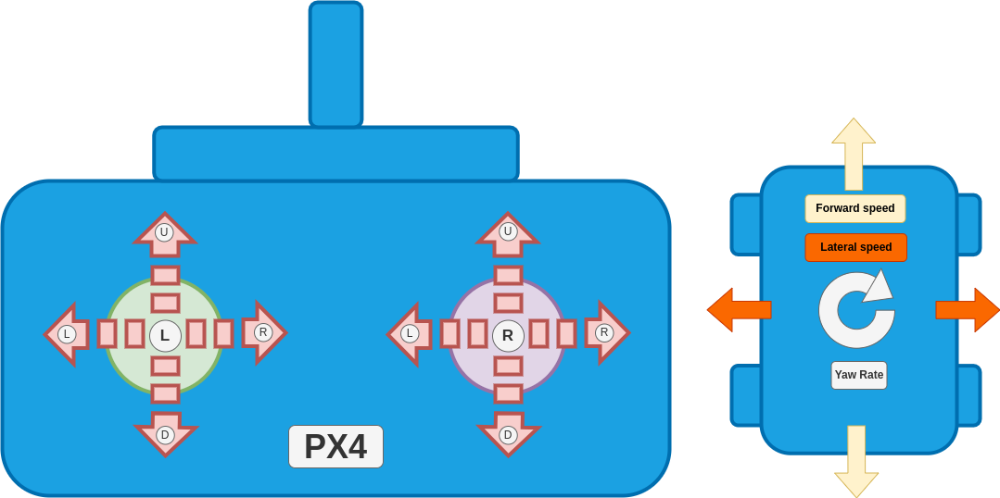

# Manual Modes (Rover)

Manual modes require stick inputs from the user to drive the vehicle.

The manual modes listed below provide increasing levels of autopilot support:

| Mode                           | Features                                                                                                   |
| ------------------------------ | ---------------------------------------------------------------------------------------------------------- |
| [Manual](#manual-mode)         | Directly map stick inputs to motor commands, no closed loop control.                                       |
| [Acro](#acro-mode)             | Closed loop yaw rate control.                                                                              |
| [Stabilized](#stabilized-mode) | Closed loop yaw rate and yaw control.                                                                      |
| [Position](#position-mode)     | Closed loop yaw rate, yaw, and speed control, and uses GPS coordinates for improved straight line driving. |

## Manual Mode

<Badge type="tip" text="Differential" /><Badge type="tip" text="Ackermann" />

The _Manual_ mode stops the rover when the RC control sticks are centred.
To manually move/drive the vehicle you move the sticks outside of the centre.

- [**Differential Rover**](../frames_rover/differential_rover.md): Moving the left-stick up/down controls the _forward speed_ and moving the right-stick left/right controls the _yaw rate_ of the vehicle.

- [**Ackermann Rover**](../frames_rover/ackermann_rover.md): Moving the left-stick up/down controls the _forward speed_ and moving the right-stick left/right controls the _steering angle_ of the vehicle.

::: info
The rover does not attempt to maintain a specific orientation or compensate for external factors like slopes or uneven terrain!
The user is responsible for making the necessary adjustments to the stick inputs to keep the rover on the desired course.
:::

## Acro Mode

<Badge type="tip" text="Differential" />

::: warning
Acro mode is not supported for Ackermann rovers (only differential rovers).
:::

::: info
This mode requires a yaw rate estimate.
:::

Acro Mode is similar to [Manual mode](#manual-mode), but with closed-loop yaw rate control.
In this mode, the left-stick input remains open-loop for forward speed control, while the right-stick input commands a desired yaw rate setpoint, which is then maintained by the rover's closed-loop control system.

See the tuning for [Acro mode](../frames_rover/differential_rover.md#acro-mode) section to go through the necessary setup to use Acro mode for differential rovers.

## Stabilized Mode

<Badge type="tip" text="Differential" />

::: warning
Stabilized mode is not supported for Ackermann rovers (only differential rovers).
:::

::: info
This mode requires a yaw rate and yaw estimate.
:::

As with [Acro mode](#acro-mode), the left-stick input remains open-loop for forward speed control, while the right stick input commands a desired yaw rate setpoint, which is then maintained by the rover's closed-loop control system.

In addition, the rover will do closed loop yaw (or heading) control when the right stick is centered, or in other words if the yaw rate setpoint is zero.
This means that the rover will maintain the current heading if the user only gives throttle input, but no yaw rate input.
Compared to [Acro mode](#acro-mode), this mode is much better at driving in a straight line as it can more effectively reject disturbances.

See the tuning for [Stabilized mode](../frames_rover/differential_rover.md#stabilized-mode) section to go through the necessary setup to use Acro mode for differential rovers.

## Position Mode

<Badge type="tip" text="Differential" />

::: warning
Stabilized mode is not supported for Ackermann rovers (only differential rovers).
:::

::: info
This mode requires a yaw rate, yaw, speed and position estimate.
:::

This is the most advanced manual mode. It uses _closed loop yaw rate control_, _closed loop speed control_ and a special logic for driving a straight line when there is no yaw rate input.

In this mode, moving the left-stick up/down commands a desired speed setpoint, and moving the right-stick left and right commands a desired yaw rate setpoint which are both close-loop controlled by the autopilot.

If there is no yaw rate input, the controller will remember the gps coordinates and yaw (or heading) of the vehicle and use those to construct a line that the rover will then follow using the [pure pursuit](../flight_modes_rover/auto.md#pure-pursuit-guidance-logic) algorithm (same path following algorithm as in auto modes).
This way the rover is even better than the [stabilized mode](#stabilized-mode) at rejecting disturbances when driving a straight line.

See the tuning for [position mode](../frames_rover/differential_rover.md#position-mode) section to go through the necessary setup to use Acro mode for differential rovers.
