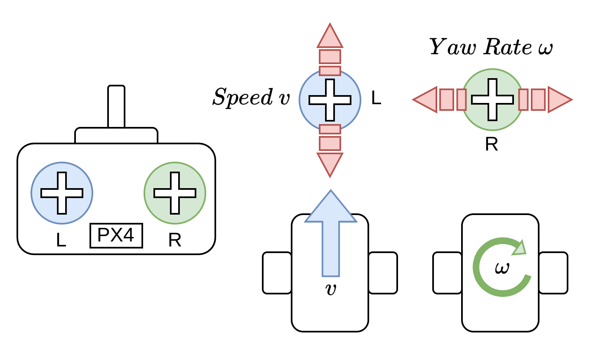

# Manual Mode (Rover)

&nbsp;&nbsp;

The _Manual_ mode stops the rover when the RC control sticks are centred. To manually move/drive the vehicle you move the sticks outside of the centre.

:::note
This rover mode is enabled if you set _Manual_ mode.
::: 

(**Differential Drive Rover**) When under manual control the throttle and roll sticks control the _speed_ and _yaw rate_ of the vehicle. 

(**Ackermann Drive Rover**) When under manual control the throttle and roll sticks control the _thrust_ and _torque_ of the vehicle. 

## Technical Description (Differential Drive)

### Manual Mode

In manual mode, the left and right joystick/stick inputs directly control (open-loop) the rover's forward speed and yaw rate (rotation rate), respectively. The rover does not attempt to maintain a specific position or heading but instead responds directly to the user's inputs, without any closed-loop feedback control.

- Left Stick:
  - Centered: Rover stops moving forward/backward.
  - Pushed forward: Rover moves forward, with speed increasing as the stick is pushed further.
  - Pulled backward: Rover moves in reverse, with speed increasing as the stick is pulled further back.

- Right Stick:
  - Centered: Rover maintains its current heading and does not rotate.
  - Pushed left/right: Rover rotates counter-clockwise/clockwise, with the rotation rate increasing as the stick is pushed further in that direction.
  
The rover's motion is controlled using a differential drive mechanism, where the left and right wheel speeds are adjusted independently to achieve the desired forward speed and yaw rate.

Forward motion is achieved by driving both wheels at the same speed in the same direction.
Rotation is achieved by driving the wheels at different speeds in opposite directions, allowing the rover to turn on the spot.
The left stick input directly maps to the forward component of the wheel speeds, while the right stick input maps to the differential component between the left and right wheel speeds for rotation.

It's important to note that in this manual mode, the rover does not attempt to maintain a specific orientation or compensate for external factors like slopes or uneven terrain. The user is responsible for making the necessary adjustments to the stick inputs to keep the rover on the desired course.

### Acro Mode

Acro Mode is similar to Manual Mode, but with a closed-loop yaw rate control. In this mode, the left stick input remains open-loop for forward speed control, while the right stick input commands a desired yaw rate setpoint, which is then maintained by the rover's closed-loop control system.

- Left Stick:
Behavior remains the same as in Manual Mode, directly controlling the rover's forward speed in an open-loop manner.
- Right Stick:
  - Centered: Rover stops rotating and tries to maintains its current heading.
  - Pushed left/right: Rover rotates counter-clockwise/clockwise at the rate commanded by the stick input, using a closed-loop controller (e.g., PID) to try to ensure the vehicle yaw rate matches the given setpoint.

## Parameters (Differential Drive)

| Parameter                                                                                          | Description                                                                                                                                                                                                                                                                                                                                                                                                                                                                                                                                                                                                                                                                                                                                                    |
| -------------------------------------------------------------------------------------------------- | -------------------------------------------------------------------------------------------------------------------------------------------------------------------------------------------------------------------------------------------------------------------------------------------------------------------------------------------------------------------------------------------------------------------------------------------------------------------------------------------------------------------------------------------------------------------------------------------------------------------------------------------------------------------------------------------------------------------------------------------------------------- |

| [RRD_SPEED_SCALE](../advanced_config/parameter_reference.md#RRD_SPEED_SCALE) | Scales the speed output of the rover by multiplying it with this parameter to adjust for too high manual open-loop speeds. |

| [RRD_ANG_SCALE](../advanced_config/parameter_reference.md#RRD_ANG_SCALE) | Scales the angular velocity output by multiplying it with this parameter, allowing for adjustments in the rover's manual open-loop turning speed. |

