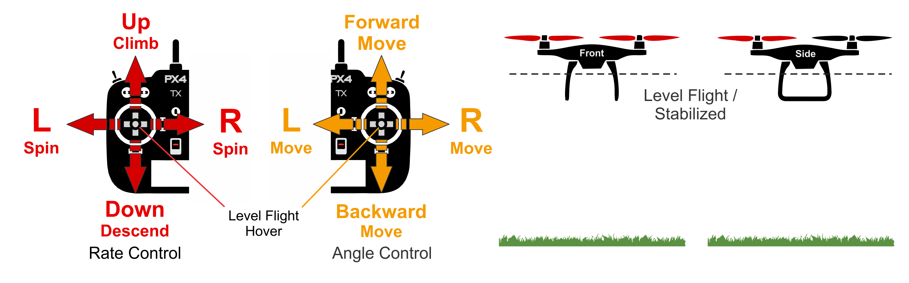

# Manual Mode (Rover)

&nbsp;&nbsp;

The _Manual_ mode stops the rover when the RC control sticks are centred. To manually move/drive the vehicle you move the sticks outside of the centre.

:::note
This rover mode is enabled if you set _Manual_ mode.
::: 

(**Differential Drive Rover**) When under manual control the throttle and roll sticks control the _speed_ and _yaw rate_ of the vehicle. 

(**Ackermann Drive Rover**) When under manual control the throttle and roll sticks control the _thrust_ and _torque_ of the vehicle. 

Upon releasing the control sticks, they automatically revert to the central deadzone, halting the rover as the throttle and roll controls align at the center. Subsequently, the vehicle maintains its position and yaw, assuming the terrain is sufficiently level and unaffected by external forces like wind. However, the rover may drift in the direction of any incline if not properly oriented against the slope.

<!--  -->

<!-- ## Technical Description

RC mode where centered sticks level vehicle (only - position is not stabilized).

The pilot's inputs are passed as roll and pitch angle commands and a yaw rate command.
Throttle is rescaled (see [below](#params)) and passed directly to control allocation.
The autopilot controls the attitude, meaning it regulates the roll and pitch angles to zero when the RC sticks are centered inside the controller deadzone (consequently leveling-out the attitude).
The autopilot does not compensate for drift due to wind (or other sources).

- Centered sticks (inside deadband):
  - Roll/Pitch sticks level vehicle.
- Outside center:
  - Roll/Pitch sticks control tilt angle in those orientations, resulting in corresponding left-right and forward-back movement.
  - Throttle stick controls up/down speed (and movement speed in other axes).
  - Yaw stick controls rate of angular rotation above the horizontal plane.
- Manual control input is required (such as RC control, joystick).
  - Roll, Pitch: Assistance from autopilot to stabilize the attitude.
    Position of RC stick maps to the orientation of vehicle.
  - Throttle: Manual control via RC sticks. RC input is sent directly to control allocation.
  - Yaw: Assistance from autopilot to stabilize the attitude rate.
    Position of RC stick maps to the rate of rotation of vehicle in that orientation. -->

## Technical Description

In RC mode, centered sticks aim to level the vehicle (position is not stabilized).

Pilot inputs translate into roll and pitch angle commands, along with a yaw rate command.
The throttle is scaled according to the [parameters below](#params) and passed directly to control allocation.
The autopilot adjusts the attitude, aiming to zero the roll and pitch angles when the RC sticks are within the controller's deadzone, thus leveling the attitude. It does not counteract drift caused by wind or other factors.

- Centered sticks (within deadband):
  - Level the vehicle using Roll/Pitch sticks.
- Outside center:
  - Control tilt angle and thus left-right and forward-back movement through Roll/Pitch sticks.
  - Adjust up/down speed (and speed in other axes) with the Throttle stick.
  - Yaw stick adjusts the angular rotation rate.
- Manual input is necessary (e.g., RC control, joystick) for:
  - Roll, Pitch: Autopilot assists in stabilizing attitude. Stick position correlates with vehicle orientation.
  - Throttle: Manually controlled via RC sticks. Input is sent straight to control allocation.
  - Yaw: Autopilot assists in stabilizing the rate of attitude change. Stick position corresponds to vehicle's rotation rate.

## Parameters (Differential Drive)

| Parameter                                                                                          | Description                                                                                                                                                                                                                                                                                                                                                                                                                                                                                                                                                                                                                                                                                                                                                    |
| -------------------------------------------------------------------------------------------------- | -------------------------------------------------------------------------------------------------------------------------------------------------------------------------------------------------------------------------------------------------------------------------------------------------------------------------------------------------------------------------------------------------------------------------------------------------------------------------------------------------------------------------------------------------------------------------------------------------------------------------------------------------------------------------------------------------------------------------------------------------------------- |

| [RRD_SPEED_SCALE](../advanced_config/parameter_reference.md#RRD_SPEED_SCALE) | Scales the speed output of the rover by multiplying it with this parameter to adjust for too high manual open-loop speeds. |

| [RRD_ANG_SCALE](../advanced_config/parameter_reference.md#RRD_ANG_SCALE) | Scales the angular velocity output by multiplying it with this parameter, allowing for adjustments in the rover's manual open-loop turning speed. |

