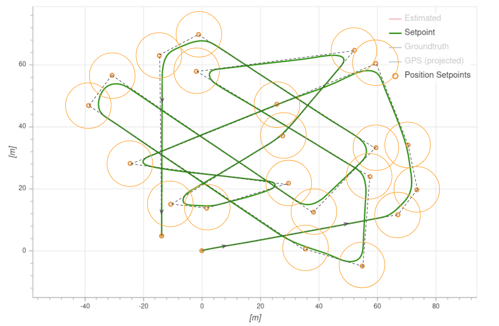
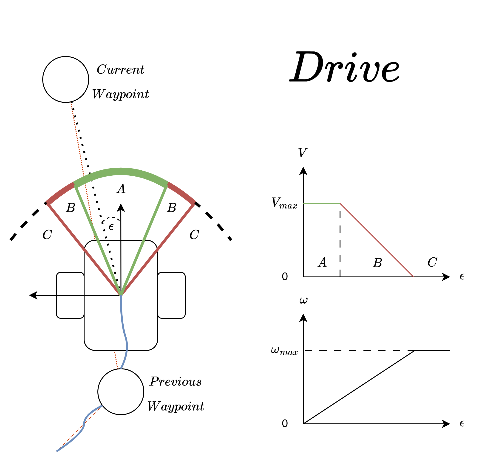
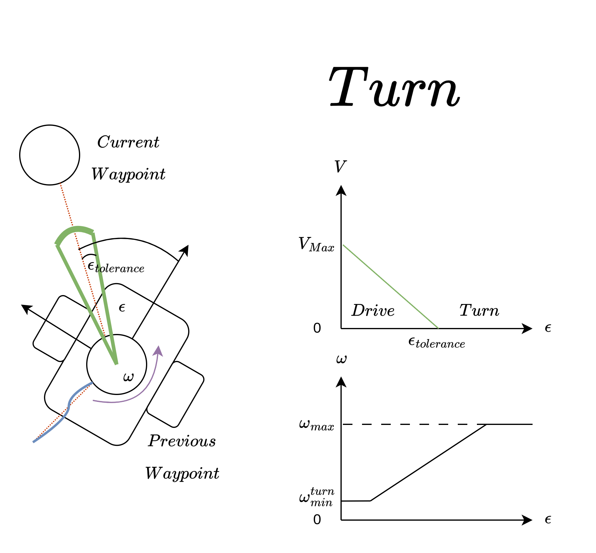
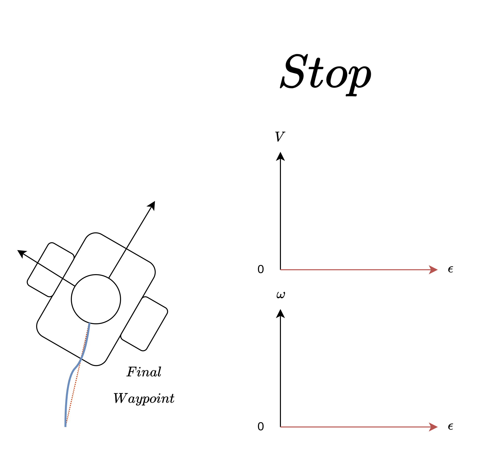

# Mission Mode (Rover)

_Mission mode_ causes the vehicle to execute a predefined autonomous [mission](../flying/missions.md) (flight plan) that has been uploaded to the flight controller.
The mission is typically created and uploaded with a Ground Control Station (GCS) application like [QGroundControl](https://docs.qgroundcontrol.com/master/en/) (QGC).

:::note

- This mode requires a global 3d position estimate (from GPS or inferred from a [local position](../ros/external_position_estimation.md#enabling-auto-modes-with-a-local-position)).
- The vehicle must be armed before this mode can be engaged.
- This mode is automatic - no user intervention is _required_ to control the vehicle.
- RC control switches can be used to change flight modes on any vehicle.
<!-- - RC stick movement will [by default](#COM_RC_OVERRIDE) change the vehicle to [Position mode](../flight_modes_mc/position.md) unless handling a critical battery failsafe.
  This is true for multicopters and VTOL in MC mode. -->

:::

## Description

Missions are usually created in a ground control station (e.g. [QGroundControl](https://docs.qgroundcontrol.com/master/en/qgc-user-guide/plan_view/plan_view.html)) and uploaded prior to launch.
They may also be created by a developer API, and/or uploaded in flight.

## Ackermann Rover: Rounded turns (Inter-Waypoint Trajectory)

PX4 expects to follow a straight line from the previous waypoint to the current target (it does not plan any other kind of path between waypoints - if you need one you can simulate this by adding additional waypoints).

An Ackermann Rover will follow a smooth rounded curve towards the next waypoint (if one is defined) defined by the acceptance radius ([NAV_ACC_RAD](../advanced_config/parameter_reference.md#NAV_ACC_RAD)).
The diagram below shows the sorts of paths that you might expect.

Vehicles switch to the next waypoint as soon as they enter the acceptance radius ([NAV_ACC_RAD](../advanced_config/parameter_reference.md#NAV_ACC_RAD)).

## Differential Rover: Stop, Turn, Drive 

<!-- The Differential Rover mission controller exploits the rover's capability to turn in place for precise waypoint navigation. Upon reaching a waypoint, it halts and orients itself directly towards the next waypoint before commencing movement. This method enhances the accuracy of the navigation by ensuring the rover is properly aligned before moving towards the next target.

The rover operates within a state machine framework, encompassing drive, turn, and stop (reached goal) states. As the rover travels between waypoints, its speed is continuously adjusted to maintain optimal alignment with its intended path. If the rover's heading deviates from the direct line to the waypoint, it will systematically reduce speed to allow for minor directional adjustments. In instances of significant misalignment, the rover will enter the turn state, coming to a stop and pivoting on the spot to realign itself with the waypoint. This ensures a sharp and accurate approach to waypoint navigation. Upon successfully reaching a waypoint, the rover transitions to the stop state, reflecting its precise navigation capability. -->

The Differential Rover mission controller takes advantage of the rover's ability to rotate on the spot for precise waypoint navigation. As the rover travels between waypoints, it operates in a state machine with three main states: **Drive**, **Turn**, and **Stop**.

In the Drive state, the rover moves towards the current waypoint while continuously adjusting its speed based on how well it is aligned with the desired path. It maintains full speed when heading straight towards the waypoint, gradually reduces speed as it deviates from the ideal path, and completely stops if the deviation exceeds a set threshold angle.

If the rover's heading becomes significantly misaligned during the Drive state, it transitions to the Turn state. Here, it stops moving forward and only rotates in place until it has reoriented itself towards the waypoint within an acceptable threshold angle. Once properly aligned again, the rover goes back to the Drive state to continue towards the waypoint. This cycle of driving, turning as needed for course corrections, and adjusting speed for optimal alignment enhances the accuracy of waypoint navigation.

Finally, when the rover reaches the final destination or goal waypoint, it enters the Stop state and halts all motion to await further instructions. If external forces act on the stopped rover, it will simply drift away from the exact goal location rather than trying to reposition itself.

This state machine approach, combined with the ability to turn in place, allows the rover to navigate waypoints precisely by ensuring it is well-aligned before moving and can stop exactly at the goal destination.Furthermore, the differential rovers dynamically adjust their speed when approaching or departing from a waypoint, guided by jerk-limited tuning parameters. This adjustment is designed to optimize the balance between speed and control, ensuring smooth transitions and precise stops at each waypoint, thereby enhancing the overall efficiency of the navigation process. The speed adjustments are based on the [jerk-limited](../config_mc/mc_jerk_limited_type_trajectory.md#auto-mode) tuning.

### Detailed description

<!-- In the Drive state, the rover drives towards the current waypoint. Full speed is maintained within area A, where the rover is well-aligned. Area B involves linear speed interpolation, reducing speed as deviation increases. Beyond the $epsilon_{threshold}$ in area C, the rover halts. Areas A, B, and C are defined by angle parameters that can be fine-tuned as needed.

The image conceptualizes these states: A is full-speed alignment, B is the speed reduction zone, and C is the stopping zone. It's not to scale, but illustrates the state transitions and speed adjustments. -->

In the **Drive state**, the rover moves towards the current waypoint. It maintains full speed within area A, where the rover is well-aligned. Area B involves linear speed reduction, slowing down as the deviation from the ideal path increases. Beyond the $\epsilon_{threshold}$ angle in area C, the rover completely stops moving forward. Areas A, B, and C are defined by configurable angle parameters that can be fine-tuned as needed. The image conceptualizes these states: A is the full-speed alignment zone, B is the speed reduction zone, and C is the stopping zone. The image is not to scale, but illustrates the state transitions and speed adjustments. The right graphs show the relationship between the heading error with angular rate and speed. 

<!-- In the Turn state, the rover has no forward speed and only angular velocity to turn on the spot. The guidance logic utilizes the differential drive's ability to turn on the stop, allowing for precise directional control. The rover will rotate until it is aligned with the desired heading and under the $\epsilon_{threshold}$. This then leads to it transitions back to the Drive state for waypoint navigation. Keep in mind the $\epsilon_{threshold}$ is not drawn to scale and can be configured with the ... parameter.  -->

In the **Turn state**, the rover has no forward speed and only rotates on the spot using its angular velocity. The guidance logic takes advantage of the differential drive's ability to turn while stopped, allowing for precise directional control. The rover will keep rotating until it is aligned with the desired heading, within the $\epsilon_{threshold}$ angle. It then transitions back to the Drive state for navigation towards the waypoint. Keep in mind that the $\epsilon_{threshold}$ value is not drawn to scale. The graphs on the right illustrate how the rover's angular rotation rate and forward speed are modulated based on its heading error relative to the desired path. For the turn state we also introduced a minimum angular velocity value $\omega^{turn}_{min}$ which can be adjusted with the following RDD_MIN_TRN_VEL parameter.

The last state is the **Stop state**. In this state, the rover stops moving as it has reached the final waypoint. It will remain stationary and await further instructions. Note: *If the rover is on an inclined slope or if any external forces act on it while stationary at the goal, it will not attempt to reposition itself to stay at the exact goal location. Instead, it will simply drift away from the goal due to the external factors.*