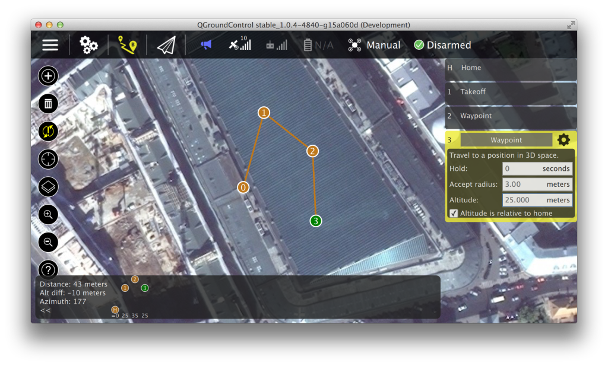
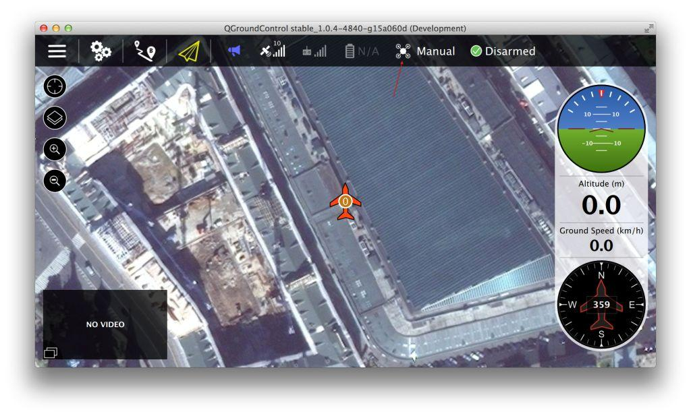

# Missions

## Planning Missions

Planning missions is straightforward: Switch to the mission view, click
on the plus icon in the top left and click into the screen. The waypoint
list on the right allows to modify the waypoint parameters. Once
finished, click on the transmission icon to send the mission to the
vehicle.

The altitude indicator on the bottom provides a sense of the relative
altitude of each waypoint.

## Flying Missions

Once the mission is uploaded, switch to the flight view. It generally
does not allow to modify the mission, but is optimized to track its
progress.

