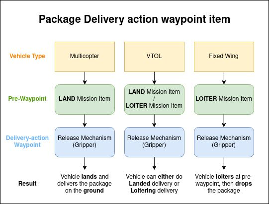
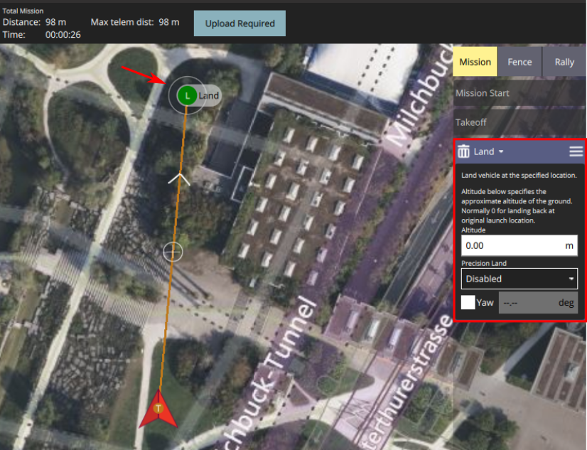
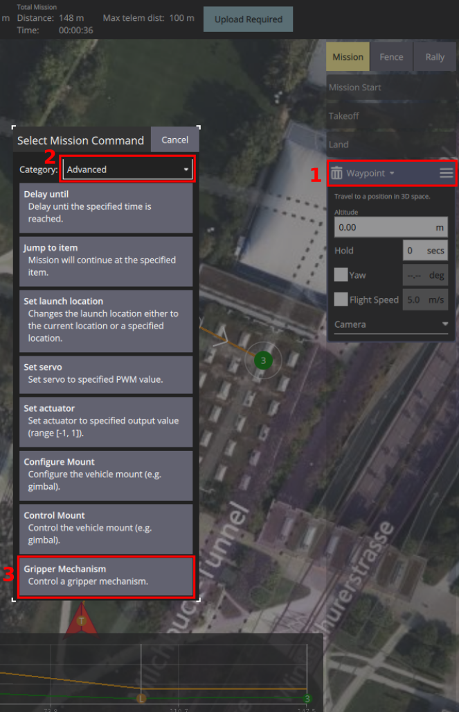
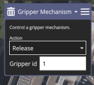
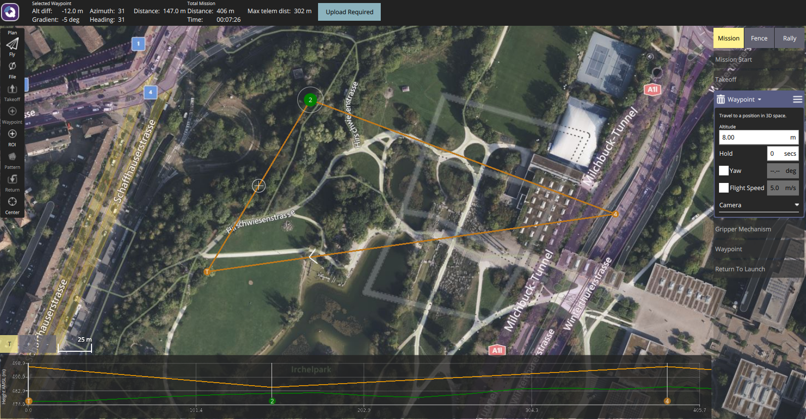
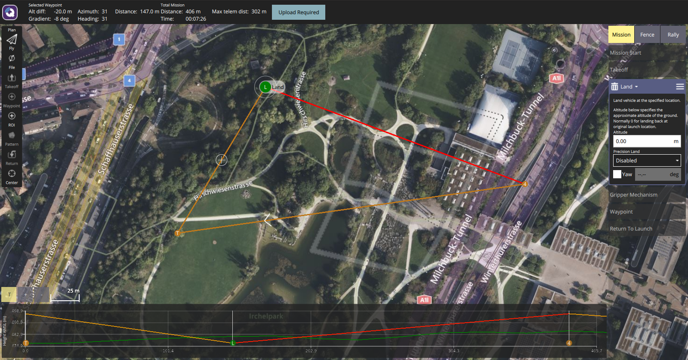

# Package Delivery Mission Planning

A package delivery mission allows user to plan and execute a package delivery. Note that this is only supported for vehicles that has a [delivery mechanism hardware](../peripherals/gripper.md) configured and installed.

## Operator Control Configuration

Before using the package delivery feature, if feasible please setup the [gripper action button](../peripherals/gripper.md#griper-action-joystick-button-mapping-in-qgc) to have a manual control over the Gripper's state.

## Delivery Mission Planning and Configuration (Gripper)

Currently the package delivery feature only supports a [Gripper mechanism](../peripherals/gripper.md). Therefore the following documentation focuses on configuring a delivery mission using a Gripper.

The package delivery feature using a gripper is embedded in the action waypoint "Gripper Mechanism". To enable different cases for different vehicle types and delivery behaviors, it has been decoupled as a separate waypoint. This is illustrated in the diagram below, where a clear **pre-waypoint** and **action-waypoint** cascade structure allows enabling different delivery use cases.

### Create a Standard Mission Waypoint

Follow the [mission documentation](missions.md) on how to setup a Mission Start, Takeoff waypoints. Then, plan whatever waypoints you would like to execute as well.

### Create a Package Delivery Waypoint

A package delivery requires combination of a **pre-waypoint** and a **action-waypoint** as described in the diagram above.

#### Create the Pre-Waypoint

You can use either one of these waypoint types for the pre-waypoint:

* **Land**: For on-land delivery of packages that can't be dropped from the sky
* **Waypoint**: For aerial delivery of packages with parachutes

#### Create 'Release Mechanism' Action Waypoint

* First, place a next waypoint anywhere in the map.
* Then click on that waypoint's text ("Waypoint") on the right-side of QGC
* Then select "Advanced" category
* Then select "Gripper Mechanism" from the drop down list

* Then configure the action for the Release mechanism in the waypoint configuration. Set it to "Release" in order to release the package.
* The gripper ID does not need to be set for now.

At this point, the Release Mechanism waypoint would have disappeared from the map since it's an Action with no positional information.

### Examples Plans

#### Package Drop Mission

Here is an example of a package delivery mission plan where the vehicle would simply drop the package while flying. This is possible since the "pre-waypoint" is a generic waypoint in 3D space.

* **Pre-waypoint**: Generic Waypoint
* **Action**: Gripper Release (Not shown on the 2D map, only in the right panel)

Notice how the altitude graph shows the pre-waypoint as an in-air waypoint, also on the right panel.

#### Land and Release Package Delivery Mission

Here is an example of a mission plan that would make the vehicle land and deliver the package. This is for multicopters that can land on the ground safely, place the package gently and then continue onto the next waypoint.

* **Pre-waypoint**: Land mission item
* **Action**: Gripper Release (Not shown on the 2D map, only in the right panel)

Notice how the altitude graph shows the 'Land' item, also on the right panel.

### Special Remarks

#### RTL Waypoint for Package Delivery with Landing

:::warning
DO NOT place a "Return to Launch" item right after the Package delivery waypoint (Pre-waypoint + Action waypoint). This will result in vehicle idling at the landed coordinate.
:::

This will allow the vehicle to take-off from the package delivery waypoint, since that isn't possible with a RTL waypoint. Due to safety reasons([related issue](https://github.com/PX4/PX4-Autopilot/pull/20044)), "Return To Launch" is disabled when vehicle is landed.

## Manual Control of Gripper in Missions

If joystick buttons are [configured for the gripper open/close actions](../peripherals/gripper.md#qgc-joystick-configuration) then these can be triggered manually in a mission or any other mode.

Note however that if you manually command the gripper to 'Close' position while the package delivery is happening (gripper open action), gripper won't be able to finish the open action.
The mission will come to a halt for a payload delivery mission item timeout, then resume the mission.
