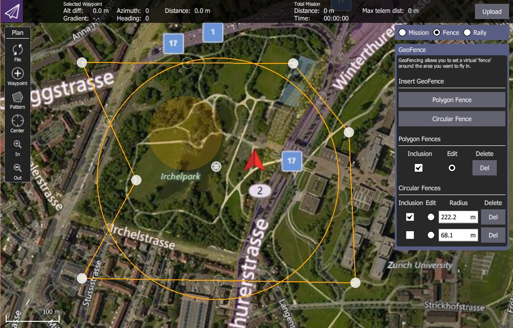

# Geofence Planning

A geofence is a *virtual* fence that can be used to prevent a vehicle entering or leaving specified areas.
PX4 supports multiple fences that can be arbitrary sized/positioned circles and polygons.

## Creating/Defining Geofences

Geofences are created in *QGroundControl*.

At high level:
1. Open **QGroundControl > Plan View**.
1. Select the **Fence** tab/button on the *Plan Editor* (right of screen).
1. Select either **Circular Fence** or **Polygon Fence** on the *Plan Editor*.
   This will add a fence of the specified type to the map.
1. Use the *Inclusion checkbox* next to the fence on the editor to specify whether it is an exclusion or inclusion area.
1. Use the highlighted markers to change fence position/size on the map.
   For polygonal fences you can click in the middle of lines to add new vertices.
1. Select the **Upload Required** button to upload the geofences (along with any [mission](../flying/missions.md) and [safety points.](../flying/plan_safety_points.md)) to the vehicle.

> **Tip** More complete documentation can be found in the *QGroundControl User Guide*: [Plan View - Geofence](https://docs.qgroundcontrol.com/en/PlanView/PlanGeoFence.html).

## Set Geofence Action

The geofence breach action is configurable: [Safety Configuration > Geofence Failsafe](../config/safety.md#geofence-failsafe).

