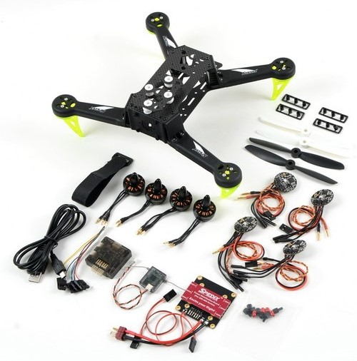
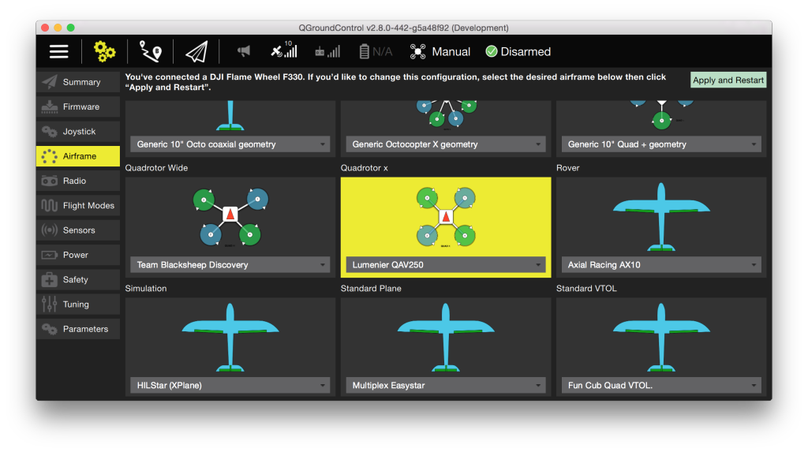

# Spedix S250

The Spedix S250 is a complete wide-arm racing quadcopter perfectly
suited for the [Pixracer](../flight_controller/pixracer.md) autopilot.

## Hardware

The hardware required for this build is displayed below.

## Mounting and Wiring

Connect GPS and the Wifi module as shown in the [Pixracer instructions](../flight_controller/pixracer.md). 
Connect the four motors in the layout and order as shown below, so the MAIN1 connector should
connect to motor 1, and so on.

## Airframe Configuration

Select the QAV250 configuration as shown below. This will not only put
PX4 into quadrotor mode, but also load decent default tuning gains.

