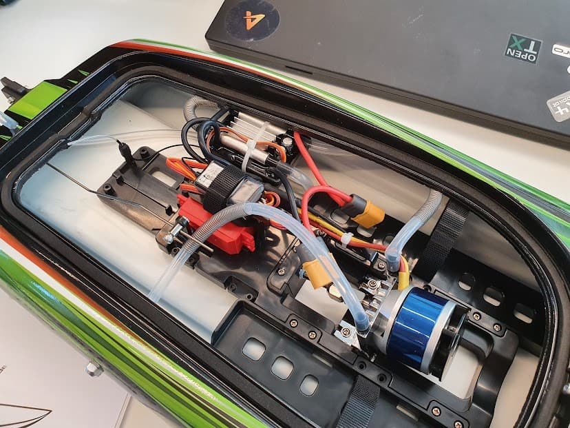

# Boat

PX4 supports boats as part of the [ground vehicle](../frames_rover/README.md) type.

This section contains boat configuration gotchas / build logs for boat frames.

:::note
Boats would likely in the future exist as a standalone type, not depending on being classified as a rover. But for now for simplicity PX4 doesn't differentiate Rover and a Boat
:::

## Boat Types

PX4 supports boats with:

- **Differential thrust**: Direction controlled by differential thrust from left/right thruster. Thrust controlled by both thruster's combined output.
- **Thruster and rudder**: Direction controlled by moving the rudder in an axis perpendicular to the water plane. Thrust controlled by thruster output.

## How to configure a Boat

Using [control allocation](../config/actuators.md), it is straightforward to setup a boat.

For boats with thruster & rudder:

1. In the [Airframe](../config/airframe.md) configuration, select the *Generic rudder boat*.
1. Follow the [Actuators document](../config/actuators.md) to map the steering and throttle outputs as displayed.

For a boat with differential thrust:

1. In the [Airframe](../config/airframe.md) configuration, select the *Generic differential boat*.
1. Follow the [Actuators document](../config/actuators.md) to map the left and right motors and throttle outputs.

## Boat builds

Here are some of the boat builds documentation:

- 

## Simulation

Gazebo provides simulations for the boat with differential thrust:

- [Differential boat](../simulation/gazebo_vehicles.md#usv_boat)

The boat will be placed in lake Zurich by default, and you can plan a mission and drive the boat in acro / stabilized / position / mission mode.

## Videos