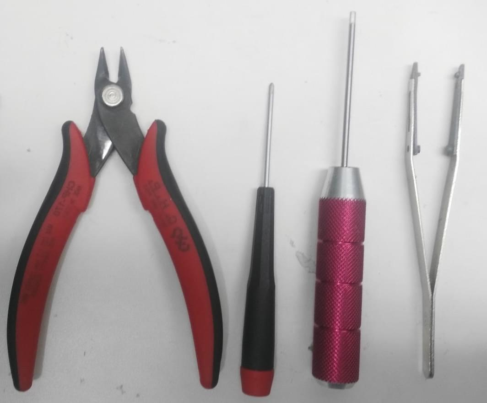
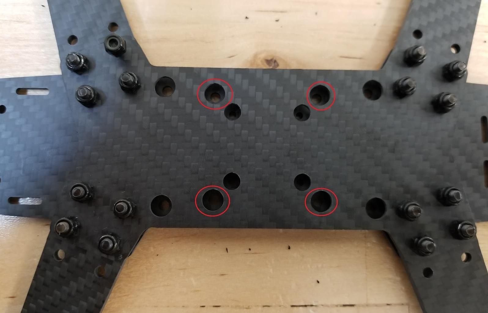
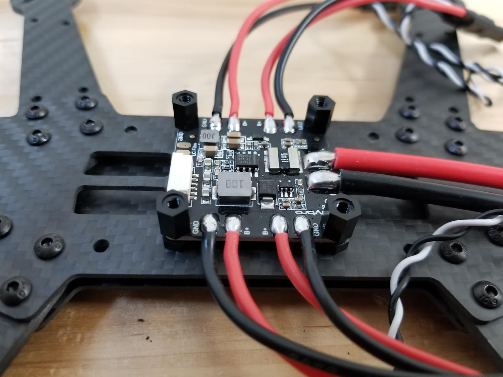
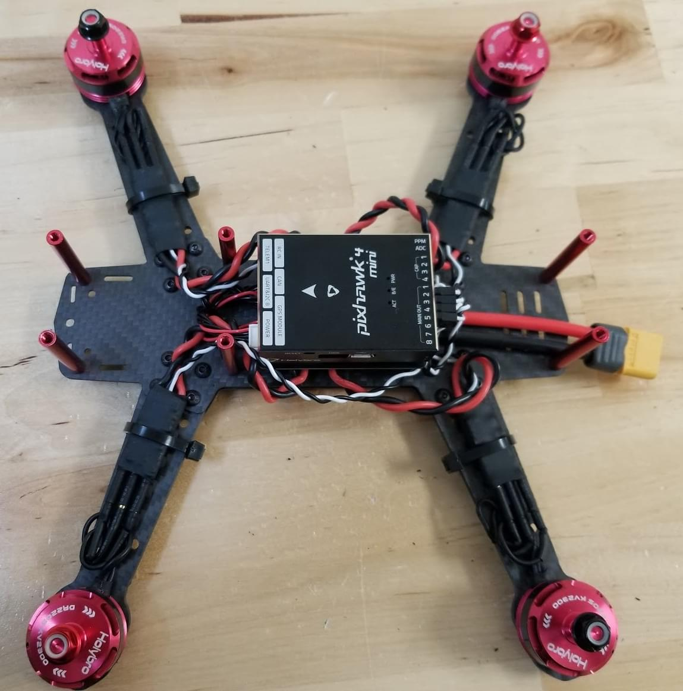

# HolyBro QAV250 + Pixhawk4-Mini Build

The [Holybro Pixhawk 4 Mini QAV250 Kit](https://shop.holybro.com/pixhawk-4-mini-qav250-kit_p1125.html) is a great way to start working with Pixhawk 4.
The kit includes a carbon-fibre QAV250 racing frame, *Pixhawk 4 Mini*, and almost all other components needed (except battery and receiver).
There are variants of the kit both with and without FPV support.

This topic provides full instructions for building the kit and configuring PX4 using *QGroundControl*.

Key information

- **Frame:** Holybro QAV250
- **Flight controller:** [Pixhawk 4 Mini](../flight_controller/pixhawk4_mini.md)
- **Assembly time (approx.):** 3.5 hours (2 for frame, 1.5 autopilot installation/configuration)

## Bill of materials

The Holybro [Pixhawk 4 Mini QAV250 Kit](https://shop.holybro.com/pixhawk-4-mini-qav250-kit_p1125.html) includes almost all required components:
* [Pixhawk 4 Mini](../flight_controller/pixhawk4_mini.md)
* [Holybro Micro FPV Radio telemetry set](http://www.holybro.com/product/17)
* Power module holybro
* Fully assembled Power Management Board with ESCs
* Motors - DR2205 KV2300
* 5” Plastic Props
* Carbon fiber 250 airframe with hardware
* Foxer camera
* Vtx 5.8ghz

Additionally you will need a battery and receiver (+compatible transmitter).
This build uses:
* Receiver: [FR SKY D4R-II](http://www.getfpv.com/radios/receivers/frsky-d4r-ii-4ch-2-4ghz-accst-receiver-w-telemetry.html)
* Battery: [4S 1300 mAh](http://www.getfpv.com/lumenier-1300mah-4s-60c-lipo-battery-xt60.html)

## Hardware

This section lists all hardware for the frame and the autopilot installation.

### Frame QAV250

Description | Quantity
--- | ---
Unibody frame plate | 1
Flight controller cover plate |  1
PDB                           |  1
Camera plate                  |  1
35mm standoffs                |  6
Vinyl screws and nuts         |  4
15mm steel screws             |  8
Steel nuts                    |  8
7mm steel screws              |  12
Velcro battery strap          |  1
Foam for battery              |  1
Landing pads                  |  4

### Electronics

Description | Quantity
--- | ---
Motors - DR2205 KV2300 |  4
Fully assembled Power Management Board with ESCs |  4
Holybro power module   |  1
Fr-sky D4R-II receiver |  1
Pixhawk 4 mini         |  1
Holybro GPS Neo-M8N    |  1
Holybro [Micro FPV Radio telemetry set](http://www.holybro.com/product/17) | 1
Battery lumenier 1300 mAh 4S 14.8V |  1
Vtx 5.8gHz             |  1
FPV camera (Complete Kit - only) |  1

The image below shows both frame and electronic components.

## Assembly

Estimated time to assemble frame is 2 hours and 1.5 hours installing the autopilot and configuring the airframe in *QGroundControl*.

### Tools needed

The following tools are used in this assembly:

- 2.0mm Hex screwdriver
- 3mm Phillips screwdriver
- Wire cutters
- Precision tweezers

### Frame assembly 

1. Attach arms to the button plate with the 15mm screws as shown:

   
1. Put the short plate over the arms

   
1. Put the nuts on the 15mm screws (shown next step)
1. Insert the plastic screws into the indicated holes (note that this part of the frame faces down when the vehicle is complete).
   
1. Add the plastic nuts to the screws (turn over, as shown)
   
1. Lower the power module over the plastic screws and then add the plastics standoffs
   
1. Put the flight controller plate on the standoffs (over the power module)
   
1. Attach the motors. The motors have an arrow indicating the direction of rotation.
   
1. Paste the damping foam on the pixhawk and paste on the flight controller plate
   
1. Connect the power module's "power" cable to *Pixhawk 4 mini*.
   
1. Attach the aluminium standoffs to the button plate
   
1. Connect the Esc’s with the motors and hold. In this image shown the order of the motors and direction of the rotation.
   

   Connect the motors on the ESC’s, make sure the motors turns to the correct side, if the motor turns of the opposite side change the cable A to the pad C and C to the pad A of the ESC.
   
   > **Warning** Test motor directions with propellers removed.
   
   
1. Connect the signal ESC cables to the PWM outputs of the Pixhawk in the correct order (see previous image)

   
1. Connect the receiver. 
   * If using a PPM receiver connect to the PPM port.
   
     
   * If using the SBUS receiver connect to the RC IN port
   
     
1. Connect the telemetry module. Paste the module with double tape and connect on the port of the telemetry.

   
1. Connect the GPS module

   

   Attach the module on the top plate (using provided 3M tape, or paste). Then put the top plate on the standoffs as shown
   
   
1. The last "mandatory" assembly step is to add the velcro to hold the battery

   

> **Tip** Additional information about connecting components can be found in the [Pixhawk 4 Wiring Quickstart](../assembly/quick_start_pixhawk4.md)

### FPV Assembly

The "Complete" version of the kit comes with an FPV system.
The diagram below shows how this is connected to the power module.

 
The FPV camera is screwed in place on the front middle plate, between the 2 main plates as shown.

The frame build is now complete! 
In the next step we can install and configure the PX4 autopilot.

## Install/configure PX4

*QGroundControl* is used to install the PX4 autopilot and configure/tune it for the QAV250 frame. 
[Download and install](http://qgroundcontrol.com/downloads/) 
*QGroundControl* for your platform.

> **Tip** Full instructions for installing and configuring PX4 can be found in [Basic Configuration](config/README.md).
This section provides a quick overview of the process.

### Firmware/airframe update

Update the *Pixhawk 4 Mini* with the PX4 firmware
1. Start *QGroundControl* and select **Firmware** from the
sidebar. Connect your vehicle to the USB port

   
   
   Select the default PX4 firmware and update. 

1. Select the airframe (**Quadrotor x > Lumenier QAV250**).

   
   Then click **Apply and Restart**.

### Vehicle calibration/setup

Vehicle calibration/setup is similar for all vehicles. 

**Step 3:** Radio calibration

1. Turn on the remote control.
2. Select **Radio** in the left-sidebar.
3. Select the "mode" of your remote control (top right).
4. Click the **Calibrate** button and follow the on-screen
   instructions.

**Step 4:** Calibrate sensors

1. Select **Sensors** in the left-sidebar.
2. Select the **Compass** button and then follow the on-screen instructions.
3. Select the **Gyroscope **button and then follow the on-screen instructions.
4. Select the **Accelerometer **button and then follow the on-screen instructions.

**Step 5:** Select flight modes.

[Flight Modes](../flight_modes/README.md) provide
autopilot assisted or fully controlled flight. New users should
configure their receiver to support the following three modes (these
make the vehicle much easier to fly):

- *Stabilized* - Vehicle hard to flip, and will level-out if the
  sticks are released (but not hold position)
- *Altitude* - Climb and drop are controlled to have a maximum rate.
- *Position* - When sticks are released the vehicle will stop (and
  hold position against wind drift)

There are a number of ways to [configure flight modes](../config/flight_mode.md). In this case
we have a three-way switch on the receiver that we map to a single channel (5).

For more information see:

- [Flight Mode Configuration](../config/flight_mode.md)
- [Flight Modes](../flight_modes/README.md)
- [Flight Modes](https://donlakeflyer.gitbooks.io/qgroundcontrol-user-guide/content/SetupView/FlightModes.html)
  (QGroundControl)

**Step 6:** Calibrate ESC

1. Remove propellers.

   > **Warning** Propellers must be removed from vehicle prior
     to performing ESC calibration!
2. Select **Power **in the left-sidebar.
3. Select the **Calibrate **button and then follow the on-screen
   instructions (Connect your battery. When the tones stop, press OK
   and unplug battery).
   
   

   

### Tuning

Firmware installation sets *default* autopilot parameters that have been
configured for the selected frame. 
These are good enough to fly with, but it is a good idea to tune the parameters for a specific frame build.

The parameters below are recommended for this build (the yellow
parameters are the ones that have changed). These were generated by
flight testing.

For general information on tuning see: [Multicopter PID Tuning Guide](../config_mc/pid_tuning_guide_multicopter.md).

## Video

The video below shows this QAV250 on a test flight.


?


## Acknowledgements

This build log was provided by the PX4 Test Team.

