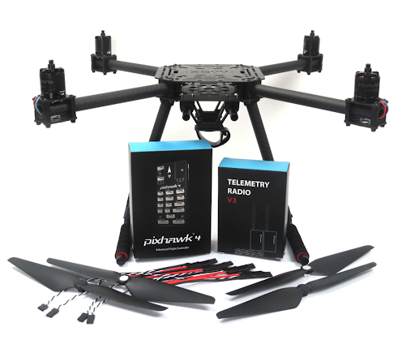

# Holybro X500 + Pixhawk4 Build

This topic provides full instructions for building the kit and configuring PX4 using *QGroundControl*.

## Key information

- **Frame:** Holybro X500
- **Flight controller:** [Pixhawk 4](../flight_controller/pixhawk4.md)
- **Assembly time (approx.):** 2 hours (75 minutes for frame, 45 minutes for autopilot installation/configuration)

## Bill of materials

The Holybro [X500 Kit](https://shop.holybro.com/x500-kit_p1180.html) includes almost all the required components:

* [Pixhawk 4 autopilot](../flight_controller/pixhawk4.md)
* Pixhawk 4 GPS
* Battery Strap
* Propellers - 1045
* Motors - 2216 KV880
* Power and Radio Cables
* Power Management - PM07
* Wheelbase - 500 mm
* Dimensions - 410*410*300 mm
* 433 MHz Telemetry Radio/915 MHz Telemetry Radio

Additionally you will need a battery and receiver ([compatible radio system](../getting_started/rc_transmitter_receiver.md)).
This build uses:

* Receiver: FR SKY Taranis
* Battery: [4S 1300 mAh](http://www.getfpv.com/lumenier-1300mah-4s-60c-lipo-battery-xt60.html)

## Hardware

This section lists all hardware for the frame and the autopilot installation.

Item | Description | Quantity
---|---|---
Socket cap scre               |  Used for motor fixing, stainless steel screw M3*5    | 16
Carbon fiber tube - Arm       |  Diameter: 16mm length: 200mm                         | 4
Motor base                    |  Consists of 6 parts and 4 screws 4 nuts              | 4
Slide bar                     |  Diameter: 10mm length: 250mm                         | 2
Battery mounting board        |  Thickness: 2mm                                       | 1
Battery pad                   |  3mm Silicone sheet black                             | 1
Pylons                        |  Engineering plastic embedded with copper nut         | 2
Cross countersunk head screw  |  Stainless steel M2.5*5mm                             | 12
PAN/TILT platform board       |  Thickness: 2mm                                       | 1
Hanger rubber ring gasket     |  Inner hole diameter: 10mm black                      | 8
Hanger                        |  Engineering plastic embedded with copper nut         | 8
Carbon fiber - Bottom plate   |  The thickness of 2mm                                 | 1
Socket cap screw              |  Stainless steel M2.5*6mm                             | 8
Nylon stud                    |  Black M3*6+6                                         | 4
Nylon screw                   |  Black M3*6                                           | 4
Carbon fiber - Top plate      |  Thickness: 1.5mm                                     | 1
Pan head screw                |  Metal black M3*30mm                                  | 16
Nylon strap                   |  U- shape, of 16mm carbon fiber tube                  | 16
Nylon nut                     |  Black M3                                             | 4
Locknut                       |  Metal black M3                                       | 16
Socket cap screw              |  Metal black M3*8mm                                   | 8
Landing gear - Vertical pole   |  Carbon fiber tube+engineering plastic+fastener       | 2
Landing gear - Cross bar       |  Composed of carbon fiber tube and multiple parts     | 2

## Package

Items | Package
---|---
Pixhawk 4                        |  1
Pixhawk4 GPS MODULE              |  1
I2C splitter Board               |  2
6 to 6 pin cable (power)         |  3
4 to 4 pin cable (CAN)           |  2
6 to 4 pin cable (Data)          |  1
10 to 10 pin cable (PWM)         |  2
8 to 8 pin cable(AUX)            |  1
7 to 7 pin cable(SPI)            |  1
6 to 6 pin cable(Debug)          |  1
PPM/SBUS out cable               |  1
XSR receiver cable               |  1
DSMX receiver cable              |  1
SBUS receiver cable              |  1
USB cable                        |  1
'X'type folding pedestal mount   |  1
70mm & 140mm carbon rod standoff |  2
6*3 2.54mm pitch Horizontal Pin  |  1
8*3 2.54mm pitch Horizontal Pin  |  2
Foam Set                         |  1
Pixhawk4 Quick Start Guide       |  1
Pixhawk4 Pinouts                 |  1
GPS Quick Start Guide            |  1

### Electronics

Item Description | Quantity
--- | ---
Pixhawk 4 autopilot（PM06 not included)            |  1
Power Management PM02（Assembled)                  |  1
Motors - 2216 KV880（V2 Update)                    |  4
Pixhawk 4 GPS                                      |  1
Fully assembled Power Management Board with ESCs   |  1
433MHz Telemetry Radio / 915MHz Telemetry Radio    |  1

### Tools needed

The following tools are used in this assembly:

- 1.5 mm Hex screwdriver
- 2.0 mm Hex screwdriver
- 2.5 mm Hex screwdriver
- 3mm Phillips screwdriver
- Wire cutters
- Precision tweezers

## Assembly

Estimate time to assemble is 120 minutes, about 75 minutes for frame assembly and 45 minutes installing and configuring the autopilot in QGroundControl.

**Step 1:** We are going to start by assembling the landing gear to the vertical pole.
Unscrew the landing gear screws and insert the vertical pole, see figures 1 and 2.

(Figure 1)

(Figure 2)

**Step 2:** We proceed to arm the motor holder by using 4 U-shaped nylon straps to attach the holder to the carbon fiber arm as shown in figure 3.

(Figure 3)

**Step 3:** Attach the power management PM02 to the bottom plate as shown in Figures 4 and 5.

(Figure 4)

(Figure 5)

**Step 4:**  Assemble the lower plate to the landing gears. Screw the landing gear with a vertical pole to the bottom plate.

The lower plate has 4 holes (see Figure 4 arrows) use the M3X8 screws, a total of 8 pieces, 4 on each side.

(Figure 6)

**Step 5:** Assembling the Battery Mount to the frame. For this we will need the M2 5X6 screws and the battery mount see Figure 7.

(Figure 7)

Insert the long rods to the small rings see Figure 8 and 9.

(Figure 8)

(Figure 9)

With the battery holder completely armed, screw it where arrow shown in the image as shown in Figure 10; keep in mind GPS module will be facing front.

(Figure 10)

**Step 6:** Assemble the 8*3 2.54mm pitch Horizontal Pin to the 10 to 10 pin cable (PWM) to the Power Management Board. Connect the 10 to 10 pin cable (PWM) to the 8*3 2.54mm pitch Horizontal Pin, see Figure 11.

(Figure 11)

Cut a piece of 3M Tape and attach to the bottom of the Horizontal Pin, see Figure 12 stick the Horizontal Pin to the Power Management Board, see Figure 13.

(Figure 12)

(Figure 13)

**Step 7:** Install vehicle Arms to the main body. Take the ESC and push it in the Arm tube as shown in Figure 14 and make sure that the ESC cables are not too long since we will push them back in as shown in Figure 15.

(Figure 14)

(Figure 15)

**Step 8:** Assemble arm to main body.

With 4 more U-shaped nylon straps attach the arm with the motor installed to the body of the vehicle as shown in Figure 16, this way you also attach the bottom plate to the top plate.

Keep in mind to have the arm tube a bit pushed in to that it can be kept securely in place as shown in the Red Square from Figure 16.

(Figure 16)

**Step 9:** Connect Motors cables.

After the 4 arms are mounted on to the main body, connect the cables (red, blue, black) and push them into the arm tube, see Figures 17.

The 3 cables that are color-coded go connected to the ESC.

(Figure 17)

**Step 10:** Mounting the GPS on the frame. For this, we will need the Pixhawk 4 GPS and the mounting plate.

Mount GPS mast to the plate, use the 4 screws see the red circle in Figure 18, keep in mind that the plate is mounted to the battery holder tubes as indicated by the arrows in Figure 18.

(Figure 18)

Use the tape and stick the GPS to the top of the GPS mast, see Figure 19.

(Figure 19)

**Step 11:** Pixhawk 4 wiring. The Pixhawk 4, which has several different wires and connections with it. Included below is a picture of every wire needed with the Pixhawk and how it looks when connected.

Plugin Telemetry and GPS module to the flight controller as seen in Figure 20; plug in the RC receiver, all 4 ESCs to the flight controller as well as the power module as shown in Figure 21.

(Figure 20)

(Figure 21)

(Fully assembled X500 Kit)

## Install/Configure PX4 {#configure}

*QGroundControl* is used to install the PX4 autopilot and configure/tune it for the QAV250 frame.
[Download and install](http://qgroundcontrol.com/downloads/)
*QGroundControl* for your platform.

> **Tip** Full instructions for installing and configuring PX4 can be found in [Basic Configuration](../config/README.md).

First update the firmware and airframe:
* [Firmware](../config/firmware.md)
* [Airframe](../config/airframe.md)
  
> **Note** You will need to select the *Holybro S500* airframe (**Quadrotor x > Holybro S500**).

Then perform the mandatory setup/calibration:
* [Sensor Orientation](../config/flight_controller_orientation.md)
* [Compass](../config/compass.md)
* [Accelerometer](../config/accelerometer.md)
* [Level Horizon Calibration](../config/level_horizon_calibration.md)
* [Radio Setup](../config/radio.md)
* [Flight Modes](../config/flight_mode.md)

Ideally you should also do:
* [ESC Calibration](../advanced_config/esc_calibration.md)
* [Battery](../config/battery.md)
* [Safety](../config/safety.md)

## Tuning

Airframe selection sets *default* autopilot parameters for the frame.
These are good enough to fly with, but it is a good idea to tune the parameters for a specific frame build.

For general information on tuning see: [Multicopter PID Tuning Guide](../config_mc/pid_tuning_guide_multicopter.md).

## Acknowledgements

This build log was provided by the Dronecode Test Flight Team.
