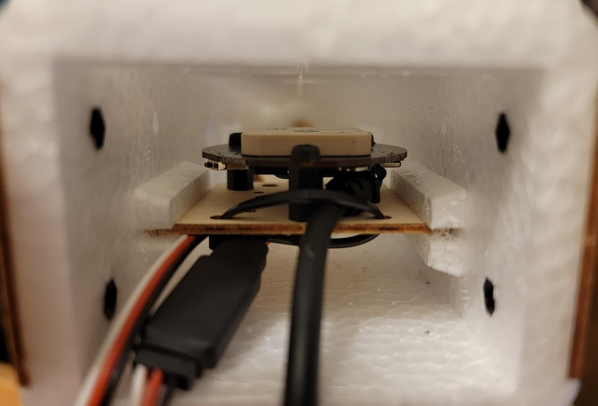
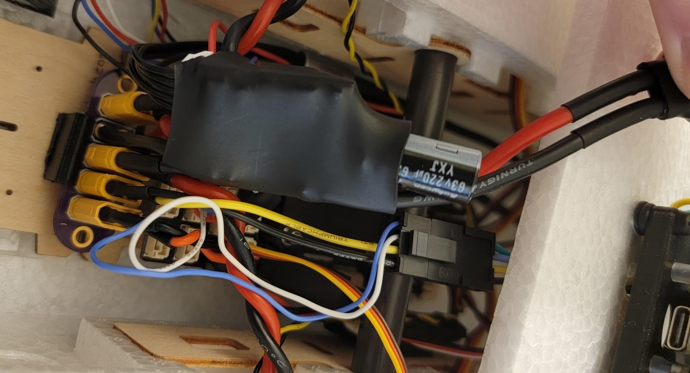
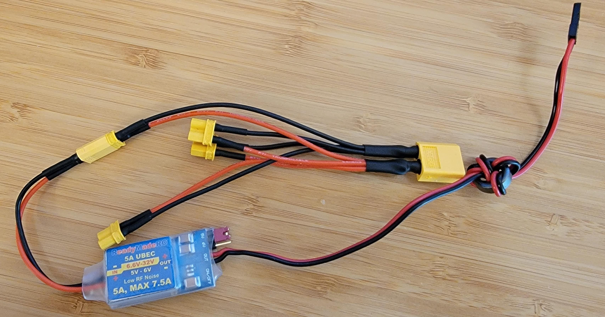
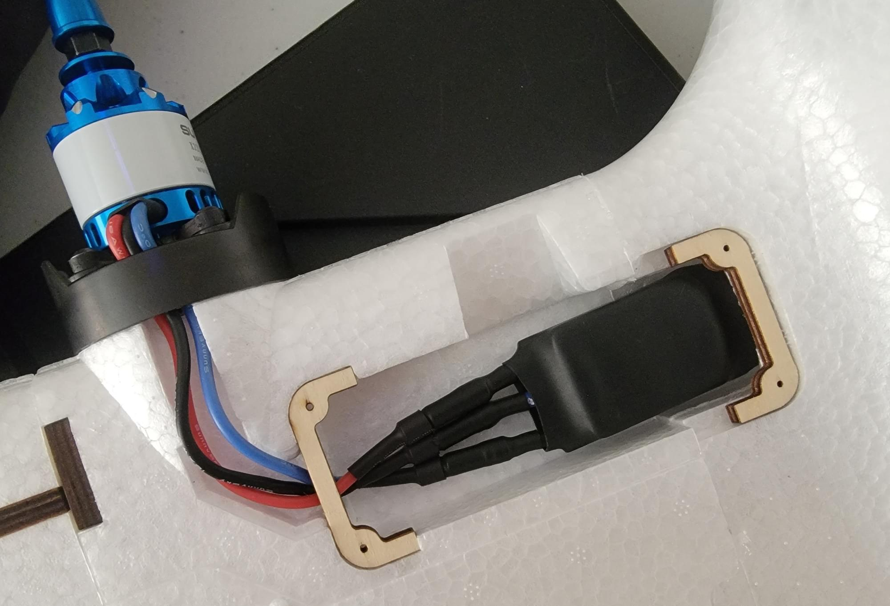

# Reptile Dragon 2 (RD2) Build

The Reptile Dragon 2 is a twin motor RC airplane specifically designed for efficient FPV [(first person view)](https://en.wikipedia.org/wiki/First-person_view_(radio_control)) flying.
Being specific for FPV, the RD2 is optimized for easy mounting of cameras, sensors, logic electronics, large batteries, antennas, and other payload components which would be found on a typical FPV airplane. 
This emphasis on payload makes this airplane an ideal candidate for a PX4 installation.

## Overview

The goal of this build was to create an efficient, long endurance FPV platform to be used for general PX4 testing and development.

Key airframe features:

- Spacious interior
- Easy access to the entire fuselage cavity with large top hatch
- Rear hatch
- Removable V tail or conventional tail options included
- Threaded inserts in the wings and fuselage top for external mounting
- Numerous mounting features
  - Top antenna hole
  - Top GPS cover
  - Side "T" antenna mounts
  - Rear electronics tray
  - Front facing "action cam" cutout
  - Front facing FPV camera cutout 
- Removable wings
- Low stall speed
- Gentle handling 

Key build features

- Easy overall build
- Easy access to Pixhawk and all peripherals
- FPV with camera pan mount
- Air data from pitot/static probe
- ~40 minute long flight times

## Parts list

- [Reptile Dragon 2 kit](https://usa.banggood.com/REPTILE-DRAGON-2-1200mm-Wingspan-Twin-Motor-Double-Tail-EPP-FPV-RC-Airplane-KIT-or-PNP-p-1805237.html?cur_warehouse=CN&ID=531466)
- [Pixhawk 5x Carrier board](https://shop.holybro.com/pixhawk-5x_p1279.html)
- [ARK6X FMU](https://arkelectron.com/product/arkv6x/)
- [Holybro power module](https://shop.holybro.com/pm02d-power-module_p1285.html)
- [Holybro M9N GPS module](https://shop.holybro.com/holybro-m9n-gps_p1280.html)
- MS4525DO differential pressure module and pitot tube
- [Caddx Vista FPV air unit](https://caddxfpv.com/products/caddx-vista-kit)
- [DJI FPV Goggles](https://www.dji.com/fpv)
- [ExpressLRS Matek Diversity RX](http://www.mateksys.com/?portfolio=elrs-r24)
- [5V BEC](https://www.readymaderc.com/products/details/rmrc-3a-power-regulator-5-to-6-volt-ubec)
- [4s2p 18650 LiIon flight battery](https://www.upgradeenergytech.com/product-page/6s-22-2v-5200mah-30c-dark-lithium-xt60)
- [Custom designed 3D printed parts](https://github.com/PX4/PX4-user_guide/raw/main/assets/airframes/fw/reptile_dragon_2/rd2_3d_printed_parts.zip)
  - Pixhawk 5x carrier mount
  - FPV pod and camera mount
  - Pitot static probe "plug" adapter
- [Custom designed power distribution PCB](https://github.com/PX4/PX4-user_guide/raw/main/assets/airframes/fw/reptile_dragon_2/xt30_power_distro_pcb.zip)
- Misc hardware: M3 hardware (standoffs, washers, O-rings, bolts), XT30 connectors, hot glue, heatshrink, Molex Microfit connectors
- Silicone wiring (14awg for high current, 16awg for low current, 22awg for low power and signals)

## Tools
- Servo tester (with centering button)
- Screw driver set
- 3D printer
- Wrench set
- Hot glue, CA glue, "Foamtac" glue
- Sandpaper

## Airframe Build

The airplane needs some assembly out of the box.
Servos, wings, and the tail will need to be installed.

:: note
For this portion of assembly, the instructions included with the kit should be sufficent, but some helpful tips are listed below
:::

### Gluing Foam
When gluing foam parts of the RD2 together, it's recommended to use sandpaper to rough the mating surface, then use CA glue.
If the foam is not roughed with sandpaper, the glue will not have a surface to be able to "grab" the foam and the bond will be poor.
Foamtac doesn't seem to stick well to this foam, so I used CA glue for all foam-to-foam mates

### Skid Plate

The RD2 comes with a skid plate, but it needs to be trimmed to fit.
Trim off the mold flashing from the flat side of the skid plate.
Uee coarse sandpaper to rough the inside surface of the skid plate as well as the mating surface on the underside of the airframe.
After checking for fit, use CA glue to glue the skid plate to the bottom of the RD2.

### Servo Installation

:: note
Prior to servo installation, it is recommended to use the sandpaper to rough the side of the servo facing the servo cover. During final installation, put a drop of Foamtac between the servo and the cover. This will prevent the servo from moving once installed.
:::

The servos on the RD2 are connected to control surfaces with adjustable servo linkages.
The RD2 instructions will note that each control surface uses a specific length of linkage (included in the kit).
Make sure to measure each linkage before installation to be sure that it is the right length linkage for that control surface.
It's very important to align the servos such that the mechanical range of the servo is well aligned with the mechanical range of the control surface.
When the servo is at it's center point, the servo arm should be at a 90 degree angle to the servo, and the control surface should be roughly centered.
It might not be possible to get this alignment perfect, so any remaining offset will be adjusted out in software.

The following steps can be used to perform servo alignment
1. Begin with the servo outside of the airplane
2. Use the servo tester to move the servo to its center point
3. Install the servo horn with the included retaining screw, taking care to align the horn to extend as close as possible to 90 degrees out on the correct side of the servo
4. Install the servo in the servo pocket on the airplane
5. Install the linkage, and twist to adjust it such that the control surface is as close to centered as possible

:: note
The servo horn will likely not sit exactly at a 90 degree angle to the servo due to the teeth on the servo shaft.
You can see this in the above example setup image.
Just get it close enough to 90 degrees, and the remaining offset will be removed either with the linkage, or later in software.
:::

## GPS/Compass Module Mounting

The GPS module was removed from its plastic case to allow the use of the mounting holes, and then nylon M3 hardware was used to attach it to the rear electronics shelf included with the RD2. Two of the three required holes are already coincidentally located in the electronics tray, so I used a marker and a drill to mark and drill the third hole. 

This location is far aft of power wiring and other magnetic disturbances, which makes for an ideal location for the GPS/compass module

## FPV Pod

The FPV pod was mounted on top of the battery hatch using nylon M3 bolts with two O-rings to space the FPV pod base plate from the battery hatch.

## Flight Computer Installation

The Holybro Pixhawk 5X carrier comes installed in a plastic case.
While the case does look nice, it is extra weight, so the carrier was removed from the case.
Once removed from the case, the ARK6X was installed, and a protective cover fitted ontop.

A custom mount for the Pixhawk 5X carrier board was designed and 3D printed.
This mount adapts the RD2's internal mounting plate hole pattern to the mounting holes on the Pixhawk 5X carrier board.
It's important to install this mount in the correct location inside the RD2; as far aft as possible.
With a large battery and the FPV pod up front, the airplane will tend to be noseheavy.
Mounting the flight computer far aft will help to keep the airframe center of gravity (CG) in the correct location.

## Electrical

### Battery Power Distribution

Battery power is routed through the Holybro Power module, then to a custom designed power distribution PCB (printed circuit board).
From the power distribution board, battery power is split to the BEC, both ESCs, and Caddx Vista through separate XT30 connectors.

Without the custom PCB, it's still easy to distirbute power to all the componets in the airplane.
This image shows an alternative solution constructed from an XT60 connectr wired to several XT30 connectors.
The servo power BEC is also shown in this image.

### Servo Power
Because the Holybro carrier does not include an onboard servo power supply, an external ["BEC"](https://en.wikipedia.org/wiki/Battery_eliminator_circuit) is used to provide power to the servos.
The input leads of the EC were soldered to a XT30 connector which was plugged into the power distribution board.
The output of the BEC can be plugged into any unused servo output (I chose IO output 8).

### ESCs & Motors

Bullet connectors were soldered to 16awg leads, which were then soldered to each phase output on each ESC.
Heatshrink was shrunk over the finished ESCs and the bullet connectors from the ESCs were connected to their respective motors. 
Motor direction depends on the order of the motor leads connected to the ESC.
For now, take a guess on each side. If either motor is spinning the wrong way, the direction can be swapped by swapping any two connections. 
Correct motor direction will be checked in the final preflight checks.

### Servos & ESC Signal Leads
Servos were wired to the FMU out port in the order left aileron, right aileron, left ESC, right ESC, elevator, rudder, FPV pan. 

:: note
The ESCs are controlled over DSHOT, not PWM like the servos. To make efficient use of the DSHOT output port restrictions, the two ESCs must be wired to FMU output channels 3 and 4.
:::

### Airspeed Sensor & Pitot Tube

The airspeed sensor was connected to the I2C port on the Pixhawk 5x carrier board with the supplied JST GH I2C cable.

The pitot tube was pushed through the pitot tube mount and then installed in the front fpv camera cut out.

The pitot/static hoses were cut to length and installed to connect the pitot static probe to the airspeed sensor.
Finally, the pitot static sensor was double stick taped to the sidewall of the airframe.

### ELRS RX

A custom cable was made to connect the ELRS RX to the JST GH `telem 2` port of the Holybro Pixhawk 5x.
The other end of the cable was terminated to a Dupont connector to connect to the standard spaced headers on the ELRS RX.
The ELRS RX was connected to the cable, and then heatshink was used to secure the two together. 

A thin radio antenna tube was pushed through the top of the airframe used to mount one of the two ELRS diversity antennas upright.
The second diversity antenna was taped to the sidewall of the airframe, 90 degrees from the alignment of the first antenna.
The ELRS RX was double stick taped to the sidewall of the airframe, next to the airspeed pressure sensor.

### USB

A right angle USB C extension cable was used to allow easy access to the USB C port on the FMU.
The cable was installed such that it escapes the pixhawk heading towards the aft of the airplane. The cable continues to run to the rear hatch, where the excess length can be securely wound into a knot.
Access to this cable can be accomplished by simply removing the rear hatch and unknotting the cable.

## Preflight & First Flight

### Radio Setup
For a first flight, I recommend to have at least `manual`, `acro`, and `position `flight modes accessible.
Additionally, I also attach an aux switch to the fixed wing autotune module so that the airframe can be easily autotuned during the first flight.

The channel mappings for this build are included in the params file linked at the bottom of this page.
I chose to map the channels in order throttle, roll, pitch, yaw, (blank), and flight mode

::note
ExpressLRS requires aux1 as an "arming channel".
This arming channel is separate from PX4's arming mechanism and is used to tell the ELRS TX that is can switch into high transmit power.
In the Px4 channel mappings, I simply skip over this channel.
On my transmitter, this channel is set to always be "high", so ELRS is always armed.
:::

### Motor Setup & Prop Installation
The RD2 kit comes with clockwise and counter clockwise propellers for counter rotating motors.
With counter rotating props, the airplane can be set up such that it has no [critical motors](https://en.wikipedia.org/wiki/Critical_engine).
With no critical motors, controllability during a failed motor will be maximized. 
The motor direction should be set such that props should be turn towards the fuselage on top of the plane.
In other words, if you look at the left motor with the airplane facing away from you, it should spin clockwise while the right motor should spin counter clockwise.

With the propellers removed, power the airplane up and use the "actuator test" page in qgc to spin up the motors.
If the left or right motor does not spin in the correct direction, swap two of its ESC leads and check it again.
Finally, when both motors are spinning the correct directions, use a wrench to attach the propellers.

### Final Checks

Prior to the first flight, a comprehensive preflight must be conducted.
I recommend checking the following items:
- Sensor calibration (QGC)
  - Mag calibration
  - Accelerometer calibration
  - Airspeed calibration
  - Level horizon calibration
- Check control surface deflection
 - Right stick -> Right aileron goes up, left aileron goes down
 - Left stick -> Left aileron goes up, right aileron goes down
 - Stick back -> elevator goes up
 -Stick forward -> elevator goes down
 - Left rudder -> Rudder goes left
 - Right rudder -> Rudder goes right
- Check Px4 inputs (in `stabilized mode`)
 - Roll right -> Right Aileron goes down
 - Roll left -> Left aileron goes down
 - Pitch up -> Elevator goes down
 - Pitch down -> Elevator goes up

### First Flight
I recommend performing the first takeoff in manual mode.
Because this airplane has no landing gear, you will either need to throw the airplane yourself, or ideally have a helper throw it.
When throwing any airplane, throw at a slightly nose up attitude with full throttle.
It's critical to be ready to give aft stick input to prevent the airplane from impacting the ground if it happens to be trimmed nosedown.
Once the airplane is successfully airborne, cruise up to an altitude of a few hundred feet and switch to `acro` mode. 
If the airplane is well behaved in `acro` mode, switch to `position` mode. 
Optionally, you can use the fixed wing auto tuner switch configured in `Radio Setup` to autotune the airframe.

## Build Results & Performance

Overall, this build was a success. The RD2 flies well in this configuration and has plenty of room onboard for sensors and additional hardware.

### Performance
- Stall speed: 15mph indicated
- Cruise speed: 35-50mph
- Endurance: ~40 minutes at 28mph

### Videos & Flight Logs
[Demo Flight log](https://review.px4.io/plot_app?log=6a1a279c-1df8-4736-9f55-70ec16656d1e)

FPV video of flight log:

### Params

[Snapshot of PX4 airframe params](https://github.com/PX4/PX4-user_guide/raw/main/assets/airframes/fw/reptile_dragon_2/reptile_dragon_2_params.params)

This param file contains the custom PX4 parameter config for this build, including radio setup, tuning and sensor config.
The param file can be loaded via QGC using the instructions at [Parameters> Tools ](https://docs.qgroundcontrol.com/master/en/SetupView/Parameters.html#tools) (QGC User Guide).