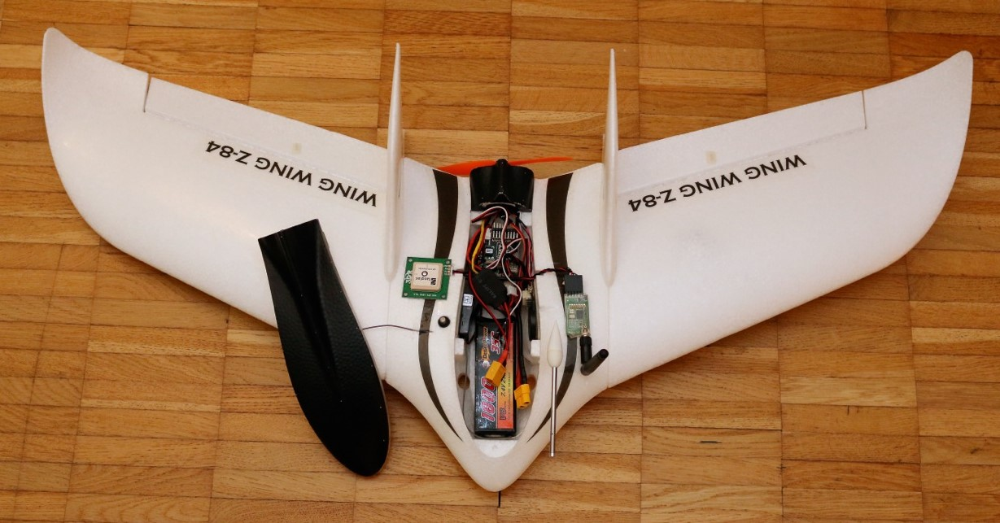
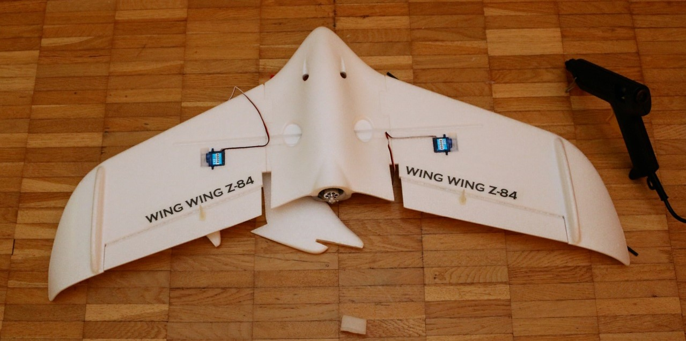
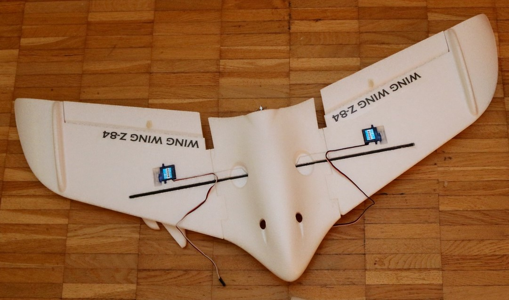
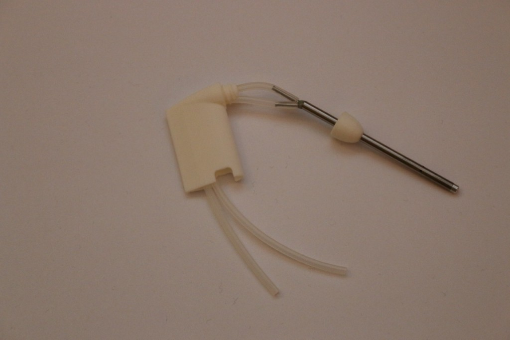
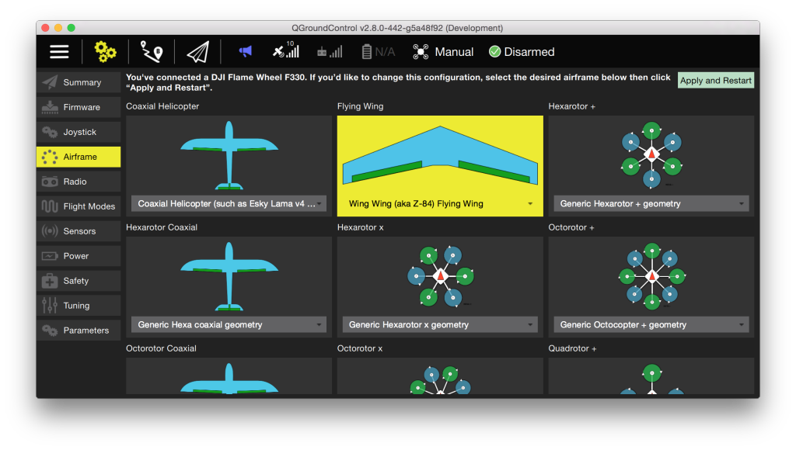

# Wing Wing Z-84 Pixracer Build

The Wing Wing Z-84 is our gold standard airframe: Small, rugged and just
large enough to host a [Pixracer](../flight_controller/pixracer.md).

Key information:

- **Frame:** Wing Wing Z-84
- **Flight controller:** Pixracer

## Parts List

### Z-84 Plug n' fly or kit

One of these:

-   [Eflight (Switzerland)](http://www.eflight.ch/shop/USER_ARTIKEL_HANDLING_AUFRUF.php?von_suchresultat=true&Ziel_ID=14949&Kategorie_ID=66213)
-   [Hobbyking International Warehouse](http://hobbyking.com/hobbyking/store/__25664__Wing_Wing_Z_84_EPO_845mm_PNF_.html)
-   [Hobbyking EU Warehouse](http://hobbyking.com/hobbyking/store/uh_viewItem.asp?idProduct=31412)

### Electronic speed controller

One of these:

-   [Mystery 12A ESC](http://hobbyking.com/hobbyking/store/__9485__Mystery_12A_Brushless_Speed_Controller_Blue_Series_.html)
-   [ePower Pro 12A](http://www.eflight.ch/pi/ePower-Pro-12A.html)

### Autopilot and Battery

-   [Pixracer](../flight_controller/pixracer.md) kit with AIRSPEED and GPS
-   1800 mA 2S LiPo Battery

### Recommended spare parts

-   1 cm diameter O-ring ([Hobbyking International Warehouse](http://www.hobbyking.com/hobbyking/store/__27339__Wing_Wing_Z_84_O_Ring_10pcs_.html))
-   125x110 mm prop ([Hobbyking](http://www.hobbyking.com/hobbyking/store/__27453__GWS_EP_Propeller_DD_5043_125x110mm_orange_6pcs_set_.html))

## Wiring

The wiring below is valid for Pixhawk and Pixracer. Use the main
outputs, not the ones labeled with AUX. The motor controller needs to
have an in-built BEC, as the autopilot is not powering the servo rail.

Port | Connection
--- | ---
RC IN    | PPM or S.BUS / S.BUS2 input
MAIN 1   | Left Aileron
MAIN 2   | Right Aileron
MAIN 3   | Empty
MAIN 4   | Throttle

## Build Log

The images below give a rough idea about the assembly process, which is
simple and can be done with a hot glue gun.

## Airframe Configuration

Select the Z-84 in the flying wing section of the QGC airframe config:

