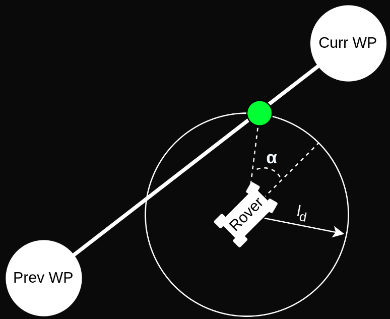

# Ackermann Rover

An _Ackermann Rover_ controls its direction by pointing the front wheels in the direction of travel
([ackermann geometry](https://en.wikipedia.org/wiki/Ackermann_steering_geometry) compensates for the fact that wheels on the inside and outside of the turn move at different rates).
This kind of steering is used on most commercial vehicles, including cars, trucks etc.

::: info
The module does not require the ackermann geometry and will work with any front-steering rover.
:::

## Airframe Setup

This section will go through the most basic setup that is necessary to start using the rover.

1. After flashing the USV build (ADD LINK!!) select the _Generic ackermann rover_ in the [Airframe](../config/airframe.md) configuration:

   

   Select the **Apply and Restart** button.

   
   ::: info
   If this airframe does not show up in the UI, it can alternatively be loaded by setting the _SYS_AUTOSTART_ parameter to _50010_.
   :::

   ::: warning
   Do not use the _Generic Ground Vehicle (Ackermann)_ airframe, this is linked to the old rover module and will not load the new module!
   :::

2. Open the [Actuators Configuration & Testing](../config/actuators.md) to map the steering and throttle functions to flight controller outputs.

This is sufficient to drive the the rover in [manual](#manual-mode) and [acro](#acro-mode) mode (here is more information on available [Flight modes](#flight-modes)).

::: info
Many features of this module are disabled by default, and are only enabled by setting certain parameters.
The [Tuning (basic)](#tuning-basic) section goes through the minimum setup required to start driving missions
and the [Tuning (advanced)](#tuning-advanced) section outlines the remaining features and tuning variables of the module.
:::

## Tuning (Basic)

To start driving missions navigate to [Parameters](../advanced_config/parameters.md) in QGroundControl and set the following parameters (ADD PICTURES!!):

| Parameter                                                                                                | Description                                                                | Unit |
| -------------------------------------------------------------------------------------------------------- | -------------------------------------------------------------------------- | ---- |
| [RA_WHEEL_BASE](../advanced_config/parameter_reference.md#RA_WHEEL_BASE)       | Wheel-base of the rover which is measured from the back to the front wheel | -    |
| [RA_MAX_STR_ANG](../advanced_config/parameter_reference.md#RA_MAX_STR_ANG)    | Maximum steering angle of the rover                                        | deg  |
| [RA_MISS_VEL_DEF](../advanced_config/parameter_reference.md#RA_MISS_VEL_DEF) | Default velocity the rover will drive during the mission                   | m/s  |

This is enough to start driving missions, but depending on the rover might not yet lead to satisfactory performance.
If that is the case further tuning is required which is outlined in [Mission parameters](#mission-parameters).

## Tuning (Advanced)

To get an overview of all parameters that are related to the ackermann rover module navigate to the _Rover Ackermann_ group in the _Parameters_ section of QGroundControl.

### General Parameters

These parameters affect the general behaviour of the rover. This will influence both auto and manual modes.

| Parameter                                                                                       | Description                                | Unit |
| ----------------------------------------------------------------------------------------------- | ------------------------------------------ | ---- |
| [RA_MAX_SPEED](../advanced_config/parameter_reference.md#RA_MAX_SPEED) | Speed the rover drives at maximum throttle | m/s  |

This is used for a feed-forward term on the speed controller in mission mode and necessary for the [acceleration slew rate](#slew-rates).

#### Slew Rates

Slew rates limit how fast the signal that is sent to the motors is allowed to change:

| Parameter                                                                                                | Description                            | Unit  |
| -------------------------------------------------------------------------------------------------------- | -------------------------------------- | ----- |
| [RA_MAX_ACCEL](../advanced_config/parameter_reference.md#RA_MAX_ACCEL)          | Limit on the acceleration of the rover | m/s^2 |
| [RA_MAX_STR_RATE](../advanced_config/parameter_reference.md#RA_MAX_STR_RATE) | Limit on the steering rate             | deg/s |

:::warning
The slew rates are not based on measurements but on assumed linear relation between the throttle input and [RA_MAX_SPEED](#RA_MAX_SPEED) or steering input and [RA_MAX_STR_ANG](#RA_MAX_STR_ANG) respectively.
Therefor these two parameters have to be set for the slew rates to work!
:::

### Mission Parameters

These parameters only affect the mission flight mode.

:::warning
The parameters in [Tuning (basic)](#tuning-basic) have to be set to drive missions!
:::

#### Pure Pursuit Parameters

The module uses a control algorithm called _Pure pursuit_ and it can be beneficial to understand how it works to properly tune (see [Pure pursuit algorithm](#pure-pursuit-algorithm)).

The look ahead distance sets how aggressive the controller behaves and is defined as follows: $l_d = v \cdot k$
It depends on the velocity $v$ of the rover and a tuning parameter $k$ that can be set with the parameter [RA_LOOKAHEAD_TUN](#RA_LOOKAHEAD_TUN).

:::info
A lower value of [RA_LOOKAHEAD_TUN](#RA_LOOKAHEAD_TUN) makes the controller more aggressive but can lead to oscillations!
:::

To deal with the edge case that the line segment is outside the look ahead radius around the rover there are 2 steps:

1. The look ahead is scaled to the crosstrack error, which creates an intersection point for the rover to drive towards.
2. Scaling the look ahead too much can have undesirable effects such as the rover driving a huge circle to return to the path, rather then taking a straight line.
3. For this purpose the maximum look ahead radius can be capped with the parameter [RA_LOOKAHEAD_MAX](#RA_LOOKAHEAD_MAX), after which the rover will drive directly
   towards the current waypoint until it gets close enough to the line segment again.

To summarize, the following parameters can be used to tune the controller:

| Parameter                                                                                                   | Description                             | Unit |
| ----------------------------------------------------------------------------------------------------------- | --------------------------------------- | ---- |
| [RA_LOOKAHEAD_TUN](../advanced_config/parameter_reference.md#RA_LOOKAHEAD_TUN) | Main tuning parameter                   | -    |
| [RA_LOOKAHEAD_MAX](../advanced_config/parameter_reference.md#RA_LOOKAHEAD_MAX) | Maximum value for the look ahead radius | m    |
| [RA_LOOKAHEAD_MIN](../advanced_config/parameter_reference.md#RA_LOOKAHEAD_MIN) | Minimum value for the look ahead radius | m    |

#### Cornering Parameters

The module employs a special cornering logic causing the rover to "cut corners" to achieve a smooth trajectory.
This is done by scaling the acceptance radius based on the corner the rover has to drive (for geometric explanation see [Cornering logic](#cornering-logic)).

The degree to which corner cutting is allowed can be tuned, or disabled, with the following parameters:

| Parameter                                                                                                             | Description                                           | Unit |
| --------------------------------------------------------------------------------------------------------------------- | ----------------------------------------------------- | ---- |
| [RA_ACC_RAD_DEF](../advanced_config/parameter_reference.md#RA_ACC_RAD_DEF)                 | Default acceptance radius                             | m    |
| [RA_ACC_RAD_MAX](../advanced_config/parameter_reference.md#RA_ACC_RAD_MAX)                 | Maximum radius the acceptance radius can be scaled to | m    |
| [RA_ACC_RAD_TUN](../advanced_config/parameter_reference.md#RA_ACC_RAD_TUN) | Tuning parameter                                      | -    |

The tuning parameter is a multiplicand on the calculated ideal acceptance radius to account for dynamic effects.

To smoothen the trajectory further and reduce the risk of the rover rolling over, the mission speed is reduced while the rover is close to a waypoint.
This is achieved by multiplying the inverse of the acceptance radius with a tuning parameter called [RA_MISS_VEL_TUN](#RA_MISS_VEL_TUN).
This value is constrained between a minimum allowed speed and the default mission speed.

The slow down effect is active when the rover is within a radius of _acceptance_radius_ \* [RA_VEL_RED_START](#RA_VEL_RED_START) of the waypoint.
This effect can be tuned, or disabled, with the following parameters:

| Parameter                                                                                                   | Description                                                               | Unit |
| ----------------------------------------------------------------------------------------------------------- | ------------------------------------------------------------------------- | ---- |
| [RA_MISS_VEL_DEF](../advanced_config/parameter_reference.md#RA_MISS_VEL_DEF)    | Default mission speed                                                     | m/s  |
| [RA_MISS_VEL_MIN](../advanced_config/parameter_reference.md#RA_MISS_VEL_MIN)    | Minimum the speed can be reduced to during cornering                      | m/s  |
| [RA_MISS_VEL_TUN](../advanced_config/parameter_reference.md#RA_MISS_VEL_TUN)    | Tuning parameter for the velocity reduction                               | -    |
| [RA_VEL_RED_START](../advanced_config/parameter_reference.md#RA_VEL_RED_START) | Tuning parameter for the distance to the WP at which the slow down begins | -    |

## Flight Modes

This section outlines all currently supported "flight" modes.

:::info
Any unsupported flight mode will simply stop the rover.
:::

### Manual Mode

Steering and throttle setpoint are taken directly from a manual input. If enabled, [slew rates](#slew-rates) will be applied to the motor commands.
Tuning for this mode can be found in [General parameters](#general-parameters)

### Acro Mode

Same as [manual mode](#manual-mode) except that the slew rates are ignored even if they are enabled.

### Mission Mode

Steering and throttle setpoints are generated from a mission plan using a [pure pursuit](#pure-pursuit-algorithm) algorithm.
Tuning for this mode can be found in [Tuning (basic)](#tuning-basic) and [Mission Parameters](#mission-parameters).

### Return Mode

This mode uses the same logic as [Mission mode](#mission-mode) with the launch position as goal.
A mission can be configured s.t. the vehicle will enter return mode after the last waypoint or return can also be started from the UI in any mode.

## Pure Pursuit Algorithm

The ackermann rover module implements a path following algorithm called Pure pursuit.
The controller takes the intersection point between a circle around the vehicle and the line segment connecting the previous and current waypoint.
The radius of the circle around the vehicle is used to tune the controller and is often referred to as look-ahead distance.

The required steering angle is calculated such that the vehicle reaches the aforementioned intersection point:

$$
\delta = \arctan\left( \frac{2Lsin(\alpha )}{l_d}\right)
$$

| Symbol   | Description        | Unit |
| -------- | ------------------ | ---- |
| $\delta$ | Steering angle     | rad  |
| $L$      | Wheelbase          | m    |
| $\alpha$ | Heading error      | rad  |
| $l_d$    | Lookahead distance | m    |

A great illustration for the derivation of this equation can be found at https://thomasfermi.github.io/Algorithms-for-Automated-Driving/Control/PurePursuit.html.

## Cornering Logic

To enable a smooth trajectory, the acceptance radius of waypoints is scaled based on the angle between a line segment from the current-to-previous and current-to-next waypoints.
The ideal trajectory would be to arrive at the next line segment with the heading pointing towards the next waypoint.
For this purpose the minimum turning circle of the rover is inscribed tangentially to both line segments.

The acceptance radius of the waypoint is set to the distance from the waypoint to the tangential points between the circle and the line segments:

$$
\begin{align}
r_{min} &= \frac{L}{\sin\left( \delta_{max}\right) } \\
\theta  &= \frac{1}{2}\arccos\left( \frac{\vec{a}*\vec{b}}{|\vec{a}||\vec{b}|}\right) \\
r_{acc} &= \frac{r_{min}}{\tan\left( \theta\right) }
\end{align}
$$

| Symbol         | Description                        | Unit |
| -------------- | ---------------------------------- | ---- |
| $\vec{a}$      | Vector from current to previous WP | m    |
| $\vec{b}$      | Vector from current to next WP     | m    |
| $r_{min}$      | Minimum turn radius                | m    |
| $\delta_{max}$ | Maximum steer angle                | m    |
| $r_{acc}$      | Acceptance radius                  | m    |
