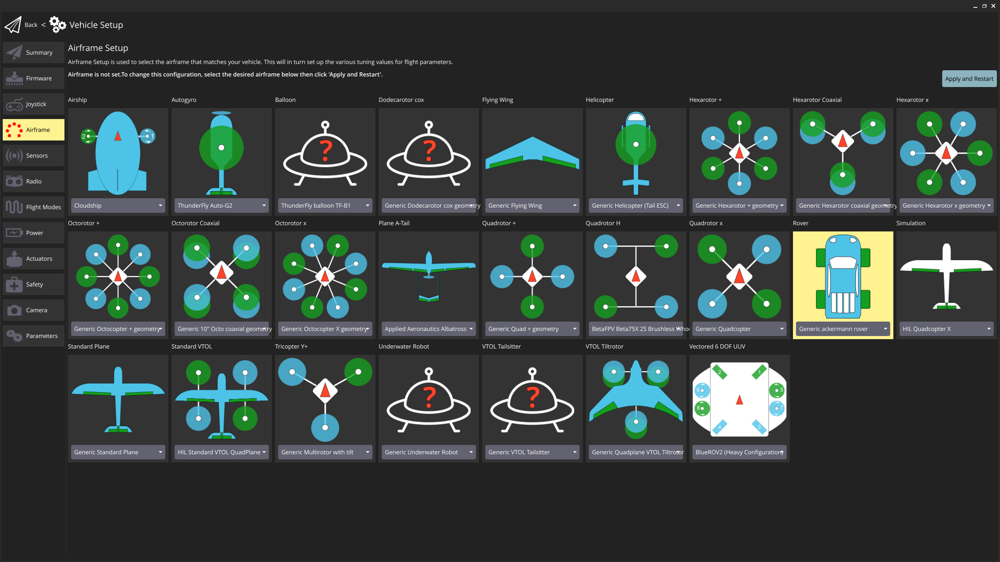
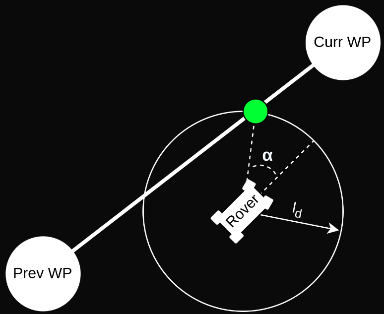

# Ackermann Rover (v2)

<Badge type="tip" text="main (PX4 v1.16+)" /> <Badge type="warning" text="Experimental" />

An _Ackermann rover_ controls its direction by pointing the front wheels in the direction of travel — the [Ackermann steering geometry](https://en.wikipedia.org/wiki/Ackermann_steering_geometry) compensates for the fact that wheels on the inside and outside of the turn move at different rates.
This kind of steering is used on most commercial vehicles, including cars, trucks etc.


::: info
PX4 does not require that the vehicle uses the Ackermann geometry and will work with any front-steering rover.
:::

::: tip
This page describes is a dedicated Ackermann rover implementation, that is intended to replace the "generic" rover module used in [Ackermann steering (v1)](../frames_rover/ackermann_rover_v1.md).
The rover already performs better than the old module for the use cases that it implements.
Note however that this is not yet in a release build, so you will have to build the firmware yourself to test it.
:::

## Basic Setup

To start using the ackermann rover:

1. First build the rover firmware for your flight controller from the `main` branch (there is no release build, so you can't just select this build from QGroundControl).

   To build for rover with the `make` command, replace the `_default` suffix with `_rover`.
   For example, to build rover for px4_fmu-v6x boards, you would use the command:

   ```sh
   make px4_fmu-v6x_rover
   ```

   ::: info
   You can also enable the module in default builds by adding the following line to your [board configuration](../hardware/porting_guide_config.md) (e.g. for fmu-v6x you might add this line to [`main/boards/px4/fmu-v6x/default.px4board`](https://github.com/PX4/PX4-Autopilot/blob/main/boards/px4/fmu-v6x/default.px4board)):

   ```sh
   CONFIG_MODULES_ROVER_ACKERMANN=y
   ```

   Note that adding the rover module may lead to flash overflow.
   You may need to disable modules that you do not plan to use, such as those related to multicopter, fixed wing, or the old rover module.
   :::

2. Load the **custom firmware** that you just built onto your flight controller (see [Loading Firmware > Installing PX4 Main, Beta or Custom Firmware](../config/firmware.md#installing-px4-main-beta-or-custom-firmware)).

3. In the [Airframe](../config/airframe.md) configuration select the _Generic ackermann rover_:

   

   ::: warning
   Do not use the _Generic Ground Vehicle (Ackermann)_ airframe as that will load the [Ackermann steering (v1)](../frames_rover/ackermann_rover_v1.md) configuration.
   :::

   Select the **Apply and Restart** button.

   ::: info
   If this airframe does not show up in the UI, it can alternatively be selected by setting the [SYS_AUTOSTART](../advanced_config/parameter_reference.md#SYS_AUTOSTART) parameter to `50010`.
   :::

4. Open the [Actuators Configuration & Testing](../config/actuators.md) to map the steering and throttle functions to flight controller outputs.

This is sufficient to drive the the rover in [manual mode](#manual-mode) (see [Flight modes](#flight-modes)).

::: info
Many features of this module are disabled by default, and are only enabled by setting certain parameters.
The [Tuning (basic)](#tuning-basic) section goes through the minimum setup required to start driving missions
and the [Tuning (advanced)](#tuning-advanced) section outlines the remaining features and tuning variables of the module.
:::

## Tuning (Basic)

To start driving missions navigate to [Parameters](../advanced_config/parameters.md) in QGroundControl and set the following parameters:

| Parameter                                                                                                | Description                                                                | Unit |
| -------------------------------------------------------------------------------------------------------- | -------------------------------------------------------------------------- | ---- |
| <a id="RA_WHEEL_BASE"></a>[RA_WHEEL_BASE](../advanced_config/parameter_reference.md#RA_WHEEL_BASE)       | Wheel-base of the rover which is measured from the back to the front wheel | m    |
| <a id="RA_MAX_STR_ANG"></a>[RA_MAX_STR_ANG](../advanced_config/parameter_reference.md#RA_MAX_STR_ANG)    | Maximum steering angle of the rover                                        | deg  |
| <a id="RA_MISS_VEL_DEF"></a>[RA_MISS_VEL_DEF](../advanced_config/parameter_reference.md#RA_MISS_VEL_DEF) | Default velocity the rover will drive during the mission                   | m/s  |


This is enough to start driving missions, but depending on the rover might not yet lead to satisfactory performance.
If that is the case further tuning is required which is outlined in [Mission parameters](#mission-parameters).

## Tuning (Advanced)

To get an overview of all parameters that are related to the Ackermann rover module navigate to the _Rover Ackermann_ group in the _Parameters_ section of QGroundControl.

### General Parameters

These parameters affect the general behaviour of the rover. This will influence both auto and manual modes.

| Parameter                                                                                       | Description                                | Unit |
| ----------------------------------------------------------------------------------------------- | ------------------------------------------ | ---- |
| <a id="RA_MAX_SPEED"></a>[RA_MAX_SPEED](../advanced_config/parameter_reference.md#RA_MAX_SPEED) | Speed the rover drives at maximum throttle | m/s  |

This is used for a feed-forward term on the speed controller in mission mode and necessary for the [acceleration slew rate](#slew-rates).

#### Slew Rates

Slew rates limit how fast the signal that is sent to the motors is allowed to change:

| Parameter                                                                                                | Description                            | Unit  |
| -------------------------------------------------------------------------------------------------------- | -------------------------------------- | ----- |
| <a id="RA_MAX_ACCEL"></a>[RA_MAX_ACCEL](../advanced_config/parameter_reference.md#RA_MAX_ACCEL)          | Limit on the acceleration of the rover | m/s^2 |
| <a id="RA_MAX_STR_RATE"></a>[RA_MAX_STR_RATE](../advanced_config/parameter_reference.md#RA_MAX_STR_RATE) | Limit on the steering rate             | deg/s |

:::warning
The slew rates are not based on measurements but on assumed linear relation between the throttle input and [RA_MAX_SPEED](#RA_MAX_SPEED) or steering input and [RA_MAX_STR_ANG](#RA_MAX_STR_ANG) respectively.
Therefore these two parameters have to be set for the slew rates to work!
:::

## Mission Parameters

These parameters only affect vehicle in [mission mode](#mission-mode).

:::warning
The parameters in [Tuning (basic)](#tuning-basic) must also be set to drive missions!
:::

### Pure Pursuit Parameters

The module uses a control algorithm called _Pure pursuit_ and it can be beneficial to understand how it works to properly tune (see [Pure pursuit algorithm](#pure-pursuit-algorithm)).

The look ahead distance sets how aggressive the controller behaves and is defined as $l_d = v \cdot k$.
It depends on the velocity $v$ of the rover and a tuning parameter $k$ that can be set with the parameter [RA_LOOKAHD_GAIN](#RA_LOOKAHD_GAIN).

:::info
A lower value of [RA_LOOKAHD_GAIN](#RA_LOOKAHD_GAIN) makes the controller more aggressive but can lead to oscillations!
:::

The lookahead is constrained between [RA_LOOKAHD_MAX](#RA_LOOKAHD_MAX) and [RA_LOOKAHD_MIN](#RA_LOOKAHD_MIN).

:::info
Increasing [RA_LOOKAHD_MIN](#RA_LOOKAHD_MIN) can help to make the steering less aggressive at slow speeds.
This can be useful especially if the [corner slow down effect](#corner-slow-down) is enabled.
:::

If the distance from the path to the rover is bigger than the lookahead distance, the rover will target the point on the path that is closest to the rover.

To summarize, the following parameters can be used to tune the controller:

| Parameter                                                                                                | Description                             | Unit |
| -------------------------------------------------------------------------------------------------------- | --------------------------------------- | ---- |
| <a id="RA_LOOKAHD_GAIN"></a>[RA_LOOKAHD_GAIN](../advanced_config/parameter_reference.md#RA_LOOKAHD_GAIN) | Main tuning parameter                   | -    |
| <a id="RA_LOOKAHD_MAX"></a>[RA_LOOKAHD_MAX](../advanced_config/parameter_reference.md#RA_LOOKAHD_MAX)    | Maximum value for the look ahead radius | m    |
| <a id="RA_LOOKAHD_MIN"></a>[RA_LOOKAHD_MIN](../advanced_config/parameter_reference.md#RA_LOOKAHD_MIN)    | Minimum value for the look ahead radius | m    |

### Cornering Parameters

#### Corner cutting

The module employs a special cornering logic causing the rover to "cut corners" to achieve a smooth trajectory.
This is done by scaling the acceptance radius based on the corner the rover has to drive (for geometric explanation see [Cornering logic](#cornering-logic)).


The degree to which corner cutting is allowed can be tuned, or disabled, with the following parameters:

| Parameter                                                                                                | Description                                           | Unit |
| -------------------------------------------------------------------------------------------------------- | ----------------------------------------------------- | ---- |
| <a id="NAV_ACC_RAD"></a>[NAV_ACC_RAD](../advanced_config/parameter_reference.md#NAV_ACC_RAD)             | Default acceptance radius                             | m    |
| <a id="RA_ACC_RAD_MAX"></a>[RA_ACC_RAD_MAX](../advanced_config/parameter_reference.md#RA_ACC_RAD_MAX)    | Maximum radius the acceptance radius can be scaled to | m    |
| <a id="RA_ACC_RAD_GAIN"></a>[RA_ACC_RAD_GAIN](../advanced_config/parameter_reference.md#RA_ACC_RAD_GAIN) | Tuning parameter                                      | -    |

The tuning parameter is a multiplicand on the calculated ideal acceptance radius to account for dynamic effects.

#### Corner slow down

To smoothen the trajectory further and reduce the risk of the rover rolling over, the mission speed is reduced as the rover gets closer to a waypoint:

- During cornering the rover drives at a speed that is equal to the the inverse of the acceptance radius (calculated using the [corner cutting logic](#corner-cutting)) multiplied with a tuning parameter called [RA_MISS_VEL_GAIN](#RA_MISS_VEL_GAIN).
- In between waypoints (straight line) the rover speed is regulated such that it will arrive at the acceptance radius of the waypoint with the desired cornering speed.
  This requires [RA_MAX_ACCEL](#RA_MAX_ACCEL) and [RA_MAX_JERK](#RA_MAX_JERK) to be set.

The mission speed is constrained between a minimum allowed speed [RA_MISS_VEL_MIN](#RA_MISS_VEL_MIN) and the default mission speed [RA_MISS_VEL_DEF](#RA_MISS_VEL_DEF).

| Parameter                                                                                                   | Description                                          | Unit    |
| ----------------------------------------------------------------------------------------------------------- | ---------------------------------------------------- | ------- |
| <a id="RA_MISS_VEL_DEF"></a>[RA_MISS_VEL_DEF](../advanced_config/parameter_reference.md#RA_MISS_VEL_DEF)    | Default mission speed                                | $m/s$   |
| <a id="RA_MISS_VEL_MIN"></a>[RA_MISS_VEL_MIN](../advanced_config/parameter_reference.md#RA_MISS_VEL_MIN)    | Minimum the speed can be reduced to during cornering | $m/s$   |
| <a id="RA_MISS_VEL_GAIN"></a>[RA_MISS_VEL_GAIN](../advanced_config/parameter_reference.md#RA_MISS_VEL_GAIN) | Tuning parameter for the velocity reduction          | -       |
| <a id="RA_MAX_JERK"></a>[RA_MAX_JERK](../advanced_config/parameter_reference.md#RA_MAX_JERK)                | Limit for forwards acc/deceleration change.          | $m/s^3$ |

## Flight Modes

Flight modes (or more accurately "Drive modes" for ground vehicles) provide autopilot support to make it easier to manually drive the vehicle, to execute autonomous missions, or to defer control to an external system.

This section outlines all supported "flight" modes for Ackermann rovers using the new Ackermann module.

:::info
Selecting any other mode than those below will simply stop the rover.
:::

### Manual Mode

Steering and throttle setpoint are taken directly from a manual input. If enabled, [slew rates](#slew-rates) will be applied to the motor commands.
Tuning for this mode can be found in [General parameters](#general-parameters)

### Mission Mode

Steering and throttle setpoints are generated from a mission plan using a [pure pursuit](#pure-pursuit-algorithm) algorithm.
Tuning for this mode can be found in [Tuning (basic)](#tuning-basic) and [Mission Parameters](#mission-parameters).

### Return Mode

This mode uses the same logic as [Mission mode](#mission-mode) with the launch position as goal.
A mission can be configured s.t. the vehicle will enter return mode after the last waypoint or return can also be started from the UI in any mode.

## Pure Pursuit Algorithm

The Ackermann rover module implements a path following algorithm called Pure pursuit.
The controller takes the intersection point between a circle around the vehicle and the line segment connecting the previous and current waypoint.
The radius of the circle around the vehicle is used to tune the controller and is often referred to as look-ahead distance.



The required steering angle is calculated such that the vehicle reaches the aforementioned intersection point:

$$
\delta = \arctan\left( \frac{2Lsin(\alpha )}{l_d}\right)
$$

| Symbol   | Description        | Unit |
| -------- | ------------------ | ---- |
| $\delta$ | Steering angle     | rad  |
| $L$      | Wheelbase          | m    |
| $\alpha$ | Heading error      | rad  |
| $l_d$    | Lookahead distance | m    |

A great illustration for the derivation of this equation can be found at https://thomasfermi.github.io/Algorithms-for-Automated-Driving/Control/PurePursuit.html.

## Cornering Logic

To enable a smooth trajectory, the acceptance radius of waypoints is scaled based on the angle between a line segment from the current-to-previous and current-to-next waypoints.
The ideal trajectory would be to arrive at the next line segment with the heading pointing towards the next waypoint.
For this purpose the minimum turning circle of the rover is inscribed tangentially to both line segments.


The acceptance radius of the waypoint is set to the distance from the waypoint to the tangential points between the circle and the line segments:

$$
\begin{align}
r_{min} &= \frac{L}{\sin\left( \delta_{max}\right) } \\
\theta  &= \frac{1}{2}\arccos\left( \frac{\vec{a}*\vec{b}}{|\vec{a}||\vec{b}|}\right) \\
r_{acc} &= \frac{r_{min}}{\tan\left( \theta\right) }
\end{align}
$$

| Symbol         | Description                        | Unit |
| -------------- | ---------------------------------- | ---- |
| $\vec{a}$      | Vector from current to previous WP | m    |
| $\vec{b}$      | Vector from current to next WP     | m    |
| $r_{min}$      | Minimum turn radius                | m    |
| $\delta_{max}$ | Maximum steer angle                | m    |
| $r_{acc}$      | Acceptance radius                  | m    |
