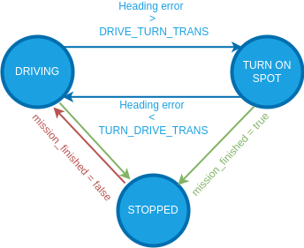

# Differential-steering Rovers

<Badge type="tip" text="main (PX4 v1.16+)" /> <Badge type="warning" text="Experimental" />

:::warning
Support for rover is [experimental](../airframes/index.md#experimental-vehicles).
Maintainer volunteers, [contribution](../contribute/index.md) of new features, new frame configurations, or other improvements would all be very welcome!
:::

A differential-steering rover's motion is controlled using a differential drive mechanism, where the left and right wheel speeds are adjusted independently to achieve the desired forward speed and yaw rate.

Forward motion is achieved by driving both wheels at the same speed in the same direction.
Rotation is achieved by driving the wheels at different speeds in opposite directions, allowing the rover to turn on the spot.

## Basic Setup

To start using the differential-steering rover:

1. Enable the module by flashing the [PX4 rover build](../frames_rover/index.md#flashing-the-rover-build) onto your flight controller.

2. In the [Airframe](../config/airframe.md) configuration select the _Generic Rover Differential_:

   

   Select the **Apply and Restart** button.

   ::: info
   If this airframe does not show up in the UI, it can alternatively be selected by setting the [SYS_AUTOSTART](../advanced_config/parameter_reference.md#SYS_AUTOSTART) parameter to `50000`.
   :::

3. Open the [Actuators Configuration & Testing](../config/actuators.md) to map the motor functions to flight controller outputs.

This is sufficient to drive the the rover in [manual mode](../flight_modes_rover/index.md#manual-mode) (see [Flight modes](../flight_modes_rover/index.md)).

::: note
The parameter [RD_MAN_YAW_SCALE](../advanced_config/parameter_reference.md#RD_MAN_YAW_SCALE) can be used to scale the manual input for the yaw rate.
:::

## Tuning (Basic)

This section goes through the basic parameters that need to be set to use all other features for the differential-steering rover.
Navigate to [Parameters](../advanced_config/parameters.md) in QGroundControl and set the following parameters:

1. [RD_WHEEL_TRACK](../advanced_config/parameter_reference.md#RD_WHEEL_TRACK) [m]: Measure the distance from the center of the right wheel to the center of the left wheel.  
   
2. [RD_MAX_SPEED](../advanced_config/parameter_reference.md#RD_MAX_SPEED) [m/s]: In manual mode, drive the rover with full throttle and enter the observed speed as the parameter.
3. [RD_MAX_YAW_RATE](../advanced_config/parameter_reference.md#RD_MAX_YAW_RATE) [deg/s]: This is the maximum yaw rate you want to allow for your rover. This will define the stick-to-yaw-rate mapping in acro mode aswell as setting an upper limit for the yaw rate in mission mode.
4. [RD_YAW_RATE_P](../advanced_config/parameter_reference.md#RD_YAW_RATE_P) and [RD_YAW_RATE_I](../advanced_config/parameter_reference.md#RD_YAW_RATE_I) [-]: Tuning parameters for the closed-loop yaw rate controller.

   ::: info
   This can be tuned by setting all previous parameters and then setting the rover to _acro mode_. Use the right stick to yaw the rover on the spot and then observe the desired and actual yaw rate in the flight log. Change parameters and iterate. Suggestion: Start the tuning process with [RD_YAW_RATE_I](../advanced_config/parameter_reference.md#RD_YAW_RATE_I) equal to zero and only set if necessary.
   :::

This is enough to start using the rover in acro mode. To start driving mission the parameters in [Tuning (Mission)](#tuning-mission) also must be set.

## Tuning (Mission)

:::warning
The parameters in [Tuning (Basic)](#tuning-basic) must also be set to drive missions!
:::

The module uses a control algorithm called pure pursuit, see [Mission Mode](../flight_modes_rover/index.md#mission-mode) for the basic tuning process.
The additional parameters are separated into the following sections:

### Mission Velocity

| Parameter                                                     | Description                                                                                                                  | Unit                |
| ------------------------------------------------------------- | ---------------------------------------------------------------------------------------------------------------------------- | ------------------- |
| [RD_MISS_SPD_DEF](#RD_MISS_SPD_DEF)                           | Sets the default velocity for the rover during the mission.                                                                  | $m/s$               |
| [RD_MAX_ACCEL](#RD_MAX_ACCEL) and [RD_MAX_JERK](#RD_MAX_JERK) | These parameters are used to calculate a velocity trajectory s.t. the rover comes to a smooth stop as it reaches a waypoint. | $m/s^2$ and $m/s^3$ |
| [RD_SPEED_P](#RD_SPEED_P) and [RD_SPEED_I](#RD_SPEED_I)       | Used to tune the closed-loop velocity controller during missions.                                                            | -                   |

### Yaw rate

The yaw rate setpoint is calculated by using the heading error calculated by the pure pursuit algorithm for a PID controller that can be tuned with [RD_HEADING_P](#RD_HEADING_P) and [RD_HEADING_I](#RD_HEADING_I).

::: note
There is some degree of overlap between this tuning and the pure pursuit controller gain set in [Mission Mode](../flight_modes_rover/index.md#mission-mode) as they both have an influence on how aggressive the rover will steer.
:::

### State machine

The module employs the following state machine to make full use of a differential-steering rovers ability to turn on the spot:  

These transition thresholds can be set with [RD_TRANS_DRV_TRN](#RD_TRANS_DRV_TRN) and [RD_TRANS_TRN_DRV](#RD_TRANS_TRN_DRV).

### Summary

To summarize, the following parameters affect the rover in mission mode:

| Parameter                                                                                                   | Description                                                    | Unit    |
| ----------------------------------------------------------------------------------------------------------- | -------------------------------------------------------------- | ------- |
| [RD_MISS_SPD_DEF](../advanced_config/parameter_reference.md#RD_MISS_SPD_DEF)    | Mission speed for the rover                                    | $m/s$   |
| [RD_MAX_ACCEL](../advanced_config/parameter_reference.md#RD_MAX_ACCEL)             | Maximum acceleration for the rover                             | $m/s^2$ |
| [RD_MAX_JERK](../advanced_config/parameter_reference.md#RD_MAX_JERK)                | Maximum jerk for the rover                                     | $m/s^3$ |
| [RD_SPEED_P](../advanced_config/parameter_reference.md#RD_SPEED_P)                   | Proportional gain for speed controller                         | -       |
| [RD_SPEED_I](../advanced_config/parameter_reference.md#RD_SPEED_I)                   | Integral gain for speed controller                             | -       |
| [RD_HEADING_P](../advanced_config/parameter_reference.md#RD_HEADING_P)             | Proportional gain for heading controller                       | -       |
| [RD_HEADING_I](../advanced_config/parameter_reference.md#RD_HEADING_I)             | Integral gain for heading controller                           | -       |
| [RD_TRANS_DRV_TRN](../advanced_config/parameter_reference.md#RD_TRANS_DRV_TRN) | Heading error threshold to switch from driving to spot turning | deg     |
| [RD_TRANS_TRN_DRV](../advanced_config/parameter_reference.md#RD_TRANS_TRN_DRV) | Heading error threshold to switch from spot turning to driving | deg     |
