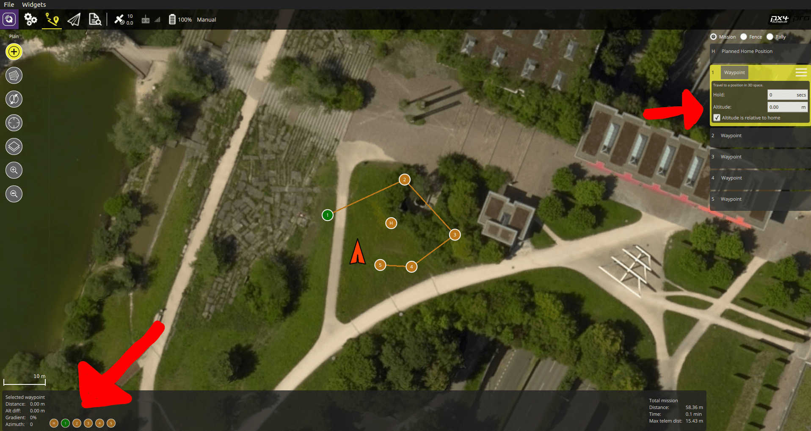

# Traxxas Stampede VXL

This vehicle was chosen to understand how a Pixhawk could be used for wheeled platforms. We chose to use a Traxxas vehicle as they are very popular and it is a very strong brand in the RC community. The idea was to develop a platform that allows for easy control of wheeled UGVs with an autopilot.

https://youtu.be/N3HvSKS3nCw


## Parts List

  * [Traxxas Stampede](https://traxxas.com/products/models/electric/stampede-vxl-tsm) All of this is used except for the top plastic cover.
  * [Pixhawk Mini](https://store.3dr.com/products/3dr-pixhawk)
  * [Power Module](https://store.3dr.com/products/10s-power-module)
  * [Telemetry Module (EU)](https://store.3dr.com/products/433-mhz-telemetry-radio) US version available in the website
  * [Spektrum Dxe Controller](http://www.spektrumrc.com/Products/Default.aspx?ProdId=SPM1000) or other PX4-compatible remotes
  * [Spektrum Quad Race Serial Receiver w/Diversity](http://www.spektrumrc.com/Products/Default.aspx?ProdID=SPM4648)
  * [PX4Flow](https://pixhawk.org/modules/px4flow)


## Assembly

The assembly consists of a wooden frame on which all the autopilot parts were attached. Tests showed that a better vibration insulation should be used, especially for the Pixhawk and the Flow module.


For this particular mounting we chose to use the clip supplied with the rover to attach the upper plate. For this, two supports were 3D printed. The CAD files are provided [here](https://github.com/PX4/Devguide/raw/master/assets/airframes/experimental/stampede/plane_holders.zip).

> **Warning** It is **HIGHLY RECOMMENDED** to set the ESC in training mode (see Traxxas Stampede Manual) so to reduce the power to 50%.


## Output connections

| PWM Output | Rate | Actuator |
| -- | -- | -- |
| MAIN1 | 50 Hz | Not connected |
| MAIN2 | 50 Hz | Steering servo |
| MAIN3 | 50 Hz | Not Connected |
| MAIN4 | 50 Hz | ESC input |
| MAIN5 | 50 Hz | Not Connected |
| MAIN6 | 50 Hz | Not Connected |
| MAIN7 | 50 Hz | Not Connected |
| MAIN8 | 50 Hz | Not Connected |


## Configuration

Rovers are configured using *QGroundControl* in the same way as any other vehicle.

The main rover-specific configuration is setting the correct frame:
1. Switch to the [Basic Configuration](../config/README.md) section in *QGroundControl*
1. Select the [Airframe](../config/airframe.md) tab. 
1. Scroll down the list to find the **Rover** icon. 
1. Choose **Traxxas stampede vxl 2wd** from the drop down list.


## Usage

At the current time, PX4 only supports MISSION and MANUAL modes when a RC remote is connected. To use the mission mode, first upload a new mission to the vehicle with QGC. Then, BEFORE ARMING, select `MISSION` and then arm. 

> **Warning** It is **_VERY IMPORTANT_** to do a mission composed **_ONLY_** of normal waypoints (i.e. **_NO TAKEOFF WAYPOINTS_**) and it is crucial to **_SET THE WAYPOINT HEIGHT OF EVERY WAYPOINT TO 0_** for a correct execution. Failing to do so will cause the rover to continuously spin around a waypoint.


A correct mission setup looks as follows


 
Since at the current state of development there is no obstacle avoidance, it is highly recommended to test missions in the simulator first to get acquainted with the software usage.


<!-- 

## Parameters

The current software provides an attitude controller and a position controller. These build on top of the fixed wing framework to move an Ackerman steered vehicle following GPS coordinates (real or fake). In order to this, 2 PIDs were implemented, one for the steering and the other for the speed.


These can be started by setting the following general parameters, which can be set with *QGroundControl* (instructions [here](../SetupView/Parameters.md)):
* SYS_AUTOSTART 50002
* MAV_TYPE 10
* MIS_LTRMIN_ALT 0.01
* MIS_TAKEOFF_ALT 0.01

This allows to start the Pixhawk configured for the Traxxas Stampede VXL. Then, the steering controller can be tuned with these parameters:
* GND_WR_D 0.1
* GND_WR_I 0.01
* GND_WR_IMAX 0.1
* GND_WR_P 1.5

The closed loop speed control can be enabled by setting 
* GND_SP_CTRL_MODE 1

which uses the second PID to control the speed with the following parameters:
* GND_SPEED_D 5
* GND_SPEED_I 0.01
* GND_SPEED_IMAX 0.5
* GND_SPEED_P 2.0
* GND_SPEED_THR_SC 0.1
* GND_SPEED_TRIM 4

If the closed loop is enabled the speed controller will take the GND_SPEED_TRIM as a target speed and will attempt to track it. If, on the other hand, GND_SP_CTRL_MODE is set to 0 then the speed controller will turn to a safe open loop setting of the throttle, controlled by these parameters:
* GND_THR_CRUISE 0.1
* GND_THR_IDLE 0
* GND_THR_MAX 0.5
* GND_THR_MIN 0

Then, general navigation parameters can be tuned for a better usage: 
* GND_L1_DIST 3
* NAV_ACC_RAD 0.5
-->

<!--
## Building the firmware

To build the firmware it is necessary to use the terminal (QGC is not supported yet). This can be done by following the instructions in [Building the Code section](../setup/building_px4.md) and uploading by running

```sh
cd ~/src/Firmware
make px4fmu-v2_default upload
```

### Simulation

Rover simulation is supported in Gazebo. 

> **Note** Simulation is non-trivial to set up. For more information see the Developer Guide here: [Gazebo > Ackerman Vehicle ](https://dev.px4.io/en/simulation/gazebo.html#ackerman-vehicle).
-->
