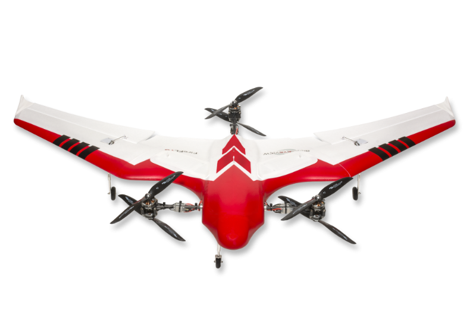
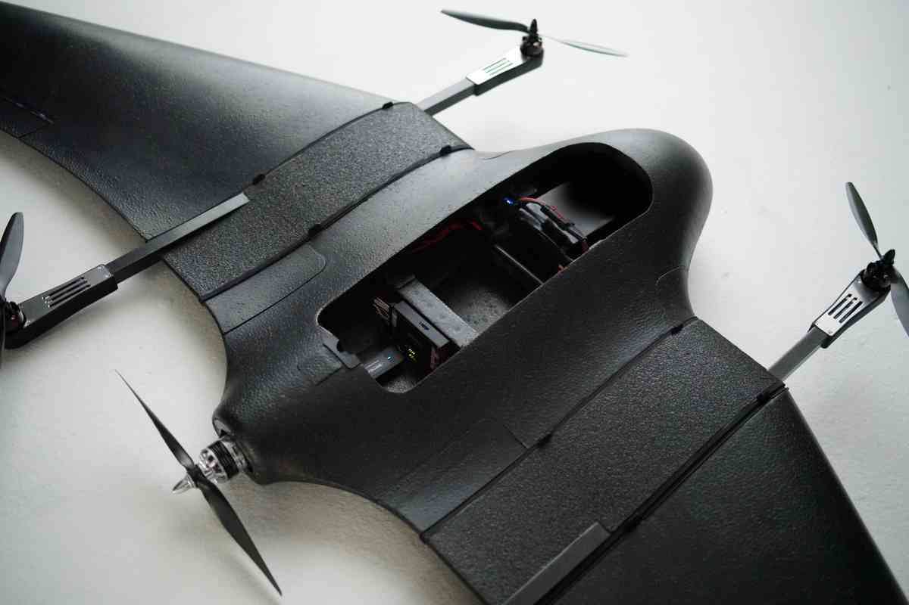

# VTOL Airframes

PX4 uses the term VTOL to refer to vehicles that support both forward flight like a fixed-wing aircraft ("airplane") and vertical take off and landing like a helicopter or multicopter.

VTOL vehicles offer the benefits of both multicopter and fixed-wing flight:
- **Vertical takeoff and landing:** Even inexperienced pilots can take off and land virtually anywhere.
- **Fast and efficient fixed wing flight:** Faster, further, and longer missions, carrying heavier payloads.
- **Hovering:** Steady platform for photography, structure scans etc.

This section contains build logs and instructions for assembling and configuring a number of VTOL vehicle frames.

## VTOL Types

PX4 supports the three most important/main VTOL configurations.

  

    
Tailsitter

    

    Rotors permanently in fixed wing-position. Takes off and lands on tail. Flips to fixed wing orientation for normal flight.
    
    <ul>
	  <li>Simple and robust</li>
	  <li>Fewer actuators</li>
      <li>Can be hard to control, particularly in wind</li>
      <li>Poor hovering</li>
    </ul>
    

  

  
Tiltrotor

  Rotors swivel 90 degrees to transition from multicopter to forward flight orientation. Takes off and lands on belly.
  

  
  <ul>
	<li>Mechanically more complex with additional actuators</li>
    <li>Easier to control than tailsitter</li>
	<li>Can hover</li>
  </ul>
  

  
Quadplane

  

  Separate rotors/flight controls for multicopter and forward flight. Takes off and lands on belly.
  
  <ul>
    <li>Most complex. More things to go wrong but better redundancy.</li>
    <li>Easiest to control</li>
    <li>Can hover</li>
	<li>Fuel engines can be used</li>
  </ul>
  

 

In general as mechanical complexity increases (from left to right) the frames become easier to use, but the cost and weight increase.
Each type has advantages and disadvantages, and there are successful commercial ventures based on all of them.

The complete set of supported configurations can be seen in [Airframes Reference > VTOL](../airframes/airframe_reference.md#vtol).

The VTOL codebase is the same codebase as for all other airframes and just adds additional control logic, in particular for transitions.

## Flying and Flight Modes

A VTOL aircraft can fly as either a multicopter or as fixed-wing vehicle.
Multicopter mode is mainly used for take off and landing while the fixed wing mode is used for efficient travel and/or mission execution.

The flight modes for VTOL vehicles are the same as for [multicopter](../getting_started/flight_modes.md#mc_flight_modes) when flying in MC mode and [fixed-wing](../getting_started/flight_modes.md#fw_flight_modes) when flying in FW mode.

The switch between modes is initiated either by the pilot using an RC switch or automatically by PX4 when needed in missions or other auto modes.

## Videos

VTOL Control & Airspeed Fault Detection (PX4 Developer Summit 2019)

@[youtube](https://youtu.be/37BIBAzD6fE)
<!-- 20190704 -->

### Tailsitter

[UAV Works VALAQ Patrol Tailsitter](https://www.valaqpatrol.com/tech-data/)

@[youtube](https://youtu.be/pWt6uoqpPIw)

[TBS Caipiroshka](../frames_vtol/vtol_tailsitter_caipiroshka_pixracer.md)

@[youtube](https://www.youtube.com/watch?v=acG0aTuf3f8&vq=hd720)

### Tiltrotor

[Convergence Tiltrotor](../frames_vtol/vtol_tiltrotor_eflite_convergence_pixfalcon.md)

@[youtube](https://youtu.be/E61P2f2WPNU)

### QuadPlane VTOL

[FunCub QuadPlane](../frames_vtol/vtol_quadplane_fun_cub_vtol_pixhawk.md)

@[youtube](https://www.youtube.com/watch?v=4K8yaa6A0ks&vq=hd720)

[Falcon Vertigo QuadPlane](../frames_vtol/vtol_quadplane_falcon_vertigo_hybrid_rtf_dropix.md)

@[youtube](https://youtu.be/h7OHTigtU0s)

[Ranger QuadPlane](../frames_vtol/vtol_quadplane_volantex_ranger_ex_pixhawk.md)

@[youtube](https://www.youtube.com/watch?v=7tGXkW6d3sA&vq=hd720)
