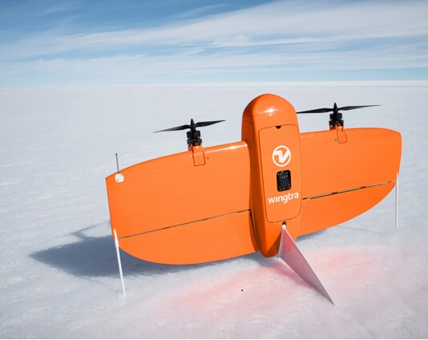

# Tailsitter VTOL

A **Tailsitter VTOL** is a [VTOL](../frames_vtol/README.md) vehicle that takes off and lands on its tail, but flips into the fixed-wing orientation for normal flight.
The tailsitter rotors are permanently fixed in position for forward flight.

Tailsitters [have the same benefits as other VTOL vehicles](../frames_vtol/README.md) vehicles: vertical takeoff and landing, fast and efficient fixed wing flight, and hovering.
Compared to other types of VTOL, tailsitters are simple and robust, but can be harder to control (particularly in wind).
They tradeoff efficiency in hover and forward flight because they use the same rotors for both.

This topic topic describes the different tailsitter configurations, and provides information required for assembly and PX4 setup.

## Tailsitter Types

PX4 supports two VTOL tailsitter configurations.
The [VTOL Duo Tailsitter](../airframes/airframe_reference.md#vtol-duo-tailsitter) has two rotors and uses elevons to flip from hover into fixed-wing flight.
The [VTOL Quad Tailsitter](../airframes/airframe_reference.md#vtol-quad-tailsitter) has four rotors like a quadcopter, and uses them (along with optional elevons, if present) to transition between modes.

  

    
<big>Duo Tailsitter</big>

    

    Two rotors and elevons.
     
      
    <ul>
      <li>More efficient in forward flight</li>
      <li>Harder to control in hover, particularly in wind</li>
      <li>Harder to tune/configure</li>
    </ul>
    

  

  
<big>Quad Tailsitter</big>

  Four rotors and optional elevons.
  

  
  <ul>
    <li>Easier and more stable hover flight</li>
    <li>Less compact form factor</li>
  </ul>
  

Quad Tailsitters are easier to fly in hover mode, and more stable - particularly in windy conditions.
Duo Tailsitters are generally more efficient in cruise flight (4 smaller propellers are less efficient than 2 larger ones) and physically more compact.

From a controls/aerodynamics perspective the Duo Tailsitter is much more complex in hover mode.
As a result they are much harder to tune for hover and transitioning. 

## Flying and Flight Modes

The flight modes for VTOL vehicles are the same as for [multicopter](../getting_started/flight_modes.md#mc_flight_modes) when flying in MC mode and [fixed-wing](../getting_started/flight_modes.md#fw_flight_modes) when flying in FW mode.

For more information see [VTOL > Flying and Flight Modes](../frames_vtol/README.md#flying-and-flight-modes)

## Assembly

Tailsitter VTOLs are assembled in much the same way as all other PX4 vehicles.
- Mounting and connecting the standard components of a PX4 system on the airframe.
- Vehicle specific motor and servo wiring for control signals and power.

### Basic Assembly

The standard components of a PX4 system include: flight controller, power system, GPS, external compass (highly recommended), radio control receiver (optional) and/or telemetry radio receiver (optional), airspeed sensor (optional on VTOL vehicles, but highly recommended).

Basic assembly of these components is covered here:
- [Basic Assembly](../assembly/README.md) - how to setup core components.
- [Peripherals](../peripherals/README.md) - additional information about peripherals (both required and optional).
  - [Airspeed Sensors](../sensor/airspeed.md): recommended for VTOL vehicles.
  
### Motor Mapping/Wiring

Flight controller outputs are connected to vehicle's motors controllers and/or flight control servos and actuators.
Motors and servos must also be powered separately from the flight controller.

The mapping between flight controller outputs and controls/motors is specified in the [Airframe Reference](../airframes/airframe_reference.md).
Since vehicles use different mechanisms for propulsion and control, the mapping depends on the specific vehicle configuration.

#### VTOL Quad Tailsitter

The mapping is defined in [Airframe Reference > VTOL Quad Tailsitter](../airframes/airframe_reference.md#vtol-quad-tailsitter).
It is reproduced below for your convenience.

- **MAIN1:** motor 1
- **MAIN2:** motor 2
- **MAIN3:** motor 4
- **MAIN4:** motor 5
- **MAIN5:** elevon left
- **MAIN6:** elevon right
- **MAIN7:** canard surface
- **MAIN8:** rudder

Note that "left" and "right" are from the perspective of a notional onboard pilot (or the vehicle from above, as shown below).

#### VTOL Duo Tailsitter

The mapping is defined in [Airframe Reference > VTOL Duo Tailsitter](../airframes/airframe_reference.md#vtol-duo-tailsitter).
It is reproduced below for your convenience.

- **MAIN1:** motor right
- **MAIN2:** motor left
- **MAIN5:** elevon right
- **MAIN6:** elevon left

Note that "left" and "right" are from the perspective of a notional onboard pilot (or the vehicle from above, as shown below).

## Airframe Configuration

VTOL configuration is covered in a number of sections:
- [Basic Configuration](../config/README.md) - Configuration that is common to all vehicle types (sensors, safety systems, batteries etc).
- [VTOL Specific Configuration](../config_vtol/README.md)
- [Peripheral Hardware](/peripherals/README.md) - Configuration for optional hardware and sensors
- [Advanced Configuration](../advanced_config/README.md): Additional configuration covering factory tuning and advanced and optional configuration.

## Build Logs

Build logs provide more detailed step-by-step guides of how others have assembled a PX4-based vehicle onto a real frame.
Build logs for other vehicle types can be useful, because much of the assembly is common to any vehicle.

Tailsitter-specific build logs are listed below:

- [TBS Caipiroshka Tailsitter Build (Pixracer)](../frames_vtol/vtol_tailsitter_caipiroshka_pixracer.md)

## Videos

This section contains videos that are specific to Tailsitter VTOL (videos that apply to all VTOL types can be found in [VTOL](../frames_vtol/README.md)).

---

[UAV Works VALAQ Patrol Tailsitter](https://www.valaqpatrol.com/tech-data/)

@[youtube](https://youtu.be/pWt6uoqpPIw)

[TBS Caipiroshka](../frames_vtol/vtol_tailsitter_caipiroshka_pixracer.md)

@[youtube](https://www.youtube.com/watch?v=acG0aTuf3f8&vq=hd720)

