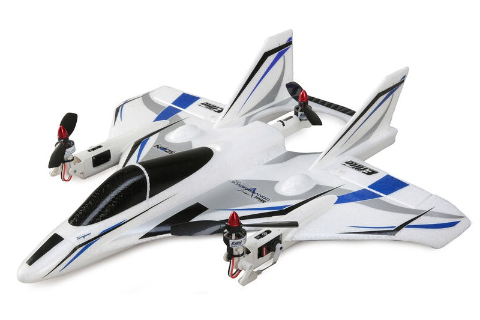

# Tiltrotor VTOL

A **Tiltrotor VTOL** is a [VTOL](../frames_vtol/README.md) vehicle that has rotors that can swivel 90 degrees, allowing them to act as either multicopter rotors or as fixed-wing propellers.

## Videos

This section contains videos that are specific to Tiltrotor VTOL (videos that apply to all VTOL types can be found in [VTOL](../frames_vtol/README.md)).

[Convergence Tiltrotor](../frames_vtol/vtol_tiltrotor_eflite_convergence_pixfalcon.md)

@[youtube](https://youtu.be/E61P2f2WPNU)
