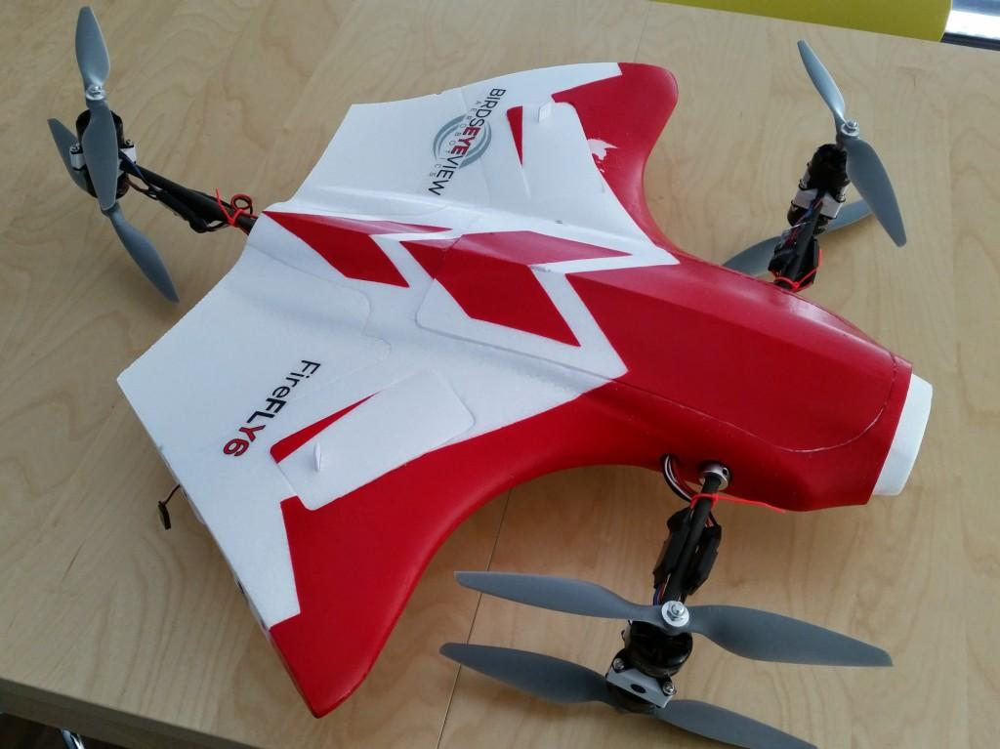
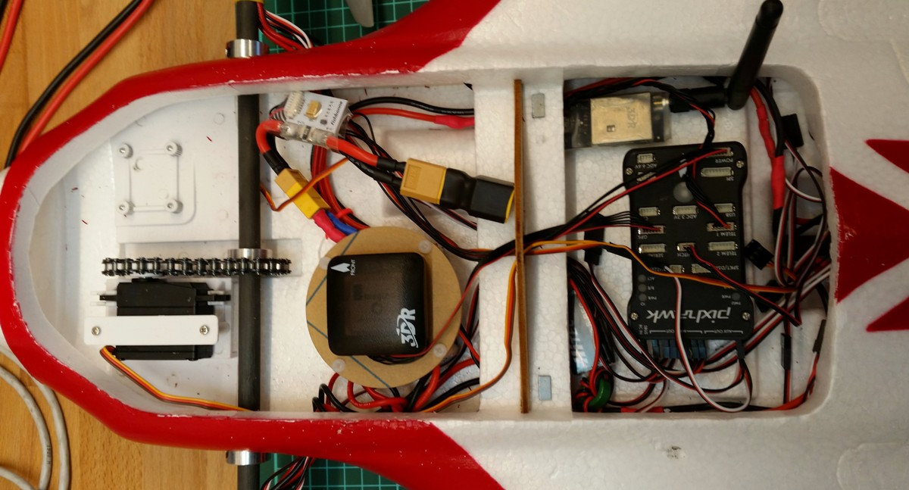

# BirdsEyeView FireFly Y6 Tiltrotor VTOL (Pixhawk)

The [BirdsEyeView FireFly Y6](https://www.birdseyeview.aero/products/firefly6-diy-25) Tiltrotor VTOL is a mapping, sports and cargo aircraft. This topic provides build
and configuration instructions for using the frame with the *Pixhawk* flight controller, including how to install and configure the PX4 autopilot using *QGroundControl*.

Key information:

- **Frame:** [BirdsEyeView FireFly Y6](https://www.birdseyeview.aero/products/firefly6-diy-25) DIY
- **Flight controller:** Pixhawk

## Airframe Setup

### Propeller orientation

Make sure that the propellers are installed correctly. These photos show
the direction and orientation of each prop. The top motors should spin
in a CCW direction while the motors at the bottom should spin in a CW
direction. The ESCs come pre-soldered to the motors so the direction of
rotation is fixed (counter clockwise on top and clockwise on the
bottom).

### Autopilot and peripherals wiring

The picture below shows one way of installing the Pixhawk, telemetry
radio and GPS. Note that if you place the GPS on top of the power
distribution board you probably should not use it as the external
magnetometer.

With the above there was significant magnetic disturbances on the
in-build magnetometer. If a bench test shows a drifting heading as you
throttle up (props on to get enough current flowing) you may need to use
the external GPS magnetometer and move it out onto the wing as shown in
this photo. Of course the cabling should be improved.

### Motor and Servo Setup

- Connect the motors to the main out rail (MAIN OUT) of the Pixhawk according to the scheme seen below
- Connect the tilt-rotor servo into AUX OUT1
- Connect the two elevon servos into AUX OUT2-3
- Connect the servo cable of the landing gear into AUX OUT4

## Firmware & Settings

Flash the stable firmware using *QGroundControl*. In *QGroundControl*
select the airframe configuration “**BirdsEyeView Aerobotics FireFly6**”
under “**VTOL Tiltrotor**” and then restart.

----

Should the airframe not be available you could set the following parameters and restart:

-   SYS\_AUTOSTART to 13002
-   SYS\_AUTOCONFIG to 1

After the reboot the configuration values will match the Standard Power
Pack. The following table serves as a guide when using the high
efficiency setup.

Parameter | Standard | High-Efficiency
--- | --- | ---
MC_PITCHRATE_FF | 0.0 | 0.0
MC_PITCHRATE_D | 0.004 | 0.005
MC_PITCHRATE_I | 0.002 | 0.09
MC_PITCHRATE_P | 0.14 | 0.125
MC_PITCH_P | 7.0 | 6.0
MC_ROLLRATE_FF | 0.0 | 0.0
MC_ROLLRATE_D | 0.005 | 0.003
MC_ROLLRATE_I | 0.002 | 0.06
MC_ROLLRATE_P | 0.19 | 0.125
MC_ROLL_P | 7.0 | 6.35
MC_YAW_FF | 0.5 | 0.3
MC_YAWRATE_FF | 0.0 | 0.0
MC_YAWRATE_D | 0.0 | 0.0
MC_YAWRATE_I | 0.02 | 0.0
MC_YAWRATE_P | 0.22 | 0.35
MC_YAW_P | 4.0 | 2.6

The system should now be ready for sensor calibration, at the end of which it should allow arming.

Notes:

-   Remember to assign the transition switch for switching to
    fixed-wing.
-   By default permanent stabilization is enabled. If you like fully
    manual flying in fixed-wing, set VT\_FW\_PERM\_STAB to 0.

The first thing to do is to try out the multicopter mode and get used to
the vehicle. Also the PID attitude controllers of the vehicle should be
tuned via *QGroundControl* before you proceed.
