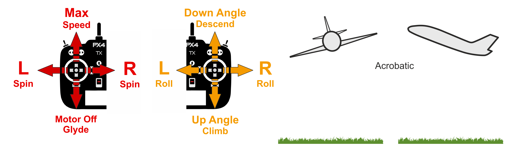

# Basic PX4 Flight Modes

During setup you will be asked to assign a Mode Switch on your Remote Control. With it you will be able to switch flight modes during flight and ask the aircraft to act in a different way depending on your needs.

Depending on the amount of assistance the Flight controller commits to you during flight you will have three main flight modes categories that you can use in PX4.

   **• Manual Modes**

   **•	Assisted Modes**

   **•	Autonomous Modes**

You have to remember that the flight modes have a slightly different way of behavior depending on the air-frame. There are differences between Airplane, Multicopter and VTOL modes so we will explain it in brief on this page.

Some modes are GPS guided (dependent) and we will use  symbol to denote them. In order to function properly and be enabled, this GPS dependent mode’s need a GPS lock and they cannot be enabled during flight without GPS Lock. 

> **Warning** It is highly advisable when you start  your aircraft at the flight field, to wait for GPS Lock prior arming to have a good Home Point Location Lock. You could see it when the Pixhawk LED starts blinking green or as a "H" symbol apears in the QGroundControl. Without Home Point GPS Lock it is impossible for the **Return to Launch / Return to Home** to be engaged and the craft will never come back in case of emergency.
You can read in depth about Flight Modes in the Flight Mode Setup page.

## COPTER FLIGHT MODES

## Manual Modes

Manual modes are with the least assistance from the PX4 autopilot or even without assistance to the pilot. 

**MANUAL - STABILIZED FLIGHT**

In Stabilized flight your Copter will hover in level flight once the Pitch and Roll sticks are at center position. You will have a full manual angle control over the multicopter. If your craft is perfectly set and balanced it will hold the altitude if Throttle is at 50% in the middle of the scale at calm weather. If there is a wind blowing the craft will drift in the direction of the wind and you have to control the throttle all the time during wind gusts to hold altitude. In order to perform a maneuver, you have to hold your Pitch, Roll and Yaw command, otherwise the craft will level itself the moment you release the control sticks.

 
 
**ACROBATIC**

For multicopter and helicopters it is the 3D flying mode. You can make flips and acrobatics. In acrobatic mode you have fully direct rate control over your aircraft. You have to remember that once you release Pitch and Roll to their center position the craft remains in its current state. You have to give back command in order to level it or change course and direction. In Acrobatic you have full rate control over the Roll, Pitch, Yaw and Throttle.

 
**RATITUDE**

In simple terms it is the mix between Stabilized and Acrobatic mode. So when the sticks are in the center the craft hovers. When you give small movements of the sticks arround the center up to the middle the craft will move gently and behave like in stabilize flight (angle control from the center to the middle). When you push the sticks beyound the middle to their extreme positions you have Acrobatic movement ie. you can perform flips and other figures (rate controll at extreme stick positions).
 

## Assisted Modes

Assisted modes are with more assistance to the pilot from the autopilot. Assisted modes need manual pilot input for the roll/pitch/yaw but automatically control the thrust to hold a fixed altitude at centered throttle stick. Vertical speed is controlled by manual input from the pilot to throttle stick but in a rate of descend and ascend fasion. The horizontal speed is controlled by the pitch/roll stick input.

**ALTITUDE: Altitude Control**

Altitude Mode is the safest non GPS guided mode appropriate for beginners learning how to fly. In this mode the altitude is controlled by the PX4 autopilot. At 50% throttle the aircraft will hold its current altitude. If you want to descend just lower the throttle bellow center or if you need to climb push the throttle over the center. The further the throttle stick is from the center position the larger the climb or descent rate you will have. In Altitude Mode you have full angle control over Pitch, Roll and Yaw. Once you center all the sticks you will have a hovering aircraft at the current altitude. If the wind blows the aircraft will drift in the direction of the wind.

 
 
 **POSITION: Position Control**

This is the GPS guided mode. You can fly in Position Mode if you need precision in flight, keeping course or hovering at a certain spot in the air, but still maintaining the control of the aircraft with your RC. The altitude is controlled by the PX4 autopilot. At 50% throttle the aircraft will hold its current altitude. If you want to descend just lower the throttle bellow center or if you need to climb push the throttle over the center. The further the throttle stick is from the center position the larger the climb or descent rate you will have. Position Mode is almost like Altitude Mode with full angle control over Pitch, Roll and Yaw. But Once you center all the sticks you will have a hovering aircraft at the current altitude and current GPS position. If the wind blows the aircraft will keep its direction of flight and course and will fight the wind.

 
 
## Autonomous Modes

Autonomous or Auto modes do not require any input from the pilot.
 
**PAUSE: Auto Pause**

You can use Pause in case of emergency or during a mission in order to Hold the aircraft at its current position autonomously, while you get time to access the situation either emergency or mission related. When you activate Pause mode with a pre-programmed switch, the copter or multi-copter will fix itself to its current GPS position and altitude and hover there. During hold you are not able to control the craft with the RC. It is the first line of defense if you loose control over the aircraft and panic.
 
 **RETURN: Return to Launch (RTL) / Return to Home**

The copter or multicopter will return in a straight line at the current altitude (if higher than the home position + hovering altitude) or on the hovering altitude (if higher than the current altitude), then lands automatically.
 
 **MISSION**

In Mission mode the aircraft will start the execution of a predefined Mission or Flight Plan. The Mission can be edited and uploaded to the aircraft with the software called Ground Control Station. The PX4 GCS is called QGroundControl and it can run on Windows, Linux, Android and iOS. You can download it from qgroundcontrol.com. The Mission upload to the aircraft can be done via USB connection on the ground or by wireless Data Link sometimes called Telemetry. During flight you can edit and change the current mission via this Data Link and monitor the current flight status and telemetry data live.
 
 **TAKE OFF**

When **Take Off** is activated the multicopter automatically will give thrust to the motors such to take off then climb vertically to a preset take off altitude, stop the climb and hover at place witing for pilot's command input.
 
 **LAND**

When **Land** is activated the multicopter automatically lower the throttle such that to stard slowly descending with preset vertical speed. When it touches the ground it will lower the throttle to minimum and disarm the craft.
 
 
## FIXED WING AIRCRAFT MODES

## Manual Modes

Manual modes are with the least assistance from the PX4 or even without assistance to the pilot. 

**STABILIZED**

In Stabilized flight your plane will maintain a level flight. It will fight against the wind gusts automatically and maintain a horizontal posture. You will have a full manual angle control over the craft. You will be able to glide with your airplane when you lower the Throttle to 0% and the motor stops. In order to perform a turn you have to hold the command throughout the maneuver because if you release the roll the plane will stop turning and level itself. It is the same for the Pitch and Yaw commands as well.

 
 
**ACROBATIC**

In acrobatic you fly like a plane without any stabilization electronics. You can make 360 rolls, flips, stalls and acrobatic figures. You have to remember that once you release Pitch and Roll to their center position the craft remains in its current state. You have to give back command in order to level it or change course and direction. The control is a Rate control over the Roll, Pitch, Yaw and Throttle.

 
 
## Assisted Modes

Assisted modes are with more assistance to the pilot from the autopilot. Assisted modes need manual pilot input for the roll/pitch/yaw but automatically control the thrust to sustain the desired speed at fixed altitude. With manual input from the pilot to the throttle stick he controls the speed of the airplane and with manual input to the pitch stick he controls the altitude.

**ALTITUDE: Altitude Control**

Altitude Mode is the safest non GPS guided mode appropriate for beginners learning how to fly. In this mode the altitude is controlled by the PX4 autopilot. The throttle will determine your airspeed, at 50% throttle the aircraft will hold its current altitude with a preset cruise air speed. You can descend and climb with pitch up and down command. In Altitude Mode you have full angle control over Pitch, Roll and Yaw. Once you center all the sticks you will have a level flying aircraft at the current altitude. If the wind blows the aircraft will drift in the direction of the wind.

 
 
 **POSITION: Position Control**

This is the GPS guided mode. You can fly in Position Mode if you need precision in flight, keeping straight line course, and still maintaining the control of the aircraft with your RC. The altitude is controlled by the PX4 autopilot. The throttle will determine your airspeed, at 50% throttle the aircraft will hold its current altitude with a preset cruise speed. You can descend and climb with pitch up and down command. Position Mode is almost like Altitude Mode with full angle control over Pitch, Roll and Yaw. But Once you center all the sticks you will have a level flying aircraft at the current altitude and GPS guided straight line course. If the wind blows the aircraft will keep its direction of flight and course and will fight the wind.

 
 
## Autonomous Modes

Autonomous or Auto modes do not require any input from the pilot.
 
**PAUSE: Auto Pause**

You can use Pause in case of emergency or during a mission in order to Hold the aircraft at its current position autonomously, while you get time to access the situation either emergency or mission related. When you activate Pause mode with a pre-programmed switch the airplane will start circling around at fixed GPS position, holding its current altitude during the circles. During hold you are not able to control the craft with the RC. It is the first line of defense if you loose control over the aircraft.
 
 
 **RETURN: Return to Launch (RTL) / Return to Home**

The aircraft returns to the home position and hovers in a circle above the home position at a preset altitude.
 
 **MISSION**

In Mission mode the aircraft will start the execution of a predefined Mission or Flight Plan. The Mission can be edited and uploaded to the aircraft with the software called Ground Control Station. The PX4 GCS is called QGroundControl and it can run on Windows, Linux, Android and iOS. You can download it from qgroundcontrol.com. The Mission upload to the aircraft can be done via USB connection on the ground or by wireless Data Link sometimes called Telemetry. During flight you can edit and change the current mission via this Data Link and monitor the current flight status and telemetry data live.
 
**TAKE OFF**

There are a couple of options for automatic Take Off for airplanes. We could perform take off from runway, from launch pad or throw the plane from hand. Different aspects from the take off process can be preset in the Prameters section in the PX4 autopilot.

**Hand throwing**

When **Take Off** is activated the autopilot will give thrust to the motor/s and the props will start spinning. Then we throw the airplane up and forward, it gives throttle and starts climbing to e preset take off altitude. Once the altitude is reached the airplane starts circling at the current altitude and wait for pilot's command input.

**Launch Pad take off**

**Runway take off**

**LAND**

## VERTICAL TAKE OFF AND LANDING AIRCRAFT (VTOL)

Basically VTOL aircraft can fly like a Copter or like an Airplane. The switch between both kinds of flying is done either by the pilot with a preset switch on the RC, or automatically by the autopilot in the Auto modes.

In the VTOL aircraft the Copter mode is used mainly for take off and landing while the Airplane Flight or Forward Flight is used for core flying or mission execution.

In copter mode the VTOL is controlled exactly like a [Copter/Multicopter](https://github.com/PX4/px4_user_guide/blob/master/en/getting_started/basic_flight_modes.md#copter-flight-modes)

In forward flight mode the VTOL is controlled exectly like an [Airplane - Fixed Wing Aircraft](https://github.com/PX4/px4_user_guide/blob/master/en/getting_started/basic_flight_modes.md#fixed-wing-aircraft-modes)

## Transition

The transition between the Copter and Fixed Wing modes is perrormed automaticaly by the autopilot on a transition switch command by the pilot or by Mission control.
