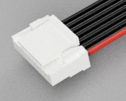

# Connector Types

Drones (and RC vehicles in general) use many different cables and connector types.

This topic identifies some of the more common connectors used, in particular those used in Pixhawk series flight controllers.

> **Note** There are far more connector types that we can cover here, but if you encounter any on your drone equipment, feel free to add them.

## Flight Controller Connectors

Pixhawk flight controllers commonly use [JST connectors](#jst_overview) from the series: [SH](http://www.jst-mfg.com/product/detail_e.php?series=231), [GH](http://www.jst-mfg.com/product/detail_e.php?series=105), [SUR](http://www.jst-mfg.com/product/detail_e.php?series=246).
Older Pixhawk controllers (FMUv2/3DR Pixhawk 1) used the [Hirose DF13 Series](https://www.digikey.com.au/en/product-highlight/h/hirose/df13-series).

The table below shows some specific examples:

Connector | Cable |  Part | Description
--- | --- | --- | ---
10-pin SH  |  | [SM10B-SRSS-TB(LF)(SN)](https://www.digikey.com/product-detail/en/jst-sales-america-inc/SM10B-SRSS-TB-LF-SN/455-1810-2-ND/926716) | NXP RT, Modal AI 
10-pin ARM     | ? | ? | FMUv2 (3DR Pixhawk 1) 
6-pin SUR  |  | ? [SM06B-SURS-TF(LF)(SN)](https://www.digikey.com/product-detail/en/jst-sales-america-inc/SM06B-SURS-TF-LF-SN/455-3591-1-ND/9921998) | Cube
6-pin SH    |  | [SM06B-SRSS-TB(LF)(SN)](https://www.digikey.com/product-detail/en/jst-sales-america-inc/455-1806-1-ND/926877) |[Pixhawk mini debug connector (DCD-Mini)](https://pixhawk.org/pixhawk-connector-standard/#dronecode_debug). Used in debug port for FMUv4/FMUv5.
6-pin GH    |  | [SM06B-GHS-TB(LF)(SN)](https://www.digikey.com/product-detail/en/jst-sales-america-inc/SM06B-GHS-TB-LF-SN/455-1568-2-ND/807790) | [Pixhawk Mini (DCM) connector standard](https://pixhawk.org/pixhawk-connector-standard/#dronecode_mini). Also (mis)used as debug port for early FMUv4 devices.
7-pin GH  |  | [SM07B-GHS-TB(LF)(SN)](https://www.digikey.com/product-detail/en/jst-sales-america-inc/SM07B-GHS-TB-LF-SN/455-1569-2-ND/807791) | NXP Debug port
10-pin SUR  |  | [SM10B-SURS-TF(LF)(SN)](https://www.digikey.com/product-detail/en/jst-sales-america-inc/SM10B-SURS-TF-LF-SN/455-2041-6-ND/1963588) | FMUv5x Debug port
6-pin DF13  |  | [DF13-6P-1.25DSA](https://www.digikey.com.au/product-detail/en/hirose-electric-co-ltd/DF13-6P-1.25DSA/H2195-ND/241769) | Pixhawk 1 connectors.

## Finding Compatible Cables/Connectors {#compatible_cables}

The easiest way to find a compatible connector is to search on the manufacturer part number in [Digi-Key](https://www.digikey.com/) (e.g. *SM10B-SRSS-TB(LF)(SN)*).
DigiKey usually shows compatible *Mating Products* and *Associated Product*.
For example, the [JST SH 6-pin connector](#jst_sh_6) has two compatible connectors:
- [SHR-06V-S-B](https://www.digikey.com.au/product-detail/en/jst-sales-america-inc/SHR-06V-S-B/455-1381-ND/759870): Has little handles (easier to get out). Use on open boards. 
- [SHR-06V-S](https://www.digikey.com.au/product-detail/en/jst-sales-america-inc/SHR-06V-S/455-1396-ND/759885): More space efficient. Use if the hole in the case is very narrow.

Once you have the part number you can search for the connector more widely (e.g. on Ebay).

Other ways to search are on manufacturer, series, pin number and/or pitch (e.g. "JST SH 6pin" and "JST 1.0mm 6 pin").

## Background

### JST Connectors {#jst_overview}

JST ("Japanese Solderless Terminal") connectors are categorized by "series" (there are a [many different JST connector series](http://www.jst-mfg.com/product/search_e.php?type=1&id=1&page=1)).
All connectors in a series share the same pin shape/size, inter-pin spacing ("pitch"), maximum current/voltage, and wire-size range.
The connectors within a series vary by number of pins, and in the size, shape, orientation, of the housing.

The table below show the JST series most commonly used on Pixhawk-based drones (all of these have just one row of pins).

JST Series | Pitch (mm) | Pin Shape | Wire Size (AWG) | Max current (A) | Max Voltage (V) | Lock | Description
--- | --- | --- | --- | --- | ---
[SH](http://www.jst-mfg.com/product/detail_e.php?series=231) | 1.0  | blade (rectangle) | 32 - 28 | 1 | 50 | N | Crimp style connector. Compact type.
[GH](http://www.jst-mfg.com/product/detail_e.php?series=105) | 1.25 | ? | 30 - 26  | 1 | 50 | Y | Crimp style connectors with secure locking device. 
[SUR](http://www.jst-mfg.com/product/detail_e.php?series=246) | 0.9 | ? | 32 - 36 | 0.5 | 30 | ? | Disconnectable type. IDC style, Compact type. Low-profile type.
