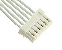
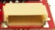
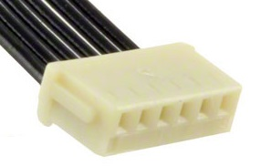

# Connector Types

Drones (and RC vehicles in general) use many different cables and connector types.

This topic identifies some of the more common connectors used, in particular those used in Pixhawk series flight controllers.

> **Note** There are far more connector types that we can cover here, but if you encounter any on your drone equipment, feel free to add them.

## Flight Controller

Pixhawk flight controllers commonly use JST ("Japanese Solderless Terminal") connectors.

JST divide their connectors into "series".
All connectors in a series share the same pin shape/size, inter-pin spacing ("pitch"), maximum current/voltage, and wire-size range.
The connectors within a series vary by number of pins, and in the size and shape of the housing.

There are a [huge number](http://www.jst-mfg.com/product/search_e.php?type=1&id=1&page=1) of JST series.

The image and table below show the JST series most commonly used on Pixhawk-based drones.  <!-- add current, voltage etc to table: SH and GH have one row of pins, 1A max current, 50V max voltage). SUR is different: .5A,30V** -->

JST Series | Pitch (mm) | Pin Shape | Wire Size (AWG) | Lock | Description
--- | --- | --- | --- | --- | ---
[SH](http://www.jst-mfg.com/product/detail_e.php?series=231) | 1.0  | blade (rectangle) | 32 - 28 | N | Crimp style connector. Compact type.
[GH](http://www.jst-mfg.com/product/detail_e.php?series=105) | 1.25 | | 30 - 26 | Y | Crimp style connectors with secure locking device. 
[SUR](http://www.jst-mfg.com/product/detail_e.php?series=246) | 0.9 | ? | ||

The table below shows some specific examples of ports and cables used on Pixhawk flight controllers.

Connector | Cable | Type | Part | Description
--- | --- | --- | --- | ---
 |  | 10-pin SH | [SM10B-SRSS-TB(LF)(SN)](https://www.digikey.com/product-detail/en/jst-sales-america-inc/SM10B-SRSS-TB-LF-SN/455-1810-2-ND/926716) | NXP RT, Modal AI 
    | ? | 10-pin ARM |? | FMUv2 (3DR Pixhawk 1) 
 |  | 6-pin SUR | ? [SM06B-SURS-TF(LF)(SN)](https://www.digikey.com/product-detail/en/jst-sales-america-inc/SM06B-SURS-TF-LF-SN/455-3591-1-ND/9921998) | Cube
   |  | 6-pin SH | [JST SH SM06B-SRSS-TB(LF)(SN)](https://www.digikey.com/product-detail/en/jst-sales-america-inc/455-1806-1-ND/926877) |[Pixhawk mini debug connector (DCD-Mini)](https://pixhawk.org/pixhawk-connector-standard/#dronecode_debug). Used in debug port for FMUv4/FMUv5.
   |  | 6-pin GH | [SM06B-GHS-TB(LF)(SN)](https://www.digikey.com/product-detail/en/jst-sales-america-inc/SM06B-GHS-TB-LF-SN/455-1568-2-ND/807790) | [Pixhawk Mini (DCM) connector standard](https://pixhawk.org/pixhawk-connector-standard/#dronecode_mini). Also (mis)used as debug port for early FMUv4 devices.
 |  | 7-pin GH | [SM07B-GHS-TB(LF)(SN)](https://www.digikey.com/product-detail/en/jst-sales-america-inc/SM07B-GHS-TB-LF-SN/455-1569-2-ND/807791) | NXP Debug port
 |  | 10-pin SUR | [SM10B-SURS-TF(LF)(SN)](https://www.digikey.com/product-detail/en/jst-sales-america-inc/SM10B-SURS-TF-LF-SN/455-2041-6-ND/1963588) | FMUv5x Debug port

