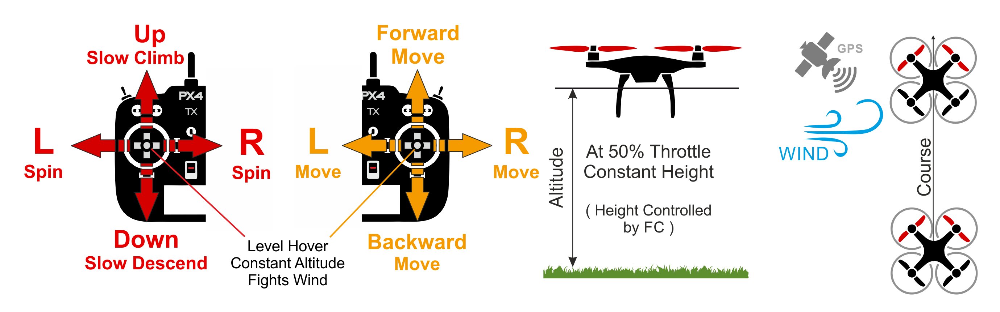
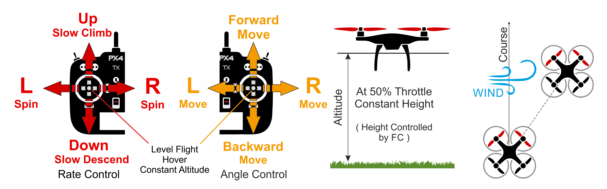
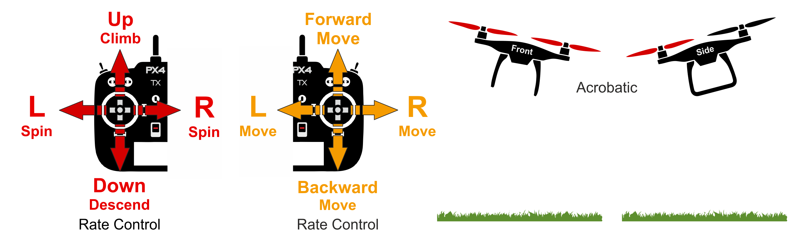
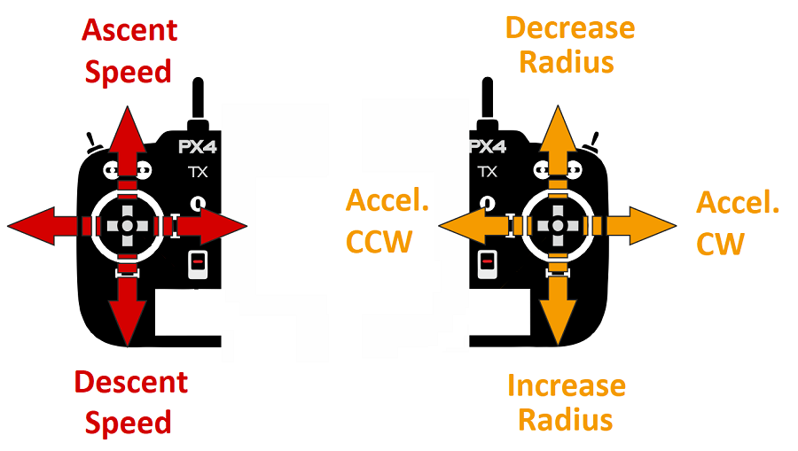
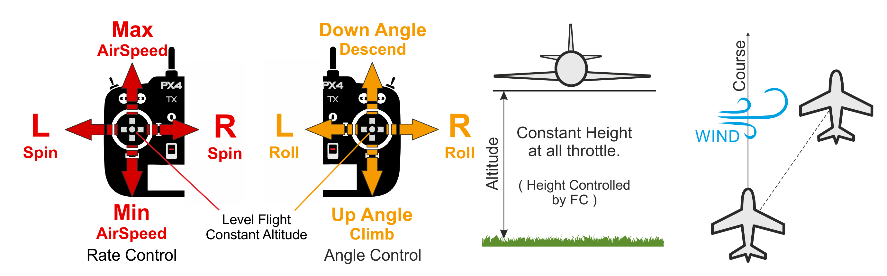
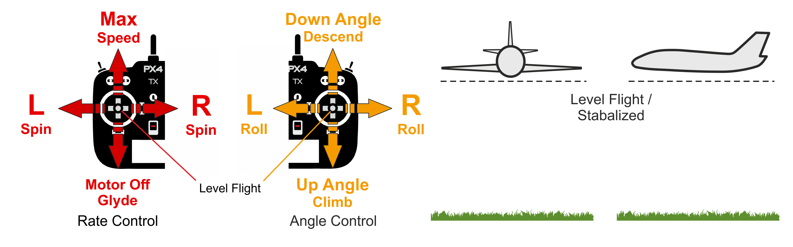
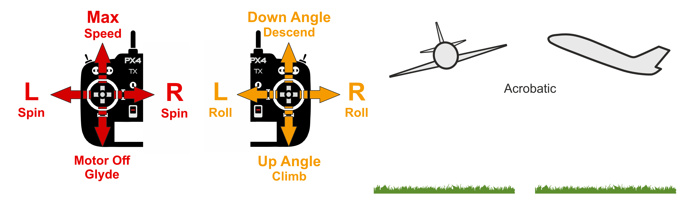

# PX4 Flight Modes Overview

Flight modes define how the autopilot responds to remote control input, and how it manages vehicle movement during fully autonomous flight.

The modes provide different types/levels of autopilot assistance to the user (pilot), ranging from automation of common tasks like takeoff and landing, through to mechanisms that make it easier to regain level flight, hold the vehicle to a fixed path or position, etc.

This topic provides an overview of the available the flight modes for different frame types: [multicopter/helicopter](#multicopter-helicopter) (MC), [fixed-wing](#fixed-wing) (FW), [VTOL](#vertical-take-off-and-landing-vtol), [rovers/boats](#rover-boat).

:::tip
More detailed information about specific flight modes can be found in [Flying > Flight Modes](../flight_modes/README.md).
:::

## Switching Between Modes

Pilots can transition between flight modes using switches on the remote control or with a ground control station (see [Flight Mode Configuration](../config/flight_mode.md)).

Not all flight modes are available on all vehicle types, and some modes behave differently on different vehicle types. 

Some flight modes make sense only under specific pre-flight and in-flight conditions (e.g. GPS lock, airspeed sensor, vehicle attitude sensing along an axis).
PX4 will not allow transitions to those modes until the right conditions are met.

Last of all, in multicopter [autonomous modes](#categories) RC stick movement will change the vehicle to [Position mode](../flight_modes/position_mc.md) [by default](../advanced_config/parameter_reference.md#COM_RC_OVERRIDE) (unless handling a critical battery failsafe).
Stick movement is ignored for autonomous fixed-wing flight.

## Autonomous and Manual Modes

Flight Modes are, generally speaking, either *manual* or *autonomous*. 
Manual modes are those where the user has control over vehicle movement via the RC control sticks (or joystick), while *autonomous* modes are fully controlled by the autopilot, and *require* no pilot/remote control input.

:::tip
Some manual modes may have autopilot-assisted mechanisms to make it easier to gain or restore controlled flight.
For example, most modes will level out the vehicle when the RC sticks are centered.
:::

Manual modes may further be divided into "easy" and "acrobatic" modes.
In the easy modes, roll and pitch sticks set the vehicle angle, resulting in left-right and forward-back movement *in the horizontal plane* (respectively).
Not only does this make movement predictable, but because angles are controlled, the vehicle is impossible to flip.
In acrobatic modes RC sticks control the rate of angular rotation (around the respective axis).
Vehicles can flip, and while more maneuverable, are harder to fly.

Fixed Wing:

* Manual-Easy: [Position](#position-mode-fw), [Altitude](#altitude-mode-fw), [Stabilized](#stabilized-mode-fw), [Manual](#manual-mode-fw)
* Manual-Acrobatic: [Acro](#acro-mode-fw)
* Autonomous: [Hold](#hold_fw), [Return](#return-mode-fw), [Mission](#mission-mode-fw), [Takeoff](#takeoff-mode-fw), [Land](#land-mode-fw), [Offboard](#offboard-mode-fw)

Multicopter/Helicopter:
* Manual-Easy: [Position](#position-mode-mc), [Altitude](#altitude-mode-mc), [Manual/Stabilized](#manual-stabilized-mode-mc), [Orbit](#orbit-mode-mc)
* Manual-Acrobatic: [Acro](#acro-mode-mc)
* Autonomous: [Hold](#hold-mode-mc), [Return](#return-mode-mc), [Mission](#mission-mode-mc), [Takeoff](#takeoff-mode-mc), [Land](#land-mode-mc), [Follow Me](#follow-me-mode-mc), [Offboard](#offboard-mode-mc)

Rover/Boat:

* Manual-Easy: [Manual](#manual-mode-ugv)
* Autonomous: [Mission](#mission-mode-ugv)

:::note
Only manual and mission modes are supported.
YOu can switch to any other mode but the behaviour will be the same as for manual mode.
:::

## Key

The icons below are used within the document:

Icon | Description
--- | ---
 | Manual mode. Remote control required.
 | Automatic mode. RC control is disabled by default except to change modes.
 | Position fix required (e.g. GPS, VIO, or some other positioning system).
 | Altitude required (e.g. from barometer, rangefinder).
[&nbsp;&nbsp;](#key_difficulty) | Flight mode difficulty (Easy to Hard)

## Multicopter / Helicopter

### Position Mode (MC)

&nbsp;&nbsp;

[Position mode](../flight_modes/position_mc.md) is an easy-to-fly RC mode in which roll and pitch sticks control _acceleration_ over ground in the vehicle's forward-back and left-right directions (similar to a car's accelerator pedal), and throttle controls speed of ascent-descent.
When the sticks are released/centered the vehicle will actively brake, level, and be locked to a position in 3D space — compensating for wind and other forces.

:::tip
Position mode is the safest manual mode for new fliers.
Unlike [Altitude](#altitude-mode-mc) and [Manual/Stabilized](#manual_stabilized_mc) modes the vehicle will stop when the sticks are centered rather than continuously drifting without constant manual guidance. 
:::

### Altitude Mode (MC)

&nbsp;&nbsp;

[Altitude mode](../flight_modes/altitude_mc.md) is a *relatively* easy-to-fly RC mode in which roll and pitch sticks control vehicle movement in the left-right and forward-back directions (relative to the "front" of the vehicle), yaw stick controls rate of rotation over the horizontal plane, and throttle controls speed of ascent-descent.

When the sticks are released/centered the vehicle will level and maintain the current *altitude*.
If moving in the horizontal plane the vehicle will continue until any momentum is dissipated by wind resistance.
If the wind blows the aircraft will drift in the direction of the wind.

:::tip
*Altitude mode* is the safest non-GPS manual mode for new fliers. It is just like [Manual/Stabilized](#manual_stabilized_mc) mode but additionally stabilizes the vehicle altitude when the sticks are released.
:::

### Manual/Stabilized Mode (MC)

&nbsp;&nbsp;

The [Manual/Stabilized](../flight_modes/manual_stabilized_mc.md) mode stabilizes the multicopter when the RC control sticks are centered.
To manually move/fly the vehicle you move the sticks outside of the center.

:::note
This multicopter mode is enabled if you set either *Manual* or *Stabilized* modes for an MC vehicle.
:::

When under manual control the roll and pitch sticks control the angle of the vehicle (attitude), the yaw stick controls the rate of rotation above the horizontal plane, and the throttle controls altitude/speed.

As soon as you release the control sticks they will return to the center deadzone.
The multicopter will level out and stop once the roll and pitch sticks are centered.
The vehicle will then hover in place/maintain altitude - provided it is properly balanced, throttle is set appropriately, and no external forces are applied (e.g. wind).
The craft will drift in the direction of any wind and you have to control the throttle to hold altitude.

### Acro Mode (MC)

&nbsp;&nbsp;

[Acro mode](../flight_modes/acro_mc.md) is the RC mode for performing acrobatic maneuvers e.g. rolls and loops.

The roll, pitch and yaw sticks control the rate of angular rotation around the respective axes and throttle is passed directly to control allocation.
When sticks are centered the vehicle will stop rotating, but remain in its current orientation (on its side, inverted, or whatever) and moving according to its current momentum.

<!-- image above incorrect: https://github.com/PX4/PX4-user_guide/issues/182 -->

### Orbit Mode (MC)

&nbsp;

The [Orbit mode](../flight_modes/orbit.md) allows you to command a multicopter (or VTOL in multicopter mode) to fly in a circle, yawing so that it always faces towards the center.

A GCS is *required* to enable the mode, and to set the center position and initial radius of the orbit.
By default the vehicle will then perform a slow ongoing orbit around the center position (1m/s) in a clockwise direction.
RC control is optional, and can be used to change the orbit altitude, radius, speed, and direction.

### Hold Mode (MC)

&nbsp;

[Hold mode](../flight_modes/hold.md) causes the multicopter to stop and hover at its current position and altitude (maintaining position against wind and other forces).
The mode can be used to pause a mission or to help regain control of a vehicle in an emergency.
It can be activated with a pre-programmed RC switch or the *QGroundControl* **Pause** button.

### Return Mode (MC)

&nbsp;

[Return mode](../flight_modes/return.md) causes the vehicle to fly a clear path to a safe location.
The mode may be activated manually (via a pre-programmed RC switch) or automatically (i.e. in the event of a [failsafe](../config/safety.md) being triggered).

The return behaviour depends on parameter settings, and may follow a mission path and/or mission landing pattern (if defined).
By default a mulitcopter will simply ascend to a safe height, fly to its home position, and then land. 

### Mission Mode (MC)

&nbsp;

[Mission mode](../flight_modes/mission.md) causes the vehicle to execute a predefined autonomous [mission](../flying/missions.md) (flight plan) that has been uploaded to the flight controller.
The mission is typically created and uploaded with a Ground Control Station (GCS) application.

:::tip
The PX4 GCS is called [QGroundControl](https://docs.qgroundcontrol.com/master/en/).
*QGroundControl* is the same application we use for [configuring PX4](../config/README.md).
:::

### Takeoff Mode (MC)

&nbsp;

[Takeoff](../flight_modes/takeoff.md) mode causes the multicopter to climb vertically to takeoff altitude and hover in position.

### Land Mode (MC)

&nbsp;

[Land mode](../flight_modes/land.md) causes the multicopter to land at the location at which the mode was engaged.

### Follow Me Mode (MC)

&nbsp;

[Follow Me mode](../flight_modes/follow_me.md) causes a multicopter to autonomously follow and track a user providing their current position setpoint.
Position setpoints might come from an Android phone/tablet running *QGroundControl* or from a MAVSDK app.

### Offboard Mode (MC)

&nbsp;

[Offboard mode](../flight_modes/offboard.md) causes the multicopter to obey a position, velocity or attitude setpoint provided over MAVLink. 

:::note
This mode is intended for vehicle control from companion computers and ground stations!
:::
 

## Fixed-Wing

### Position Mode (FW)

&nbsp;&nbsp;

[Position mode](../flight_modes/position_fw.md) is an easy-to-fly RC mode in which, when the sticks are released/centered, the vehicle will level and fly a straight line ground track in the current direction — compensating for wind and other forces. 

The throttle determines airspeed (at 50% throttle the aircraft will hold its current altitude with a preset cruise speed).
Pitch is used to ascend/descend. Roll, pitch and yaw are all angle-controlled (so it is impossible to roll over or loop the vehicle).

:::tip
Position mode is the safest fixed-wing manual mode for new fliers.
:::

### Altitude Mode (FW)

&nbsp;&nbsp;

[Altitude mode](../flight_modes/altitude_fw.md) makes it easier for users to control vehicle altitude, and in particular to reach and maintain a fixed altitude. The mode will not attempt to hold the vehicle course against wind.

The climb/descent rate is controlled via the pitch/elevator stick.
Once centered the autopilot latches onto the current altitude and will maintain it during yaw/roll, and at any airspeed.
The throttle input controls airspeed.
Roll and pitch are angle-controlled (so it is impossible to roll over or loop the vehicle).

When all remote control inputs are centered (no roll, pitch, yaw, and ~50% throttle) the aircraft will return to straight, level flight (subject to wind) and keep its current altitude.

:::tip
*Altitude mode* is the safest non GPS guided mode appropriate for beginners learning how to fly.
It is just like [Manual](#manual_fw) mode but additionally stabilizes the vehicle altitude when the pitch stick is released.
:::

### Stabilized Mode (FW)

&nbsp;&nbsp;

[Stabilized mode](../flight_modes/stabilized_fw.md) puts the vehicle into straight and level flight when the RC sticks are centered, maintaining the horizontal posture against wind (but not vehicle heading and altitude).

The vehicle climb/descends based on pitch input and performs a coordinated turn if the roll/pitch sticks are non-zero.
Roll and pitch are angle controlled (you can't roll upside down or loop).

:::tip
*Stabilized mode* is much easier to fly than [Manual mode](#manual_fw) because you can't roll or flip it, and it is easy to level the vehicle by centering the control sticks.
:::

The vehicle will glide if the throttle is lowered to 0% (motor stops).
In order to perform a turn the command must beheld throughout the maneuver because if the roll is released the plane will stop turning and level itself (the same is true for pitch and yaw commands).

### Acro Mode (FW)

&nbsp;&nbsp;

[Acro mode](../flight_modes/acro_fw.md) is the RC mode for performing acrobatic maneuvers e.g. rolls, flips, stalls and acrobatic figures.

The roll, pitch and yaw sticks control the rate of angular rotation around the respective axes and throttle is passed directly to control allocation.
When sticks are centered the vehicle will stop rotating, but remain in its current orientation (on its side, inverted, or whatever) and moving according to its current momentum.

### Manual Mode (FW)

&nbsp;&nbsp;

[Manual mode](../flight_modes/manual_fw.md) sends RC stick input directly to control allocation for "fully" manual control.

:::tip
This is the hardest mode to fly, because nothing is stabilised.
Unlike [Acro Mode](#acro_fw) if the RP stick is centered the vehicle will not automatically stop rotating around the axis - the pilot actually has to move the stick to apply force in the other direction.
:::

:::note
This is the only mode that overrides the FMU (commands are sent via the safety coprocessor).
It provides a safety mechanism that allows full control of throttle, elevator, ailerons and rudder via RC in the event of an FMU firmware malfunction.
:::

### Hold Mode (FW)

&nbsp;

[Hold](../flight_modes/hold.md) causes a fixed-wing vehicle to start circling around the current position at its current altitude.
The mode can be used to pause a mission or to help regain control of a vehicle in an emergency.
It can be activated with a pre-programmed RC switch or the *QGroundControl* **Pause** button.

### Return Mode (FW)

&nbsp;

[Return mode](../flight_modes/return.md) causes the vehicle to fly a clear path to a safe location.
The mode may be activated manually (via a pre-programmed RC switch) or automatically (i.e. in the event of a [failsafe](../config/safety.md) being triggered).

The return behaviour depends on parameter settings, and may follow a mission path and/or mission landing pattern (if defined).
By default a fixed wing vehicle will ascend to a safe height and use a mission landing pattern if one exists, otherwise it will fly to the home position and circle. 

### Mission Mode (FW)

&nbsp;

[Mission mode](../flight_modes/mission.md) causes the vehicle to execute a predefined autonomous [mission](../flying/missions.md) (flight plan) that has been uploaded to the flight controller.
The mission is typically created and uploaded with a Ground Control Station (GCS) application. 

:::tip
The PX4 GCS is called [QGroundControl](https://docs.qgroundcontrol.com/master/en/). *QGroundControl* is the same application we use for [configuring PX4](../config/README.md).
:::

### Takeoff Mode (FW)

&nbsp;

[Takeoff mode](../flight_modes/takeoff.md#fixed_wing) initiates the vehicle takeoff sequence.
The specific launch behaviour depends on the configured takeoff mode (catapult/hand-launch mode or runway takeoff mode).

### Land Mode (FW)

&nbsp;

[Land mode](../flight_modes/land.md) causes the vehicle to turn and land at the location at which the mode was engaged.
Fixed wing landing logic and parameters are explained in the topic: [Mission > Fixed Wing Mission Landing](../flight_modes/mission.md#fw-mission-landing).

### Offboard Mode (FW)

&nbsp;

[Offboard mode](../flight_modes/offboard.md) causes the fixed wing vehicle to obey attitude setpoints provided over MAVLink. 

:::note
This mode is intended for vehicle control from companion computers and ground stations!
:::

## Vertical Take Off and Landing (VTOL)

A VTOL aircraft can fly as either a multicopter or as fixed-wing vehicle.
The multicopter mode is mainly used for take off and landing while the fixed wing mode is used for efficient travel and/or mission execution.

Generally the flight modes for VTOL vehicles are the same as for [multicopter](#mc_flight_modes) when flying in MC mode and [fixed-wing](#fw_flight_modes) when flying in FW mode.

The switch between modes is initiated either by the pilot using an RC switch or automatically by PX4 when needed in the Auto modes.

A few notes:
- VTOL [Return mode](../flight_modes/return.md) uses a mission landing by default, if defined.

## Rover/Boat

Ground vehicles and boats only support [manual mode](#manual-mode-ugv) and [mission mode](#mission-mode-ugv) (while you can switch to other modes, these all behave just like manual mode).

### Manual Mode (UGV)

&nbsp;&nbsp;

:::note
This mode is enabled unless mission mode is set.
:::

*Manual mode* stops motors when RC control sticks are centered.
To move the vehicle you move the sticks outside of the center.

<!--
When under manual control the roll and pitch sticks control the angle of the vehicle (attitude), the yaw stick controls the rate of rotation above the horizontal plane, and the throttle controls altitude/speed.
-->

As soon as you release the control sticks they will return to the center deadzone.
This will turn off the motors and center the wheels/rudder.
There is no active braking, so the vehicle may continue to move until its momentum dissipates (and for a boat, continue to drift).

### Mission Mode (UGV)

&nbsp;

*Mission mode* <!-- [Mission mode](../flight_modes/mission.md) --> causes the vehicle to execute a predefined autonomous [mission](../flying/missions.md) (flight plan) that has been uploaded to the flight controller.
The mission is typically created and uploaded with a Ground Control Station (GCS) application.

:::tip
The PX4 GCS is called [QGroundControl](https://docs.qgroundcontrol.com/master/en/).
*QGroundControl* is the same application we use for [configuring PX4](../config/README.md).
:::

## Further Information

* [Flying > Flight Modes](../flight_modes/README.md) - Detailed technical explanation of all modes
* [Basic Configuration > Flight Modes](../config/flight_mode.md) - How to map RC control switches to specific flight modes
