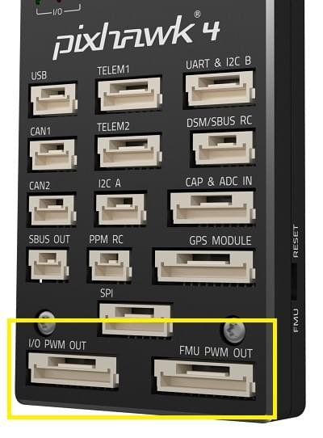

# Basic Concepts

This topic provides a basic introduction to drones and using PX4 (it is meant mostly for novice users but is also a good introduction for experienced users).

If you are already familiar with the basic concepts, you can move on to [Basic Assembly](../assembly/README.md) to learn how to wire your specific autopilot hardware.
To load firmware and set up the vehicle with _QGroundControl_, see [Basic Configuration](../config/README.md).

## What is a Drone?

A drone is an unmanned "robotic" vehicle that can be remotely or autonomously controlled.

Drones are used for many [consumer, industrial, government and military applications](https://px4.io/ecosystem/commercial-systems/).
These include (non exhaustively): aerial photography/video, carrying cargo, racing, search and surveying etc.

Different types of drones are used for air, ground, sea, and underwater.
These are (more formally) referred to as Unmanned Aerial Vehicles (UAV), Unmanned Aerial Systems (UAS), Unmanned Ground Vehicles (UGV), Unmanned Surface Vehicles (USV), Unmanned Underwater Vehicles (UUV).

The "brain" of the drone is called an autopilot.
It consists of _flight stack_ software running on _vehicle controller_ ("flight controller") hardware.

Some drones also have a separate on-vehicle [companion computer](#offboard-companion-computer).
These provide powerful general-purpose computing platform for networking, computer vision, and many other tasks.

## PX4 Autopilot

[PX4](https://px4.io/) is powerful open source autopilot _flight stack_.

Some of PX4's key features are:

- Controls [many different vehicle frames/types](../airframes/airframe_reference.md), including: aircraft (multicopters, fixed-wing aircraft and VTOLs), ground vehicles and underwater vehicles.
- Great choice of hardware for [vehicle controller](#vehicle-flight-controller-board), sensors and other peripherals.
- Flexible and powerful [flight modes](#flight-modes) and [safety features](#safety-settings-failsafe).
- Robust and deep integration with [companion computers](#offboard-companion-computer) and [robotics APIs](../robotics/README.md) ([ROS 2](../ros/ros2_comm.md), [MAVSDK](http://mavsdk.mavlink.io)).

PX4 is a core part of a broader drone platform that includes the [QGroundControl](#qgroundcontrol) ground station, [Pixhawk hardware](https://pixhawk.org/), and [MAVSDK](http://mavsdk.mavlink.io) for integration with companion computers, cameras and other hardware using the MAVLink protocol.
PX4 is supported by the [Dronecode Project](https://www.dronecode.org/).

## QGroundControl

The Dronecode ground control station is called [QGroundControl](http://qgroundcontrol.com/).
You can use _QGroundControl_ to load (flash) PX4 onto the [vehicle control hardware](flight_controller_selection.md), you can setup the vehicle, change different parameters, get real-time flight information and create and execute fully autonomous missions.

_QGroundControl_ runs on Windows, Android, MacOS or Linux. Download and install it from [here](http://qgroundcontrol.com/downloads/).

## Vehicle/Flight Controller Board

PX4 was initially designed to run on [Pixhawk Series](../flight_controller/pixhawk_series.md) controllers, but can now run on Linux computers and other hardware.
You should select a board that suits the physical constraints of your vehicle, the activities you wish to perform, and of course cost.

For more information see: [Flight Controller Selection](flight_controller_selection.md).

## Sensors

PX4 uses sensors to determine vehicle state (needed for stabilization and to enable autonomous control).
The system _minimally requires_ a gyroscope, accelerometer, magnetometer (compass) and barometer.
A GPS or other positioning system is needed to enable all automatic flight modes and some manual modes.
Fixed-wing and VTOL-vehicles should additionally include an airspeed sensor (very highly recommended).

For more information see:

- [Sensors](../getting_started/sensor_selection.md)
- [Peripherals](../peripherals/README.md)

## Outputs: Motors, Servos, Actuators

PX4 uses _outputs_ to control: motor speed (e.g. via [ESC](#escs-motors)), flight surfaces like ailerons and flaps, camera triggers, parachutes, grippers, and many other types of payloads.

The outputs may be PWM ports or DroneCAN nodes (e.g. DroneCAN [motor controllers](../dronecan/escs.md)).
The images below show the PWM output ports for [Pixhawk 4](../flight_controller/pixhawk4.md) and [Pixhawk 4 mini](../flight_controller/pixhawk4_mini.md).

 

The outputs are divided into `MAIN` and `AUX` outputs, and individually numbered (i.e. `MAINn` and `AUXn`, where `n` is 1 to usually 6 or 8).
They might also be marked as `IO PWM Out` and `FMU PWM OUT` (or similar).

:::warning
A flight controller may only have `MAIN` PWM outputs (like the _Pixhawk 4 Mini_), or may have only 6 outputs on either `MAIN` or `AUX`.
Ensure that you select a controller that has enough ports/outputs for your [airframe](../airframes/airframe_reference.md).
:::

You can connect almost any output to any motor or other actuator, by assigning the associated function ("Motor 1") to the desired output ("AUX1") in QGroundControl: [Actuator Configuration and Testing](../config/actuators.md).
Note that the functions (motor and control surface actuator positions) for each frame are given in the [Airframe Reference](../airframes/airframe_reference.md).

**Notes:**

- Pixhawk controllers have an FMU board and _may_ have a separate IO board.
  If there is an IO board, the `AUX` ports are connected directly to the FMU and the `MAIN` ports are connected to the IO board.
  Otherwise the `MAIN` ports are connected to the FMU, and there are no `AUX` ports.
- The FMU output ports can use [D-shot](../peripherals/dshot.md) or _One-shot_ protocols (as well as PWM), which provide much lower-latency behaviour.
  This can be useful for racers and other airframes that require better performance.
- There are only 6-8 outputs in `MAIN` and `AUX` because most flight controllers only have this many PWM/Dshot/Oneshot outputs.
  In theory there can be many more outputs if the bus supports it (i.e. a UAVCAN bus is not limited to this few nodes).

## ESCs & Motors

Many PX4 drones use brushless motors that are driven by the flight controller via an Electronic Speed Controller (ESC)
(the ESC converts a signal from the flight controller to an appropriate level of power delivered to the motor).

For information about what ESC/Motors are supported by PX4 see:

- [ESC & Motors](../peripherals/esc_motors.md)
- [ESC Calibration](../advanced_config/esc_calibration.md)
- [ESC Firmware and Protocols Overview](https://oscarliang.com/esc-firmware-protocols/) (oscarliang.com)

## Battery/Power

PX4 drones are mostly commonly powered from Lithium-Polymer (LiPo) batteries.
The battery is typically connected to the system using a [Power Module](../power_module/README.md) or _Power Management Board_, which provide separate power for the flight controller and to the ESCs (for the motors).

Information about batteries and battery configuration can be found in [Battery Estimation Tuning](../config/battery.md) and the guides in [Basic Assembly](../assembly/README.md) (e.g. [Pixhawk 4 Wiring Quick Start > Power](../assembly/quick_start_pixhawk4.md#power)).

## Manual Control

Pilots can control a vehicle manually using either a [Radio Control (RC) System](#radio-control-rc) or a [Joystick/Gamepad](#gcs-joystick-controller) controller connected via QGroundControl.

:::note
PX4 does not _require_ a manual control system for autonomous flight modes.
:::

:::note
Both methods can be used for most manual control use cases, such as surveys.
RC systems are recommended when first tuning/testing a new frame design or when flying racers/acrobatically (and in other cases where low latency is important).
:::

### Radio Control (RC)

[Radio Control \(RC\)](../getting_started/rc_transmitter_receiver.md) systems can be used to manually control PX4.

They consist of a ground based RC controller that uses a radio transmitter to communicate stick/control positions to a receiver on the vehicle.
Some RC systems can additionally receive telemetry information back from the autopilot.

[RC System Selection](../getting_started/rc_transmitter_receiver.md) explains how to choose an RC system. Other related topics include:

- [Radio/Remote Control Setup](../config/radio.md) - Remote control configuration in _QGroundControl_.
- [Manual Flying](../flying/basic_flying.md) - Learn how to fly with a remote control.
- [FrSky Telemetry](../peripherals/frsky_telemetry.md) - Set up the RC transmitter to receive telemetry/status updates from PX4.

### GCS Joystick Controller

A [Joystick/Gamepad](../config/joystick.md) connected through _QGroundControl_ can also be used to manually control PX4.

With this approach, QGroundControl translates stick/button information from a connected Joystick into MAVLink-protocol messages, which are then sent to PX4 using the shared telemetry radio link.
The telemetry radio must have sufficient bandwidth for both manual control and other telemetry messages, and of course this approach means that you must have a ground station running QGroundControl.

Joysticks are also used to manually fly PX4 in a [simulator](../simulation/README.md).

:::note
Controllers like the _Auterion_ [Skynav](https://auterion-gs.com/skynav/) and _UAVComponents_ [MicroNav](https://uxvtechnologies.com/ground-control-stations/micronav/) integrate QGC and a Joystick, and connect the vehicle via a high bandwidth telemetry radio link.

:::

## Safety Switch

Some vehicles have a _safety switch_ that must be engaged before the vehicle can be [armed](#arming-and-disarming) (when armed, motors are powered and propellers can turn).

Commonly the safety switch is integrated into a GPS unit, but it may also be a separate physical component.

## Data/Telemetry Radios

[Data/Telemetry Radios](../telemetry/README.md) can provide a wireless MAVLink connection between a ground control station like _QGroundControl_ and a vehicle running PX4.
This makes it possible to tune parameters while a vehicle is in flight, inspect telemetry in real-time, change a mission on the fly, etc.

## Offboard/Companion Computer

A [Companion Computer](../companion_computer/README.md) (also referred to as "mission computer" or "offboard computer"), is a separate on-vehicle computer that communicates with PX4 to provide higher level command and control.

The companion computer usually runs Linux, as this is a much better platform for "general" software development, and allows drones to leverage pre-existing software for computer vision, networking, and so on.

The flight controller and companion computer may be pre-integrated into a single baseboard, simplifying hardware development, or may be separate, and are connected via a serial cable, Ethernet cable, or wifi.
The companion computer typically communicates with PX4 using a high level Robotics API such as [MAVSDK](https://mavsdk.mavlink.io/) or [ROS 2](../ros/ros2_comm.md).

Relevant topics include:

- [Companion Computers](../companion_computer/README.md)
- [Off-board Mode](../flight_modes/offboard.md) - Flight mode for offboard control of PX4 from a GCS or companion computer.
- [Robotics APIs](../robotics/README.md)

## SD Cards (Removable Memory)

PX4 uses SD memory cards for storing [flight logs](../getting_started/flight_reporting.md), and they are also required in order to use UAVCAN peripherals and fly [missions](../flying/missions.md).

By default, if no SD card is present PX4 will play the [format failed (2-beep)](../getting_started/tunes.md#format-failed) tune twice during boot (and none of the above features will be available).

::: tip
The maximum supported SD card size on Pixhawk boards is 32GB.
The _SanDisk Extreme U3 32GB_ and _Samsung EVO Plus 32_ are [highly recommended](../dev_log/logging.md#sd-cards).
:::

SD cards are never-the-less optional.
Flight controllers that do not include an SD Card slot may:

- Disable notification beeps are disabled using the parameter [CBRK_BUZZER](../advanced_config/parameter_reference.md#CBRK_BUZZER).
- [Stream logs](../dev_log/logging.md#log-streaming) to another component (companion).
- Store missions in RAM/FLASH.
  <!-- Too low-level for this. But see FLASH_BASED_DATAMAN in  Intel Aero: https://github.com/PX4/PX4-Autopilot/blob/main/boards/intel/aerofc-v1/src/board_config.h#L115 -->

## Arming and Disarming

A vehicle is said to be _armed_ when all motors and actuators are powered, and _disarmed_ when nothing is powered.
There is also a _prearmed_ state when only actuators are powered.

:::warning
Armed vehicles can be dangerous as propellors will be spinning.
:::

Arming is triggered by default (on Mode 2 transmitters) by holding the RC throttle/yaw stick on the _bottom right_ for one second (to disarm, hold stick on bottom left).
It is alternatively possible to configure PX4 to arm using an RC switch or button (and arming MAVLink commands can also be sent from a ground station).

To reduce accidents, vehicles should be armed as little as possible when the vehicle is on the ground.
By default, vehicles are:

- _Disarmed_ or _Prearmed_ (motors unpowered) when not in use, and must be explicitly _armed_ before taking off.
- Automatically disarm/prearm if the vehicle does not take off quickly enough after arming (the disarm time is configurable).
- Automatically disarm/prearm shortly after landing (the time is configurable).
- Arming is prevented if the vehicle is not in a "healthy" state.
- Arming is prevented if the vehicle has a [safety switch](#safety-switch) that has not been engaged.
- Arming is prevented if a VTOL vehicle is in fixed-wing mode ([by default](../advanced_config/parameter_reference.md#CBRK_VTOLARMING)).

When prearmed you can still use actuators, while disarming unpowers everything.
Prearmed and disarmed should both be safe, and a particular vehicle may support either or both.

:::tip
Sometimes a vehicle will not arm for reasons that are not obvious.
QGC v4.2.0 (Daily build at time of writing) and later provide an arming check report in [Fly View > Arming and Preflight Checks](https://docs.qgroundcontrol.com/master/en/qgc-user-guide/fly_view/fly_view.html#arm).
From PX4 v1.14 this provides comprehensive information about arming problems along with possible solutions.
:::

A detailed overview of arming and disarming configuration can be found here: [Prearm, Arm, Disarm Configuration](../advanced_config/prearm_arm_disarm.md).

## Flight Modes

Flight modes provide different types/levels of vehicle automation and autopilot assistance to the user (pilot).
_Autonomous modes_ are fully controlled by the autopilot, and require no pilot/remote control input.
These are used, for example, to automate common tasks like takeoff, returning to the home position, and landing.
Other autonomous modes execute pre-programmed missions, follow a GPS beacon, or accept commands from an offboard computer or ground station.

_Manual modes_ are controlled by the user (via the RC control sticks/joystick) with assistance from the autopilot.
Different manual modes enable different flight characteristics - for example, some modes enable acrobatic tricks,
while others are impossible to flip and will hold position/course against wind.

:::tip
Not all flight modes are available on all vehicle types, and some modes can only be used when specific conditions have been met (e.g. many modes require a global position estimate).
:::

An overview of the available flight modes for each vehicle can be found below:

- [Flight Modes (Multicopter)](../flight_modes_mc/README.md)
- [Flight Modes (Fixed-Wing)](../flight_modes_fw/README.md)
- [Flight Modes (VTOL)](../flight_modes_vtol/README.md)
- [Flight Modes (Rover)](../flight_modes_rover/README.md)

Instructions for how to set up your remote control switches to enable different flight modes is provided in [Flight Mode Configuration](../config/flight_mode.md).

## Safety Settings (Failsafe)

PX4 has configurable failsafe systems to protect and recover your vehicle if something goes wrong!
These allow you to specify areas and conditions under which you can safely fly, and the action that will be performed if a failsafe is triggered (for example, landing, holding position, or returning to a specified point).

:::note
You can only specify the action for the _first_ failsafe event.
Once a failsafe occurs the system will enter special handling code, such that subsequent failsafe triggers are managed by separate system level and vehicle specific code.
:::

The main failsafe areas are listed below:

- Low Battery
- Remote Control (RC) Loss
- Position Loss (global position estimate quality is too low).
- Offboard Loss (e.g. lose connection to companion computer)
- Data Link Loss (e.g. lose telemetry connection to GCS).
- Geofence Breach (restrict vehicle to flight within a virtual cylinder).
- Mission Failsafe (prevent a previous mission being run at a new takeoff location).
- Traffic avoidance (triggered by transponder data from e.g. ADSB transponders).

For more information see: [Safety](../config/safety.md) (Basic Configuration).

## Heading and Directions

All the vehicles, boats and aircraft have a heading direction or an orientation based on their forward motion.

:::note
For a VTOL Tailsitter the heading is relative to the multirotor configuration (i.e. vehicle pose during takeoff, hovering, landing).
:::

It is important to know the vehicle heading direction in order to align the autopilot with the vehicle vector of movement.
Multicopters have a heading even when they are symmetrical from all sides!
Usually manufacturers use a colored props or colored arms to indicate the heading.

In our illustrations we will use red coloring for the front propellers of multicopter to show heading.

You can read in depth about heading in [Flight Controller Orientation](../config/flight_controller_orientation.md)
