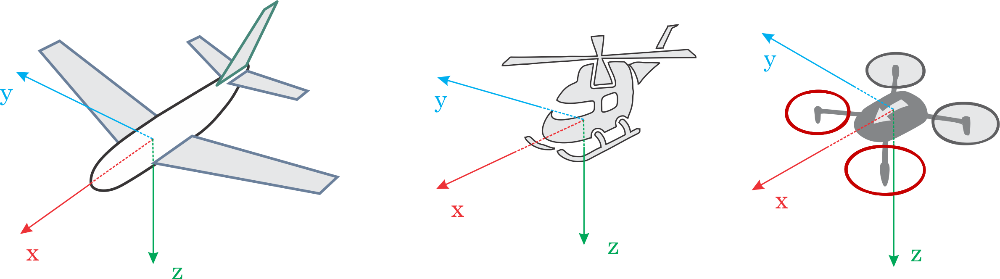

# PX4 Basic Concepts

In this chapter we will introduce you to the most basic concepts of setting up and controlling your drone. This section is meant mostly for novice users but it is a good quick start introduction to PX4 autopilot concepts for the experienced users as well.

## PX4 Autopilot

PX4 is platform independent autopilot software (or a software stack/firmware) that can fly or drive Unmanned Aerial or Ground Vehicles (UAV/UGV). It is loaded (flashed) on certain [vehicle control hardware](flight_controller_selection.md) and together with Ground Control Station it makes a fully autonomous autopilot system. 

The PX4 ground control station is called  [QGroundControl](http://qgroundcontrol.com/) and is integral part of the PX4 Autopilot System. [QGroundControl](http://qgroundcontrol.com/) can run on [Windows, OS X or Linux](http://qgroundcontrol.com/downloads/). With the help of  QGroundControl you can load (flash) the PX4 on to the [vehicle control hardware](flight_controller_selection.md), you can setup the vehicle, change different parameters, get real-time flight information and create and execute fully autonomous missions.

## Heading and Directions

All the vehicles, boats and aircraft have a heading direction or an orientation based on their forward motion.

It is important to know the vehicle heading direction in order to align the autopilot with the vehicle vector of movement. Despite it is not obvious, Multicopters have a heading despite they are symmetrical from all sides. Usually manufacturers use a colored props or colored arms to indicate the heading.

In our illustrations we will use red coloring for the front propellers of multicopter to show heading.

You can read in depth about heading in [Flight Controller Orientation](../config/flight_controller_orientation.md)

## PX4 Connections

In order to set up, control and interact with your PX4 drone you need to connect with it. There are tree main types of connection you can have to Pixhawk hardware and respectively to PX4:

* [Remote Control \(RC\) Connection](TBD) - Connection between the RC handset and vehicle-based receiver that you use to manually direct the vehicle.
* [Data/Telemetry Connection](TBD) - Connection between QGroundControl and your drone by Data Radio, Wifi or USB cable.
* Off-board Connection - A data connection between PX4 and external microcomputer that can control PX4.

You can follow the links to see detailed explanation on each connection type.

## Remote Control

A remote control (RC) radio system is required if you want to *manually* control your vehicle (PX4 does not require a radio system for autonomous flight modes). A radio system consists of a transmitter with the operator that communicates with a receiver based on the vehicle. 

To pick a radio system see: [RC System Selection](../getting_started/rc_transmitter_receiver.md). To learn more about flying with an RC transmitter see: [Flying 101](../flying/basic_flying.md).