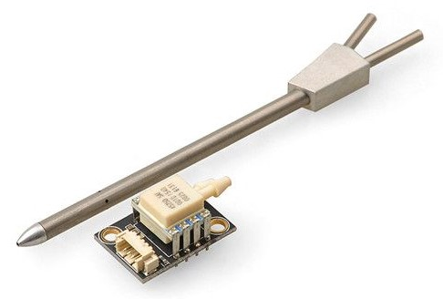
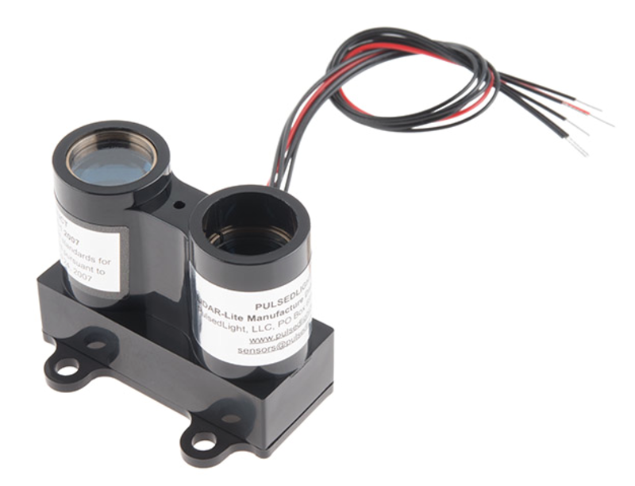
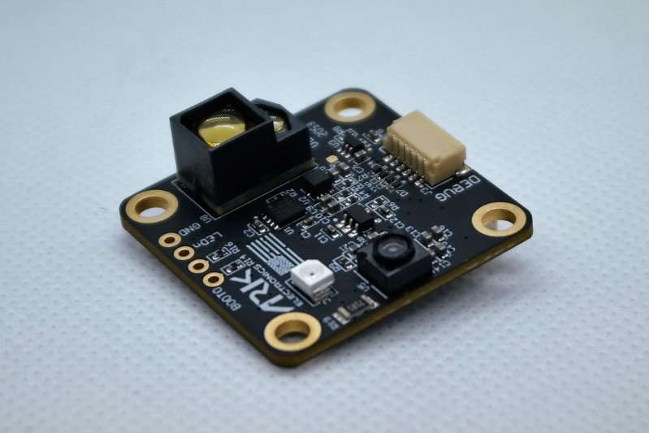

# Sensors

PX4-based systems use sensors to determine vehicle state (needed for stabilization and to enable autonomous control).
The vehicle states include: position/altitude, heading, speed, airspeed, orientation (attitude), rates of rotation in different directions, battery level, and so on.

PX4 *minimally requires* a gyroscope, accelerometer, magnetometer (compass) and barometer.
A GPS or other positioning system is needed to enable all automatic modes, and some manual/assisted modes.
Fixed-wing and VTOL-vehicles should additionally include an airspeed sensor (highly recommended).

The minimal set of sensors is incorporated into [Pixhawk Series](../flight_controller/pixhawk_series.md) flight controllers (and may also be in other controller platforms).
Additional/external sensors can be attached to the controller.

Below we describe some of the external sensors.

## GPS & Compass

PX4 supports a number of Global Navigation Satellite System (GNSS) receivers and compasses (magnetometers). 
It also supports Real Time Kinematic (RTK) GPS Receivers, which extend GPS systems to centimetre-level precision.

We recommend the use of an external "combined" compass/GPS module mounted as far away from the motor/ESC power supply lines as possible - typically on a pedestal or wing (for fixed-wing).

GPS/compass hardware options are listed in:
- [GPS/Compass](../gps_compass/README.md)
- [RTK GNSS (GPS)](../gps_compass/rtk_gps.md)

:::note
[Pixhawk-series](../flight_controller/pixhawk_series.md) controllers include an *internal* compass. Due to electromagnetic interference caused by power cables close to the flight controller, it is highly recommended to not rely on the internal compass for heading estimation and instead to mount an external one.
:::

## Airspeed

Airspeed sensors are *highly recommended* for fixed-wing and VTOL frames.

They are so important because the autopilot does not have other means to detect stall.
For fixed-wing flight it is the airspeed that guarantees lift not ground speed!

For more information and recommended hardware see: [Airspeed Sensors](../sensor/airspeed.md).

## Distance

Distance sensors are used for smooth landings, object avoidance and terrain following.

PX4 supports many affordable distance sensors, using different technologies, and supporting different ranges and features.
For more information see: [Distance Sensors](../sensor/rangefinders.md).

## Optical Flow

[Optical Flow sensors](../sensor/optical_flow.md) use a downward facing camera and a downward facing distance sensor for velocity estimation.
PX4 blends the sensor output with information from other position sources (e.g. GPS) to provide a more accurate position lock. 
This sensor can be used indoors, when no GPS signal is available.

## See Also

- [Peripheral Hardware](../peripherals/README.md) contains documentation for other sensors, such as [Battery/Power Monitors](../power_module/README.md)), [Air traffic warning systems](../peripherals/adsb_flarm.md), [Tachometers](../sensor/tachometers.md).
- [Basic Assembly](../assembly/README.md) contains flight controller quick start guides.
  These explain how to connect the core sensors to specific flight controller hardware.
- [Flight Controller](../flight_controller/README.md) topics often contain wiring information.
