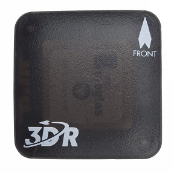
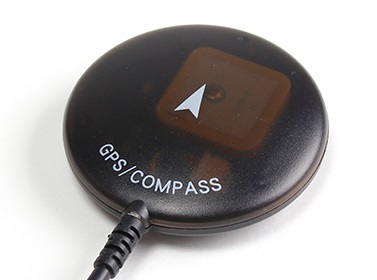
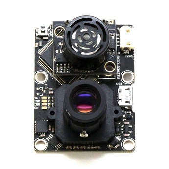

# Sensor Selection

PX4 autopilot is capable of flying without any additional external
sensors, because Pixhawk (the hardware FC) already has inbuilt sensors.
There are 3 Gyros + 3 Accelerometers + 3 Magnetometers + Barometric
pressure sensor for proper altitude reading. Despite that, we strongly
recommend using **GPS** in all frames in order to unveil the full
potential of the aircraft or vehicle and enable its automatic modes. For
most of the fixed wing aircraft, **Airspeed sensor** is mandatory as
well.

## GPS

There are many types of GPS you can use with Pixhawk and PX4. We
recommend using GPS + Compass solution like the original 3DR GPS or
alternative LEA 6H, NEO 7M, NEO 8 GPS+Compass solutions.

 

Because the internal compass of Pixhawk is close to other electronics it
could be susceptible to electromagnetic noise. So when we use the
external Compass we can locate it away from electronics on a pedestal or
at the wing of the plane.

## Airspeed

The Airspeed sensor is mandatory for most of the Airplane Frames and for
all VTOL Frames. It is very important sensor because the PX4 autopilot
does not have other means to detect stall, except with the airspeed
sensor. For the airplane it is the airspeed that guarantees lift not
ground speed. We recommend using the digital airspeed sensor.

## Distance

There are more and more affordable Lidar Rangefinder options. These
sensors are used during the final phase of landing for precise altitude
measuring. They are also used for avoidance. PulsedLight launched their
Lidar-Lite2 Laser Rangefinder. as an economical laser based measurement
solution supporting a wide variety of applications like in drones. It
measures distance, velocity and signal strength of cooperative and non
cooperative targets at distances from zero to more than 40 meters.
Offering the highest performance available in a single beam ranging
sensor in its class.

## Position

Flow is an optical flow smart camera that can track motion, as well has
as integrated sonar sensor. The blended information is fed to the
Pixhawk to have one of the most locked in position holds available. It
is used as a Positioning sensor when there is no GPS signal like
indoors.

For the wiring of all sensors see: [Sensors Wiring](?sensors-wiring).

