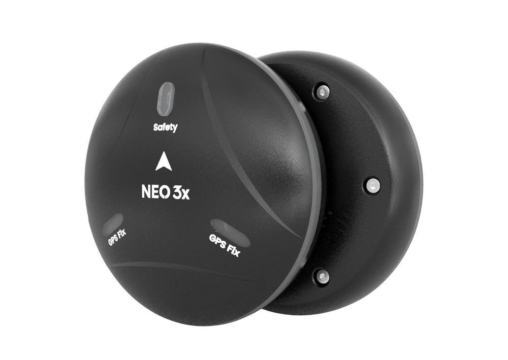
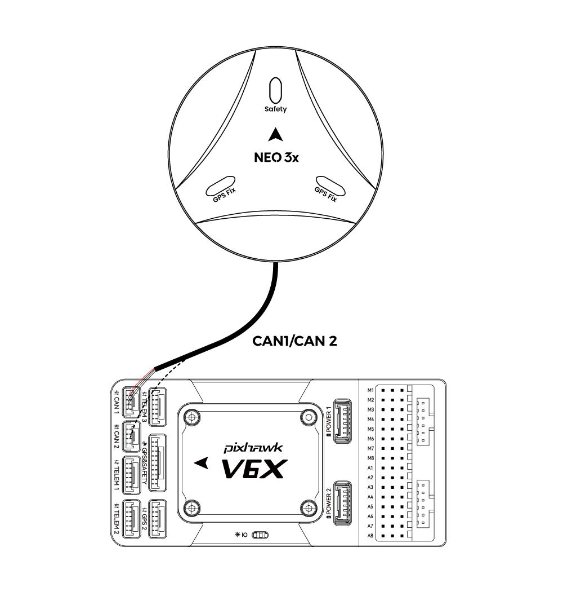
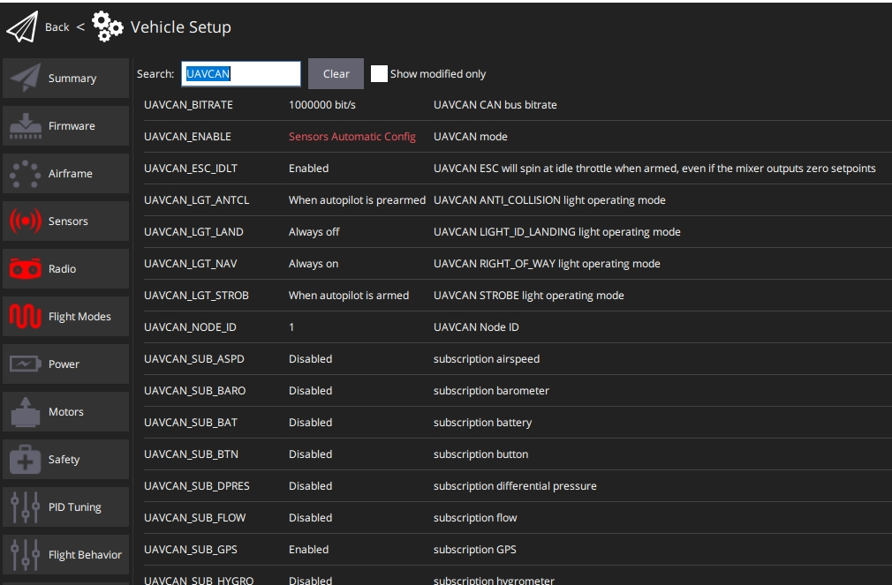

# CUAV NEO 3X GPS

CUAV Neo 3X is a GNSS receiver that is waterproof and dustproof. 

It has IP66 protection capability and integrates UBLOX M9N module, RM3100 compass, color LED light and safety switch.

:::note
CUAV NEO 3X supports 1.13.0 and above PX4 firmware.
:::

Main features :

- Professional waterproof and dustproof design.
- Support DroneCAN protocol.
- Quad Satellite System Receiver (Ublox M9N).

  

### Data sheet

| :--- | :--- |
| MUC | STM32F412 |
| Protocol|DroneCAN|
| Compass|RM3100|
| Barometer |ICP-20100|
| GNSS receiver |Ublox M9N |
| Frequency band | GPS: L1C/A GLONASS:L10F  Beidou:B1I Galileo:E1B/C|
| Number of concurrent GNSS | 4|
|Horizontal accuracy|1.5m|
|Number of satellites(MAX)|32+|
|Acquisition | Cold start：24S Hot start：2S Aided start:2s |
|Nav. update rate|5Hz(default)，25Hz(MAX)|
| Sensitivity | Tracking and nav:-167dBm Cold start Hot star:-148dBm Reacquisition: -160dBm |
|Protection level|IP66|
| Input voltage | 4.7~5.2V|
| Operating temperature | -10~70℃ |
| Size | 67*67*21.2mm |
| Weight |46g(no cable）|

## Where to Buy

* [CUAV](https://www.alibaba.com/product-detail/Free-shipping-CUAV-NEO-3X-GPS_1601004167114.html?spm=a2747.manage.0.0.6aa271d2urCPnP)

## Wiring and Connections

 

* NEO 3X connected to autopilot CAN1/CAN2 interface

> [!TIP]
> The settings for other ArduPilot/PX4 flight stacks are the same.

## Enable

Open QGroundControl>Parameters and modify the following parameters

* `UAVCAN_ENABLE`Set to `Sensors Automatic config` .
* `UAVCAN_SUB_GPS` Set to `Enable`.

 

## More info

* [CUAV docs](https://doc.cuav.net/gps/neo-series-gnss/zh-hans/neo-3x.html)
  