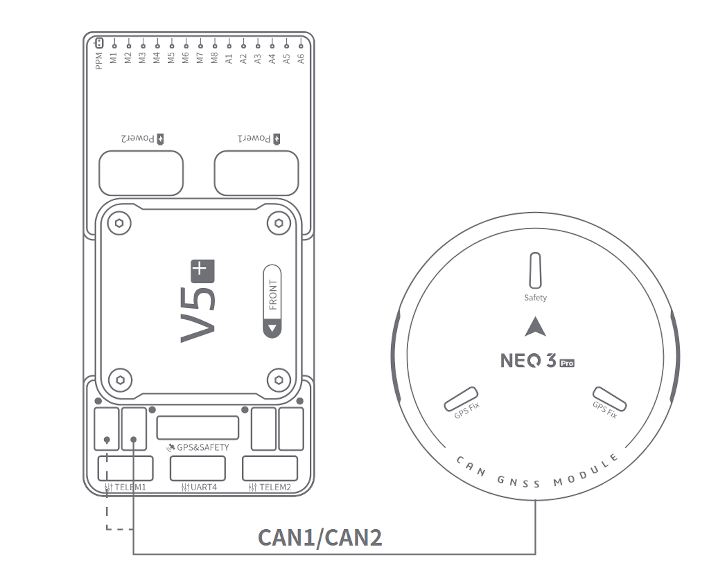
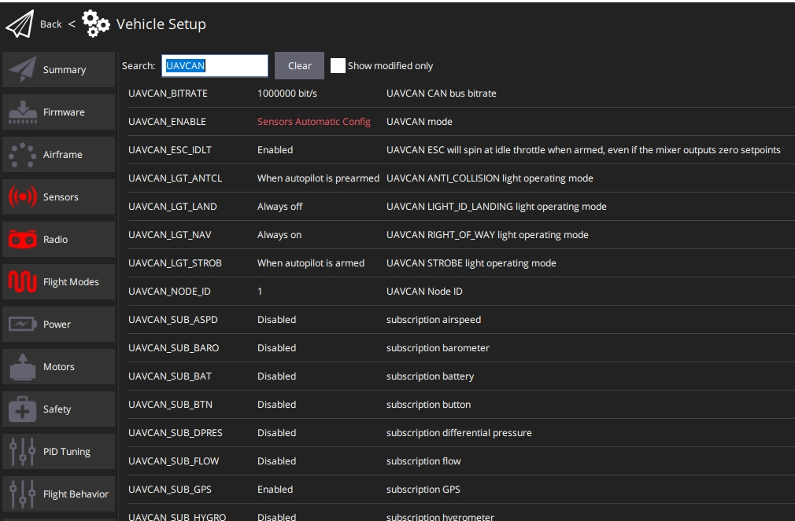

# CUAV NEO 3 Pro

NEO 3Pro is a DroneCan GPS receiver produced by CUAV. 

It integrates UBLOX M9N, STM32F4 MCU, RM3100 compass, three-color LED light and safety switch.

:::note
NEO 3X supports 1.13.0 and above PX4 firmware.
:::

  

### Data sheet

:--- | :--- |
| Processor | STM32F412 |
| Compass | RM3100 |
| Barometer | MS5611 |
| GNSS receiver | UBLOX NEO M9N |
| RGB drive|NCP5623C|
| Buzzer| Passive buzzer |
|Safety switch|Physical button|
|GNSS|Beidou、Galileo、 GLONASS、 GPS|
|GNSS Augmentation System|SBAS:WAAS,EGNOS,MSAS QZSS:L1s(SAIF) other：RTCM3.3|
|Number of concurrent GNSS|4|
|Frequency band|GPS:L1C/A GLONASS:L10F Beidou:B1I Galileo:E1B/C|
|Horizontal accuracy| 2.0M|
|Speed accuracy|0.05M/S|
|Nav. update rate|25Hz(Max)|
|Acquisition|Cold start：24S Hot start：2S Aided start:2s|
|Number of satellites(MAX)|32+|
|Sensitivity|Tracking and nav-167dBm Cold start Hot star-148dBm Reacquisition -160dBm|
|Protocol|UAVCAN|
|Port TYpe|GHR-04V-S|
|Supported flight controller|CUAV series, Pixahwk series |
|Wave filtering|SAW+LNA+SAW|
|Anti-Electromagnetic/radio frequency interference|EMI+RFI|
| Upgrade firmware | support|
| Input voltage | 5V |
| Operating temperature|-10~70℃|
| Size | 60*60*16MM |
| Weight|33g |

## Where to Buy

* [CUAV](https://cuav.en.alibaba.com/product/1600165544920-820872629/Free_shipping_CUAV_Neo_3_pro_drone_UAVCAN_GNSS_processor_STM32F412_autopilot_ublox_M9N_positioning_RM3100_compass_uav_gps_module.html?spm=a2700.shop_oth.74.2.636e28725EvVHb)

## Wiring and Connections

 

* NEO 3 Pro connected to autopilot CAN1/CAN2 interface

## Enable

Open QGroundControl>Parameters and modify the following parameters

* `UAVCAN_ENABLE`Set to `Sensors Automatic config` .
* `UAVCAN_SUB_GPS` Set to `Enable`.

 

## More info

* [CUAV docs](https://doc.cuav.net/gps/neo-series-gnss/en/neo-3-pro.html)
  