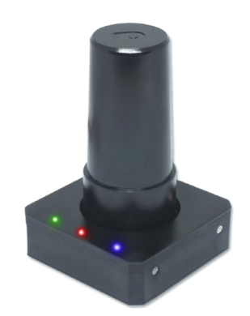

# LOCOSYS HAWK A1 GPS/GNSS

The [Here2 GPS receiver](http://www.proficnc.com/all-products/152-gps-module.html) is an update to the Here GPS module from HEX.

Main features include:
- Concurrent reception of L1 and L5 band signals
- Support GPS, GLONASS,BEIDOU, GALILEO, QZSS
- Capable of SBAS (WAAS, EGNOS, MSAS, GAGAN)
- Support 135-channel GNSS
- Fast TTFF at low signal level
- Free hybrid ephemeris prediction to achieve faster cold start
- Default 5Hz, up to 10 Hz update rate*
- Build-in super capacitor to reserve system data for rapid satellite acquisition
- Three LED indicator for Power, PPS and Data transmit
* Note: SBAS support 5Hz only.

## Purchase

* [LOCOSYS](https://www.locosystech.com/en/product/hawk-a1-LU23031-V2.html) (Taiwan)

## Configuration

Setup and use on PX4 is plug and play. 

## Wiring and Connections

The Locosys GPS comes with an 8 pin connector that can be inserted directly into the GPS2 UART port.

The Pixhawk 
For these controllers you can modify the GPS cable (as shown below) to remove pin 6 and 7. 

 

Pin 6 and 7 are for the safety button - these can be attached as well if needed.

### Pinout

The Here2 GPS pinout is provided below. This can be used to help modify the connector for other autopilot boards.

| pin | Here2 GPS     | pin | Pixhawk 3 Pro GPS |
| --- | ------------- | --- | ----------------- |
| 1   | VCC_5V        | 1   | VCC               |
| 2   | GPS_RX        | 2   | GPS_TX            |
| 3   | GPS_TX        | 3   | GPS_RX            |
| 4   | SCL           | 4   | SCL               |
| 5   | SDA           | 5   | SDA               |
| 6   | BUTTON        | -   | -                 |
| 7   | BUTTON_LED    | -   | -                 |
| 8   | GND           | 6   | GND               |

## Specification

