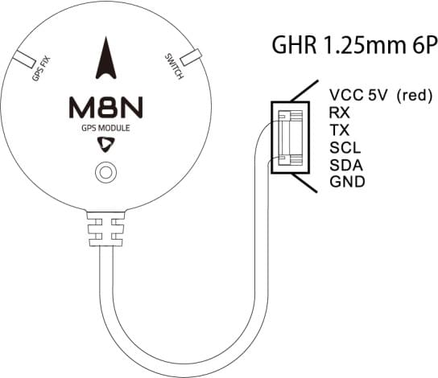
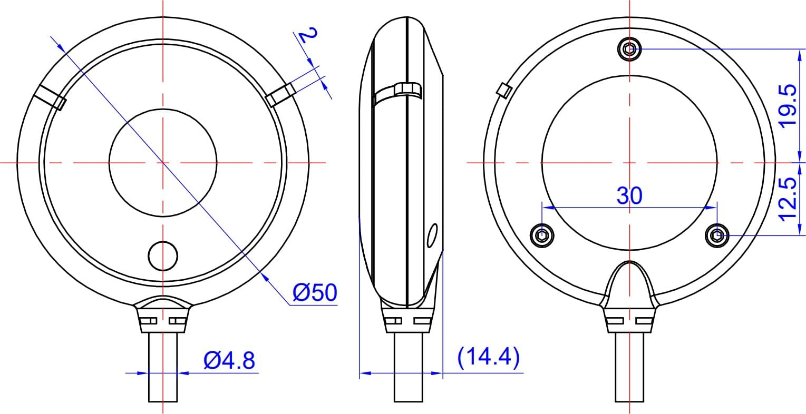

# Holybro M8N & M9N GPS

The GPS includes a M8N or M9N UBLOX module, IST8310 compass, tri-colored LED indicator, and a safety switch. There are 3 different connectors options for different purposes.This module ships with a baud rate of 38400 5Hz

  

### Features and Specifications:

* Ublox Neo-M8N or M9N module
* Industry leading –167 dBm navigation sensitivity
* Cold starts: 26s
* LNA MAX2659ELT+
* 25 x 25 x 4 mm ceramic patch antenna
* Rechargeable Farah capacitance
* Low noise 3.3V regulator
* Current consumption: less than 150mA @ 5V
* Fix indicator LEDs
* Protective case
* 26cm cable included
* Diameter 50mm total size, 32 grams with case.
* **M8N:** Concurrent reception of up to 3 GNSS (GPS, Galileo, GLONASS, BeiDou)
* **M9N:** Concurrent reception of up to 4 GNSS (GPS, Galileo, GLONASS, BeiDou)

## Where to Buy

* [Holybro](https://shop.holybro.com/c/gps-systems_0428)

## Wiring and Connections

There are 3 different connectors options for different purposes.

## Pinout

| SKU12012 Holybro M8N GPS (JST GHR1.25mm 10 pin cable) this JST GH 10Pin connector can be use d on Pixhawk Series 10pin“GPS Module” or "GPS1" input port.                                   |      |
| ------------------------------------------------------------------------------------------------------------------------------------------------------------------------------------------------------------------------------------------------------------------------ | ----------------------------------------------------------------------- |
|  SKU12013   Holybro M8N GPS for Pix32  (Molex1.25mm 6pin  ; 4pin  ;3pin cable) :   These Molex 1.25mm 6pin  ; 4pin  ;3pin connectors are for Pix32 "Switch", "GPS", and "I2C" input ports. (not for Pix32 v5 or v6)  |      |
|  SKU12014   Holybro M8N 2nd GPS (JST GHR1.25m m 6pin cable) ：   This JST GH 6Pin connector can be used on Pixhawk Series 6pin“UART  ; I2C”or " GPS2" input port as secondary GPS.                      |  |

Note: Pinout is the same for M9N GPS Module

## Dimension

