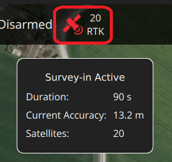

# RTK GPS

[Real Time Kinematic (RTK)](https://en.wikipedia.org/wiki/Real_Time_Kinematic) increases the accuracy of GNSS/GPS systems to centimeter-level. RTK allows PX4 to be used in applications like precision surveying, where pinpoint accuracy is essential.

You will need:
- A pair of (supported) [RTK GPS devices](#supported-rtk-devices) (a "base" for the ground station and a "rover" for the vehicle)
- A *laptop/PC* with QGroundControl (QGroundControl for Android/iOS do not support RTK)
- A vehicle with a WiFi or Telemetry radio link to the laptop

> **Note** *QGroundControl* can theoretically enable RTK GPS for multiple vehicles (provided they each have a rover module). At time of writing this use case has not been tested.

## Supported RTK Devices

PX4 supports the [u-blox M8P](https://www.u-blox.com/en/product/neo-m8p), [u-blox F9P](https://www.u-blox.com/en/product/zed-f9p-module) and the [Trimble MB-Two](https://www.trimble.com/Precision-GNSS/MB-Two-Board.aspx) GPS and products that incorporate it. The following RTK-compatible devices have been tested.
* [CUAV C-RTK GPS](../gps_compass/rtk_gps_cuav_c-rtk.md)
* [Drotek XL RTK GPS](../gps_compass/rtk_gps_drotek_xl.md)
* [Here+ RTK GPS](../gps_compass/rtk_gps_hex_hereplus.md)
* [Trimble MB-Two](../gps_compass/rtk_gps_trimble_mb_two.md)
* [Freefly RTK GPS](../gps_compass/rtk_gps_freefly.md) (F9P)
* [SparkFun GPS-RTK2 Board - ZED-F9P](https://www.sparkfun.com/products/15136) (www.sparkfun.com)
* [SIRIUS RTK GNSS ROVER (F9P)](https://store-drotek.com/911-1010-sirius-rtk-gnss-rover-f9p.html#/158-sensor-no_magnetometer) (store-drotek.com)
* [Femtones MINI2 Receiver](../gps_compass/rtk_gps_fem_mini2.md)  

> **Note** Some RTK modules can only be used in a particular role (base or rover), while others can be used interchangeably.

## Hardware setup

### Rover RTK Module (Vehicle)

Connect the vehicle-based module to the flight controller's GPS port (in the same way as any other GPS module). 

The actual cables/connectors required will depend on the flight controller and selected RTK module (see [documentation for the selected device](#supported-rtk-devices) for more information).

### Base RTK Module (Ground)

Connect the base module to *QGroundControl* via USB.
The base module must not be moved while it is being used.
  
> **Tip** Choose a position where it won't need to be moved, has a clear view of the sky, and is well separated from any buildings.
  Often it is helpful to elevate the base GPS, by using a tripod or mounting it on a roof. 

### Telemetry Radio/WiFi

The vehicle and ground control laptop must be connected via [wifi or a radio telemetry link](../telemetry/README.md).

The link *must* use the MAVLink2 protocol as it makes more efficient use of the channel.
This should be set by default, but if not, follow the [MAVLink2 configuration instructions](#mavlink2) below.

## RTK Connection Process

The RTK GPS connection is essentially plug and play:

1. Start *QGroundControl* and attach the base RTK GPS via USB to the ground station. The device is recognized automatically. 
1. Start the vehicle and make sure it is connected to *QGroundControl*.
   
   > **Tip** An RTK GPS status icon is displayed in the top icon bar while an RTK GPS device is connected (in addition to the normal GPS status icon).
     The icon is red while RTK is being set up, and then changes to white once RTK GPS is active.
	 You can click the icon to see the current state and RTK accuracy. 
1. *QGroundControl* then starts the RTK setup process (known as "Survey-In").

   Survey-In is a startup procedure to get an accurate position estimate of the base station.
   The process typically takes several minutes (it ends after reaching the minimum time and accuracy specified in the [RTK settings](#rtk-gps-settings)).
   
   You can track the progress by clicking the RTK GPS status icon.

    

1. Once Survey-in completes:

   - The RTK GPS icon changes to white and *QGroundControl* starts to stream position data to the vehicle:
   
     
   - Vehicle GPS switches to RTK mode.
     The new mode is displayed in the *normal* GPS status icon (`3D RTK GPS Lock`):

     
   

## Optional PX4 Configuration

The following settings may need to be changed (using *QGroundControl*). 

### RTK GPS settings

The RTK GPS settings are specified in the *QGroundControl* [General Settings](https://docs.qgroundcontrol.com/en/SettingsView/General.html#rtk_gps) (**SettingsView > General Settings > RTK GPS**).

These settings define the minimum duration and minimum accuracy for completing the RTK GPS setup process (known as "Survey-In).

> **Tip** You can save and reuse a base position in order to save time: perform Survey-In once, select *Use Specified Base Position* and press **Save Current Base Position** to copy in the values for the last survey.
  The values will then persist across QGC reboots until they are changed.

### MAVLink2

The MAVLink2 protocol must be used because it makes more efficient use of lower-bandwidth channels.
This should be enabled by default on recent builds.

To ensure MAVLink2 is used:
* Update the telemetry module firmware to the latest version (see [QGroundControl > Setup > Firmware](https://docs.qgroundcontrol.com/en/SetupView/Firmware.html)).
* Set [MAV_PROTO_VER](../advanced_config/parameter_reference.md#MAV_PROTO_VER) to 2 (see [QGroundControl Setup > Parameters](https://docs.qgroundcontrol.com/en/SetupView/Parameters.html))

### Tuning

You may also need to tune some parameters as the default parameters are tuned assuming a GPS accuracy in the order of meters, not centimeters. 
For example, you can decrease [EKF2_GPS_V_NOISE](../advanced_config/parameter_reference.md#EKF2_GPS_V_NOISE) and [EKF2_GPS_P_NOISE](../advanced_config/parameter_reference.md#EKF2_GPS_P_NOISE) to 0.2.

### Use RTK GPS for Yaw

Some RTK GPS units (i.e. with multiple antennas) can output a yaw angle, which can be used instead of the heading from the magnetic compass.
To enable this, set bit position 7 in [EKF2_AID_MASK](../advanced_config/parameter_reference.md#EKF2_AID_MASK) to 1 (add 128 to the parameter value).

### Dual Receivers

A second GPS receiver can be used as a backup (either RTK or non RTK).
See the [EKF2 GPS Configuration](../advanced_config/tuning_the_ecl_ekf.md#gps) section.

<!-- 
- Video demonstration would be nice.
- something that shows positioning of base, connection of RTK rover, survey in process. Some sort of short precision survey. 
-->

## Vehicle Setup Example

The airframe build topic [DJI Flamewheel 450 with distance sensor and RTK GPS](https://dev.px4.io/master/en/airframes_multicopter/dji_flamewheel_450.html) describes an airframe setup with the Here+ RTK GPS and a Pixhawk 3 Pro.

