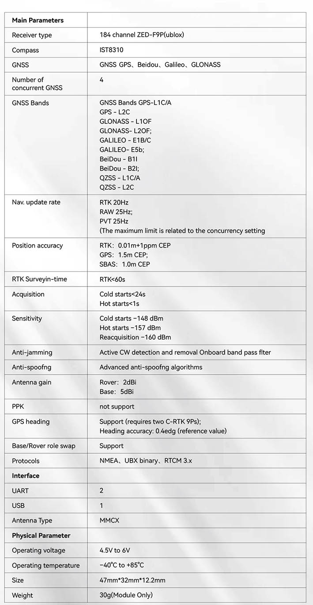
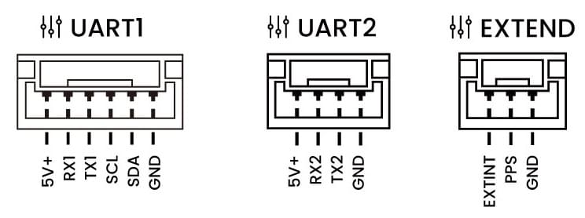

# CUAV C-RTK 9Ps
The [C-RTK 9Ps](https://www.cuav.net/en/c_rtk_9ps/) is a multi-satellite system multi-band centimeter-level RTK GNSS system launched by CUAV.

It simultaneously receives GPS, GLONASS, Galileo and Beidou satellite signals; faster positioning and higher accuracy; supports [RTK GPS Heading](../gps_compass/u-blox_f9p_heading.md) using dual modules.

Using C-RTK 9Ps enables PX4 to gain centimeter-level precision flight capability; ideal for drone performances, agricultural drones and other application scenarios.

## Purchase

[cuav Store](https://store.cuav.net/shop/c-rtk-9ps/)

## Specification

## Wiring and Connections

**C-RTK 9Ps（Base）**

- Use a tripod to mount the base station's antenna to the top, and connect the antenna to the base station
- Connect the base station and telemetry to the computer with a usb cable.

**C-RTK 9Ps（Rover）**

- Mount the C-RTK 9Ps (Rover) antenna vertically.
- Connect the antenna to the C-RTK 9Ps (Rover).
- Connect the C-RTK 9Ps (Rover) to the flight controller.
- Connect telemetry to the flight controller Telem1/Telem2 interface

> **NOTE** C-RTK 9Ps come with 6Pin and 10Pin connectors compatible with Pixhawk standard flight controllers, connect to CPS1 or GPS2; please select the special cable according to the cable identification

## Configuration

RTK setup and use on PX4 via _QGroundControl_ is largely plug and play (see [RTK GPS](../advanced_features/rtk-gps.md) for more information).

## Pinouts

## Size and Weight

## Nav. update rate

## More information

[CUAV docs]（https://doc.cuav.net/gps/c-rtk/en/c-rtk-9ps.html)
