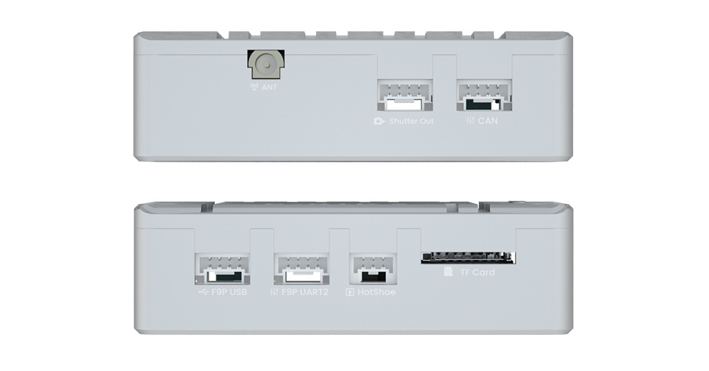

# CUAV C-RTK2

The [CUAV C-RTK2 receiver](http://doc.cuav.net/gps/c-rtk/en/) is a high-performance PPK/RTK positioning module created by CUAV for professional applications such as drone aerial survey (Mapping).
It has a high-precision IMU and positioning module.
It can reduce more than 80% of control points.
it can also be used as an RTK receiver.
It is suitable for many applictions including: aerial surveying and mapping, agricultural plant protection, drone swarms and other application scenarios.

## Other characteristics

* High-performance H7 processor
* High precision industrial grade IMU
* Support RTK and save RAW raw data (PPK) at the same time
* Multi-satellite and multi-frequency receivers
* UAVCAN/Dronecan protocol
* Support hotshoe and shutter trigger
* HS_USB and U disk mode

## Purchase

* [cuav Store](https://store.cuav.net/shop/c-rtk-2/)
* [cuav aliexpress](https://pt.aliexpress.com/item/1005003754165772.html?spm=a2g0o.store_pc_groupList.8148356.13.2f893550i0NE4o)

# Quick Summary

* RTK Receiver
  * ZED-F9P
* Receiving channel
  * 184
* Main FMU Processor
  * STM32H743VIH6(2M flash、1M RAM）
* On-board sensors:
  * Accelerometer/Gyroscope: ICM20689
* Magnetometer: RM3100
  * Barometer: ICP10111
* TF card expansion
  * 32G(MAX)
* PPK(post processed kinematic)
  * support
* RTK(Real - time kinematic)
  * support
* GNSS Bands
  * GPS:L1C/A,L2C
  * GLONASS:L1OF,L2OF
  * GALILEO: E1B/C E5b
  * Beidou:B1I B2I
* Enhanced system
  * QZSS:L1C/A,L2C,L1S
  * SBAS:L1C/A
* Number of concurrent GNSS
  * 4(GPS、GLONASS、GALILEO、Beidou）
* Nav. update rate
  * RTK Up to 20HZ
  * RAW Up to 25hz
  * default：5hz
* Convergence time
  * RTK < 10 sec
* Position accuracy（RMS)
  * RTK:0.01m+1ppm(level);0.02m+1ppm(vertical)
  * GPS:1.5m(level)
* Acquisition
  * Cold starts 24 s
  * Aided starts 2 s
  * Reacquisition 2 s
* Sensitivity
  * Tracking & Nav –167 dBm
  * Cold starts –148 dBm
  * Hot starts –157 dBm
  * Reacquisition –160 dBm
* Anti-spoofng
  * Advanced anti-spoofng algorithms
* Protocols
  * NMEA
  * UBX binary
  * RTCM version 3.x
* Time pulse
  * 0.25Hz~10Hz(Configurable)
* Anti-jamming
  * Active CW detection and removal Onboard band pass flter
* Support flight control type
  * Compatible with flight controllers running PX4 firmware
* interface
  * 1 Hotshoe
  * 1 shutter in
  * 1 sutter out
  * 1 Type(HS_USB)
  * 1 F9P USB
  * 1 F9P UART
  * 1 Antenna(mmcx)
* Supply voltage
  * 4.5~6v
* Operating temperature
  * -20~85℃
* Size
  *  56x33x16.5mm
* Weight
  * 39g
  
## Configuration

[CUAV Docs](https://doc.cuav.net/gps/c-rtk2/en/quick-start-c-rtk2.html) will guide you through it.

## Pinout

## More information

[CUAV Docs](https://doc.cuav.net/gps/c-rtk2/en/)
