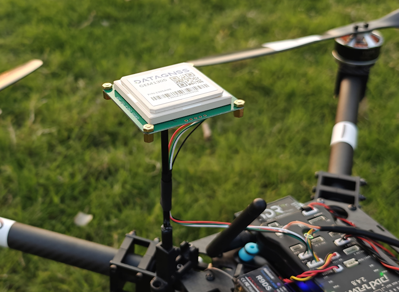
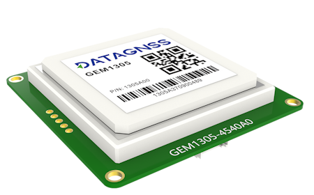
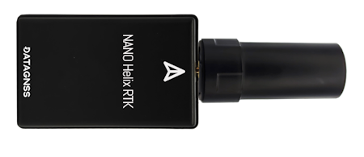
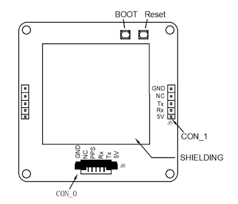

# DATAGNSS GEM1305 RTK Receiver with antenna

GEM1305 is a RTK receiver with antenna designed and manufactured by [DATAGNSS](https://www.datagnss.com/).

GEM1305 is based on the new generation CYNOSURE IV dual-core GNSS SoC. It supports RTK functionality with a maximum data update rate of 10Hz.

> **Note:** GEM1305/NANO Series RTK doesn't support Moving Base mode yet.

## Where to Buy

- [DATAGNSS website](https://www.datagnss.com/)

## Key Features

- Full constellation, multi-frequency GNSS satellite receiver
- Support RTK with up to 10hz output rate
- Standard UART serial interface
- Lightweight only 50g or 26g(NANO RTK receiver)
- High performance antenna

## Frequencies

- GPS/QZSS: L1 C/A, L5C
- GLONASS: L1OF
- BEIDOU: B1I, B2a
- GALILEO: E1, E5a
- IRNSS: L5

## GNSS

- 128 hardware channels
- 3D accuracy: **1.5m** CEP
- RTK accuracy: **2cm** +1PPM(H), 3cm+1PPM(V)

## Interface

- UART, 230400bps default
- SMA connector for antenna
- Output rate 5Hz default, up to 10Hz
- Main power supply, 4.7~5.2V

## Protocol

- NMEA-0183 output
- RTCMv3 input/output

## Environment

- Operating temp. -20~85℃

## Dimension and weight

- 55x55x12mm
- 50g (GEM1305) 26g (NANO with Helix)

## Pin definition

The board is connected to the autopilot via UART interface.

The 1.25mm pitch 6P connector (from Left PIN1 to PIN6):

- 1: GND
- 2: NC
- 3: PPS
- 4: Rx
- 5: Tx
- 6: 5V

Please note that the board only includes RTK and doesn't include compass.

## Setup

RTK setup on PX4 via _QGroundControl_ is plug and play (see [RTK GPS](../gps_compass/rtk_gps.md) for more information).

## Wiring and Connections

RTK technology can greatly improve the accuracy of positioning.

RTK technology requires a base and a rover, with the base placed on the ground, which is referred to as the rover on the drone. The data from the base needs to be transmitted to the drone via telemetry radio and inputted into the RTK receiver on the rover.

The 6-pins connector provides the interface for RTK, the 2.54mm Pin Header also support for RTK data input and output.
You could connect the 6-pins connector or Pin Header to the flight controller's GPS port.

Refer to [How to setup Base station](https://wiki.datagnss.com/index.php/GEM1305-autopilot) to find more details.

## Package List

- GEM1305 RTK Receiver
- DG-6P-C01, GH-1.25mm-6P cable

## Resource

- [GEM1305 2D drawing file](https://wiki.datagnss.com/index.php/GEM1305)
- [NANO RTK Receiver 2D drawing file](https://wiki.datagnss.com/images/3/31/EVK-DG-1206_V.2.0.pdf)
- [DATAGNSS WiKi](https://wiki.datagnss.com)
- [HED-10L Heading RTK Receiver](https://wiki.datagnss.com/index.php/HED-10L)

## More information

- [NANO RTK Receiver](https://www.datagnss.com/collections/evk/products/tau951m-1312-tiny-evk)
- [HELIX Antenna for RTK](https://www.datagnss.com/collections/rtk-antenna/products/smart-helix-antenna)
- [RTK Antenna AGR6302G](https://www.datagnss.com/collections/rtk-antenna/products/antenna-agr6302g)
- [AT400 RTK Antenna](https://www.datagnss.com/collections/rtk-antenna/products/at400-multi-band-antenna-for-rtk)