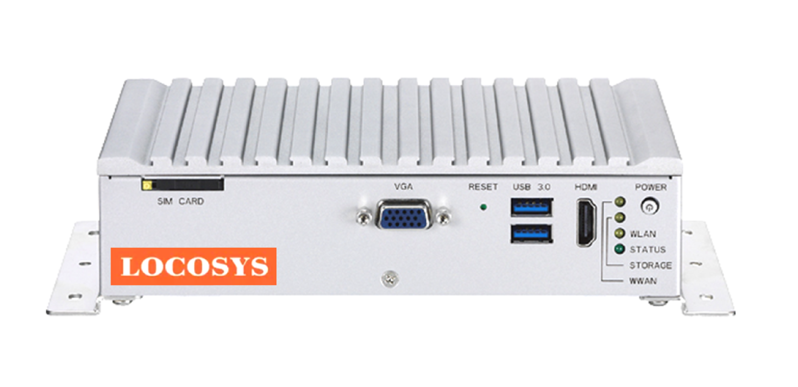

# Locosys M300 RTK system 

[LOCOSYS RTK-M300](https://www.locosystech.com/en/product/RTK-System/rtk-M300.html), a compact, rugged and industrial grade computer with Intel Atom® x5-E3930 processor dual core 1.3GHz (boost up to 1.8GHz), Aluminum top case with sheet metal, is designed for the harsh or need noiseless Ad-hoc network environment.

LOCOSYS RTK-M300 has the advanced RTK (Real-time kinematic) receiver supports global GPS/Glonass/Beidou/Galileo/QZSS satellites , L1+L5 Dual-frequency and multi-constellation RTK positioning solution. RTK-M300 adopt full frequency 4G-LTE communication board, Worldwide LTE, UMTS/HSPA+ and GSM/GPRS/EDGE coverage. It features 10/100/1000Mbps Ethernet data and voice connectivity. With external SIM socket, it allows user to access SIM card conveniently. RTK-M300 installs Win10 (or Linux)operating system, suitable for with LOCOSYS Firebird application software,provide user-friendly graphical operation interface, whether it is used for “Base station” management or “Rover” use.

Because of the fan-less compact design, certified (-30 ~ +70 degrees) high and low temperature test , and (MIL-STD-810) military standard vibration test, provide fast and easy installation. It is especially for the RTK Base Station with limited room space to locate the computer system, but without compromising with its space to scarify its features. Whether as a RTK Base station or RTK Rover, it is very fast and convenient to use and install. RTK-M300 keeps the flexibility to meet different demands for telemetric monitor or surveying applications.

## Features

- Intel Atom® x5-E3930 processor dual core base clock 1.3GHz (boost up to 1.8GHz) compact and fan-less design.
- L1 + L5 Dual-frequency and multi-constellation heading and RTK positioning solution.
- Support GPS, GLONASS, BeiDou, GALILEO, QZSS satellite.
- Capable of SBAS (WAAS, EGNOS, MSAS, GAGAN).
- Support 135-channel GNSS.
- RTK Position Accuracy 1cm CEP.
- GNSS Position Accuracy 1.5m CEP
- Support 1/5Hz Default. (Option: Up to 10Hz update rate).
- 10/100/1000Mbps Ethernet.
- Operating temperature range -30 to +70°C.
- AC 100-240V Power adapter.
- Support wide range DC input from 9-36V.
- Certified by CE/FCC/E13 mark.
- Passed Military standard (MIL-STD-810) vibration test.
- RTK Base station management or RTK Rover use.

## Where to buy
[LOCOSYS RTK-M300](https://www.locosystech.com/en/product/RTK-System/rtk-M300.html)

:::note
PX4 drivers for Ethernet, CAN and USB are under development.
:::

## Required Firmware Options

The following firmware options need to be selected when buying the device:
- 5Hz, 10Hz, 20Hz 
- INS 
- HEADING
- OBS
- RTK
- BASE 

## Functional Ports

## Wiring and Connections

The [MINI2 Receiver](http://www.femtomes.com) is connected to a UART on the flight controller (GPS port) for data.
To power the module you will need a separate 12V power supply.
The pins on the 12-pin connector are numbered as shown below.

## Configuration

For heading estimation the two antennas need to be on the same level and at least 30 cm apart from each other.
The direction that they are facing does not matter as it can be configured with the [GPS_YAW_OFFSET](../advanced_config/parameter_reference.md#GPS_YAW_OFFSET) parameter.

Configure the serial port on which the [MINI2 Receiver](http://www.femtomes.com) will run using [GPS_1_CONFIG](../advanced_config/parameter_reference.md#GPS_1_CONFIG), and set the baud rate to 115200 using [SER_GPS1_BAUD](../advanced_config/parameter_reference.md#SER_GPS1_BAUD).

Once configured the receiver is used in the same way as any other [RTK GPS](../gps_compass/rtk_gps.md) (i.e. with respect to the Survey-in process).

## Additional Information

The MINI2 incorporates the following components:

- [FB672](http://www.femtomes.com/en/FB672.php): Compact, dual antenna, dual frequency GNSS OEM board (delivers centimeter accurate position and precise heading).

  

- [FB6A0](http://www.femtomes.com/en/FB6A0.php): Compact, quadruple frequency GNSS OEM board (delivers centimeter-accurate positioning)

  

Detailed product instructions can be obtained on the official website or by contacting us.
