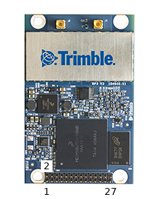

# Trimble MB-Two

The [Trimble MB-Two RTK GPS receiver](https://www.trimble.com/Precision-GNSS/MB-Two-Board.aspx) is a high-end, dual-frequency [RTK GPS module](../gps_compass/rtk_gps.md) that can be configured as either base or rover.

In addition to a precise position, the MB-Two has dual-antenna support and can estimate a heading angle. This is useful for situations where a compass cannot provide reliable heading information, for example when flying close to metal constructs.

## Required Firmware Options
The following firmware options need to be selected when buying the device:
- \[X\] \[2\] \[N\] \[G\] \[W\] \[Y\] \[J\] for 20Hz position updates and RTK support, 1cm horizontal and 2cm vertical position accuracy
- \[L\] LBAND
- \[D\] DUO - Dual Antenna Heading
- \[B\] BEIDOU + \[O\] GALILEO, if needed

## Antennas and Cable
The Trimble MB-Two requires two dual-frequency (L1/L2) antennas, for example the [Maxtenna M1227HCT-A2-SMA](http://www.maxtena.com/products/helicore/m1227hct-a2-sma/).
They can be bought from [Farnell](https://uk.farnell.com/maxtena/m1227hct-a2-sma/antenna-1-217-1-25-1-565-1-61ghz/dp/2484959) for instance.

The antenna connector type on the device is MMCX. Suitable cables for the above antannas (SMA connector) can be found here:
- [30 cm version](https://www.digikey.com/products/en?mpart=415-0073-012&v=24)
- [45 cm version](https://www.digikey.com/products/en?mpart=415-0073-018&v=24)

## Wiring and Connections

The Trimble MB-Two is connected to a UART on the flight controller (GPS port).
It requires a 3.3V power supply, but it cannot be powered from a Pixhawk, it needs another power source (the maximum consumption is 360mA).

The pins on the 28-pin connector are numbered as following:

| Pin | Name  | Description
| --- | ------------- | --- |
| 6   | Vcc 3.3V      | Power supply   |
| 14  | GND           | Connect to power the supply and GND of the Autopilot   |
| 15  | TXD1          | Connect to RX of the Autopilot   |
| 16  | RXD1          | Connect to TX of the Autopilot   |

## Configuration
For heading estimation the two antennas need to be on the same level and at least 30 cm apart from each other.
Which direction they are facing does not matter as it can be configured with the [GPS_YAW_OFFSET](../advanced_config/parameter_reference.md#GPS_YAW_OFFSET) parameter.

The MB-Two has problems with baudrate auto-detection, thus the baudrate needs to be configured manually by setting [SET_GPS1_BAUD](../advanced_config/parameter_reference.md#SET_GPS1_BAUD) to 115200.

To activate the heading fusion for the attitude estimation, enable *GPS yaw fusion* with the [EKF2_AID_MASK](../advanced_config/parameter_reference.md#EKF2_AID_MASK) parameter.

