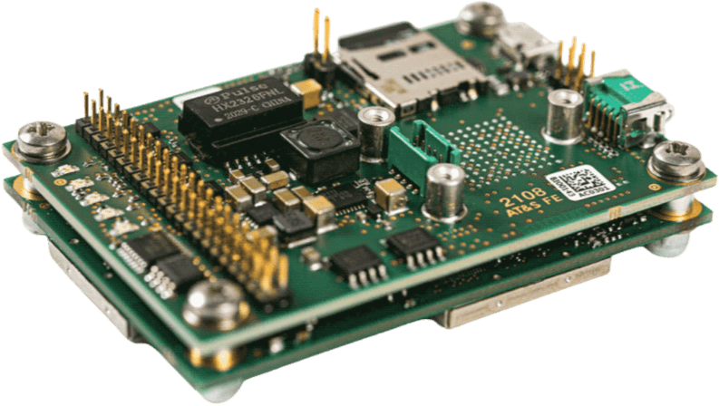
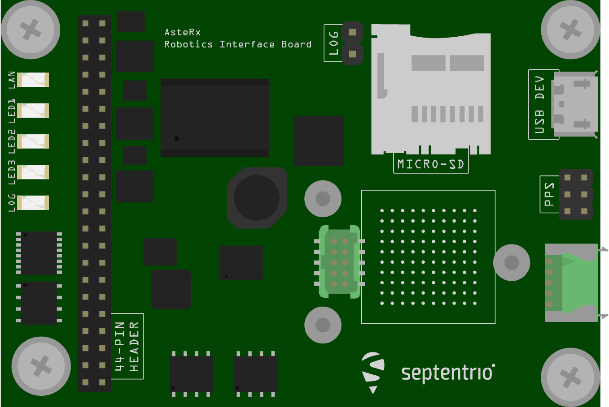
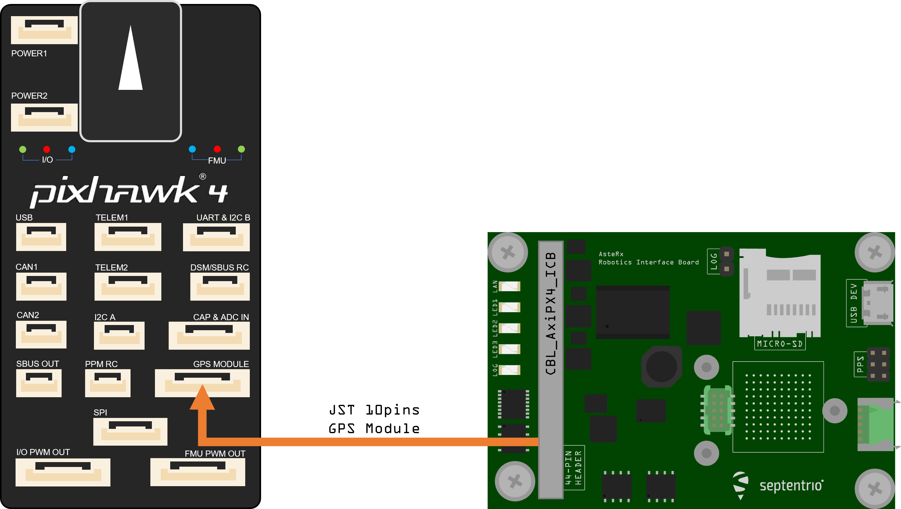

# AsteRx OEM with Robotics Interface Board

Septentrio is the leading worldwide supplier of OEM GPS / GNSS receivers. Our OEM receivers deliver accurate and
reliable positions to demanding industrial applications in a small, light-weight form factor. We also offer several dual
antenna receivers providing heading & pitch or heading & roll angles ideal for autonomous navigation or machine control.
Inertial sensor integration of the AsteRx-i family offers a full attitude solution (heading, pitch and roll)
synchronized with accurate positioning.

The Robotics Interface Board coupled with Septentrio GNSS receiver boards provides common interfaces like USB, ethernet,
on board logging and other functionalities designed for rapid prototyping, product evaluation or efficient integration.

Size: 71.53 x 47.5 x 18.15 mm 

Weight = 50g

## Table Of Contents
1. [Key Features](../../en/gps_compass/septentrio_asterx-rib.md#key-features)
2. [Purchase](../../en/gps_compass/septentrio_asterx-rib.md#purchase)
3. [Interfaces](../../en/gps_compass/septentrio_asterx-rib.md#interfaces)
   1. [USB](../../en/gps_compass/septentrio_asterx-rib.md#usb)
   2. [44-pin Header](../../en/gps_compass/septentrio_asterx-rib.md#44-pin-header)
   3. [LED's](../../en/gps_compass/septentrio_asterx-rib.md#leds)
   4. [LOG Button Header](../../en/gps_compass/septentrio_asterx-rib.md#log-button-header)
   5. [PPS/Event Header](../../en/gps_compass/septentrio_asterx-rib.md#ppsevent-header)
   6. [Power Supply Options](../../en/gps_compass/septentrio_asterx-rib.md#power-supply-options)
4. [Hardware Setup](../../en/gps_compass/septentrio_asterx-rib.md#hardware-setup)
   1. [Dual Antenna](../../en/gps_compass/septentrio_asterx-rib.md#hardware-setup)
   2. [Web App](../../en/gps_compass/septentrio_asterx-rib.md#web-app)
5. [PX4 Setup](../../en/gps_compass/septentrio_asterx-rib.md#px4-setup)
   1. [Single Antenna](../../en/gps_compass/septentrio_asterx-rib.md#single-antenna)
   2. [Dual Antenna](../../en/gps_compass/septentrio_asterx-rib.md#px4-setup)

## Key Features

- Credit-card size boards with low power consumption
- Easy-to-integrate into any system
- Best-in-class RTK performance with true multi-constellation, multi-frequency GNSS technology
- Advanced Interference Mitigation (AIM+) anti-jamming and anti-spoofing technology
- Resilient to vibrations and shocks
- 44 pins I/O connector for autopilots such as Pixhawk
- On-board logging
- Micro USB connector

## Purchase

All AsteRx receivers and Robotic Interface Boards can be purchased from the Septentrio webshop:

- [AsteRx-m3 Pro](https://www.septentrio.com/en/products/gnss-receivers/oem-receiver-boards/asterx-m3-pro)
- [AsteRx-m3 Pro+](https://www.septentrio.com/en/products/gnss-receivers/oem-receiver-boards/asterx-m3-pro-plus)

Other PX4 supported devices from Septentrio:
- [mosaic-go evaluation kit](../../en/gps_compass/septentrio_mosaic-go.md)

## Interfaces

### USB
_Connector type: micro USB type B._

The micro USB type B connector can be attached to a PC to power the receiver and to communicate with it over its USB
port.

### 44-pin header
_Connector type: SAMTEC TMM-122-03-S-D, 2-mm pitch._

The 44-pin header can be used to connect multiple GPIO devices. Please refer to
the [hardware manual](https://www.septentrio.com/system/files/support/asterx-m3_product_group_hardware_manual_2.2.0_1.pdf)
for the pinout.

### LED's

The LED pins can be used to monitor the receiver status. They can be used to drive external LEDs (max drive current
10mA). It is assumed that the LED lights when the electrical level of the corresponding pin is high. The general-purpose
LED (GPLED pin) is configured with the setLEDMode command.

### Log Button Header

Putting a jumper on the LOG Button header (.100” vertical header) is equivalent to pressing a “log button”. The
interface board takes care of debouncing.

### PPS/Event Header

_Connector type: SAMTEC TMM-103-03-G-D, 2-mm pitch._

The 6-pin 2mm header next to the micro USB connector exposes the first PPS signal.

### Power Supply Options

When a USB cable is connected to the micro USB connector, the interface board is powered from the computer through the
USB connector.Alternatively, the power can be applied from the PWR_IN pins of the 44-pin connector. The voltage range
when powering from the PWR_IN pins is 4.5V to 30V. Power can be applied from both sources at the same time. On-board
diodes prevent short circuits. The interface board provides the 3V3 supply to the AsteRx-m3 OEM receiver and a 5V DC
voltage to the VANT pin of the AsteRx-m3 OEM.

## Hardware setup

1. Make sure the receiver is powered with at least 3.3V. You can use the micro USB connector or the open ended supply (labeled "PWR & GND") on the 44 pin cable for this.
2. Connect one or two GNSS antennas to the external antenna ports on the AsteRx-i3 D board.
3. Connect the 44-pin cable to the AsteRx-i3 D board on RIB and connect the 6 pin JST GH connector to the UART & I2C B port on the Pixhawk 4 as shown in the diagram above.

:::note 
PX4 will ensure that the GNSS module is automatically configured however, if you have a dual antenna setup, it
is required to set the layout as accurately as possible in the web app.
:::

### Dual antenna

The attitude (heading/pitch) can be computed from the orientation of the baseline between the main and the aux1 GNSS
antennas.

To enable multi-antenna attitude determination, follow the following procedure:

1. Attach two antennas to your vehicle, using cables of approximately the same length. The default antenna configuration
   is as depicted in the figure. It consists in placing the antennas aligned with the longitudinal axis of the vehicle,
   main antenna behind aux1. For best accuracy, try to maximize the distance between the antennas, and avoid significant
   height difference between the antenna ARPs.
2. In practice, the two antenna ARPs may not be exactly at the same height in the vehicle
   frame, or the main-aux1 baseline may not be exactly parallel or perpendicular to the
   longitudinal axis of the vehicle. This leads to offsets in the computed attitude angles.
   These offsets can be compensated for with the **setAttitudeOffset** command.

:::note 
For optimal heading results, the two antennas should be seperated by at least 30cm / 11.8 in (ideally 50cm /
19.7in or more)

For additional configuration of the dual antenna setup, please refer to
our [Knowledge Base](https://customersupport.septentrio.com/s/article/Setting-up-and-configuring-the-AsteRx-i-compensating-for-a-non-default-antenna-orientation) or the [hardware manual](https://www.septentrio.com/system/files/support/asterx-i3_product_group_hardware_manual_1.0.0.pdf)
:::

### Web app

mosaic-H GPS/GNSS receiver module with heading comes with fully documented interfaces, commands and data messages. The
included GNSS receiver control and analysis software [RxTools](https://www.septentrio.com/en/products/software/rxtools)
allows receiver configuration, monitoring as well as data logging and analysis.

The receiver includes an intuitive web user interface for easy operation and monitoring allowing you to control the
receiver from any mobile device or computer. The web interface also uses easy-to-read quality indicators ideal to
monitor the receiver operation during the job at hand.

## PX4 setup

### Single antenna

Edit the following parameters in the GPS tab:

- [GPS_1_CONFIG](https://docs.px4.io/master/en/advanced_config/parameter_reference.html#GPS_1_CONFIG): TELEM1
- [GPS_1_GNSS](https://docs.px4.io/master/en/advanced_config/parameter_reference.html#GPS_1_GNSS): 31
- [GPS_1_PROTOCOL](https://docs.px4.io/master/en/advanced_config/parameter_reference.html#GPS_1_PROTOCOL): Auto detect (
  or SBF)
- [SER_TEL1_BAUD](https://docs.px4.io/master/en/advanced_config/parameter_reference.html#SER_TEL1_BAUD): 115200 8N1

Go to “Tools” &#8250; “Reboot Vehicle”

### Dual antenna

Edit the following parameters in the GPS tab:

- [GPS_1_CONFIG](https://docs.px4.io/master/en/advanced_config/parameter_reference.html#GPS_1_CONFIG): TELEM1
- [GPS_1_GNSS](https://docs.px4.io/master/en/advanced_config/parameter_reference.html#GPS_1_GNSS): 31
- [GPS_1_PROTOCOL](https://docs.px4.io/master/en/advanced_config/parameter_reference.html#GPS_1_PROTOCOL): Auto detect (
  or SBF)
- [SER_TEL1_BAUD](https://docs.px4.io/master/en/advanced_config/parameter_reference.html#SER_TEL1_BAUD): 115200 8N1
- [EKF2_AID_MASK](https://docs.px4.io/master/en/advanced_config/parameter_reference.html#EKF2_AID_MASK): Use GPS & GPS
  yaw fusion (129)
- [GPS_YAW_OFFSET](https://docs.px4.io/master/en/advanced_config/parameter_reference.html#GPS_YAW_OFFSET): set according
  to your setup

Go to “Tools” &#8250; “Reboot Vehicle”

:::tip 
If you want more detailed information about the AsteRx and the Robotics Interface Board, please refer to
the [hardware manual](https://www.septentrio.com/system/files/support/mosaic_hardware_manual_v1.5.0.pdf) or the [Septentrio Support](https://customersupport.septentrio.com) page.
:::