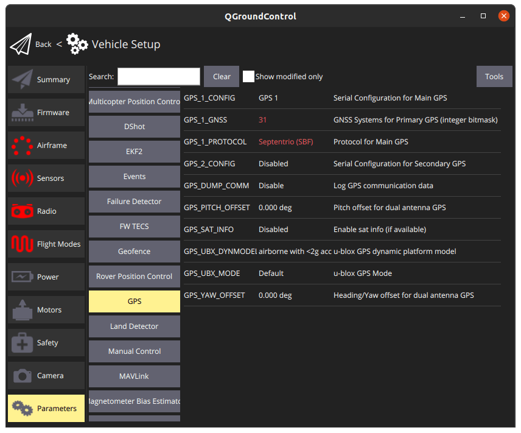

# Septentrio mosaic-go evaluation kit

The mosaic-go Evaluation Kit is composed of the mosaic module soldered on an interface board inside a metallic housing.

Sized at only 71 x 59 x 12 mm and weighing only 58 g, mosaic-go offers unmatched size to performance ratio. mosaic-go
includes:

- High update rate (>100 Hz) and low latency, both crucial for control systems of autonomous applications
- Reliable centimetre-level positioning
- Full L2 support via P(Y) code

  Mosaic-go part number:
  Single-antenna version, incorporating mosaic-X5: 410386(including accessories). Dual-antennaversion,
  incorporatingmosaic-H: 410397(including accessories).

- Size: 71 x 59 x 12 mm ± 1mm
- Weight: 58g ± 1g

## Table Of Contents
1. [Purchase](../../en/gps_compass/septentrio_mosaic-go.md#purchase)
2. [The mosaic-go heading evaluation kit contains](../../en/gps_compass/septentrio_mosaic-go.md#the-mosaic-go-heading-evaluation-kit-contains)
3. [Interfaces](../../en/gps_compass/septentrio_mosaic-go.md#interfaces)
   1. [USB](../../en/gps_compass/septentrio_mosaic-go.md#usb)
   2. [RSV USB](../../en/gps_compass/septentrio_mosaic-go.md#rsv-usb)
   3. [RF_IN1 and RF_IN2](../../en/gps_compass/septentrio_mosaic-go.md#rf_in1-and-rf_in2)
   4. [TF-Card](../../en/gps_compass/septentrio_mosaic-go.md#tf-card)
   5. [6-pin connector](../../en/gps_compass/septentrio_mosaic-go.md#6-pin-connector)
   6. [4-pin connector](../../en/gps_compass/septentrio_mosaic-go.md#4-pin-connector)
4. [Hardware Setup](../../en/gps_compass/septentrio_mosaic-go.md#hardware-setup)
   1. [Dual Antenna](../../en/gps_compass/septentrio_mosaic-go.md#hardware-setup)
   2. [Web App](../../en/gps_compass/septentrio_mosaic-go.md#web-app)
5. [PX4 Setup](../../en/gps_compass/septentrio_mosaic-go.md#px4-setup)
   1. [Single Antenna](../../en/gps_compass/septentrio_mosaic-go.md#single-antenna)
   2. [Dual Antenna](../../en/gps_compass/septentrio_mosaic-go.md#px4-setup)
6. [LED Status](../../en/gps_compass/septentrio_mosaic-go.md#led-status)

## Purchase

The mosaic-go kit is available on the [official shop](https://shop.septentrio.com/en) of Septentrio.

- [mosaic-go heading GNSS module evaluation kit](https://shop.septentrio.com/en/shop/mosaic-go-heading-gnss-module-evaluation-kit)
- [mosaic-go GNSS module receiver evaluation kit](https://shop.septentrio.com/en/shop/mosaic-go-gnss-module-receiver-evaluation-kit)

Other PX4 supported devices from Septentrio:

- [AsteRx OEM with Robotics Interface Board](../../en/gps_compass/septentrio_asterx-rib.md)

## The mosaic-go Heading Evaluation Kit Contains:

- 1 mosaic-H or mosaic-X5 module soldered on an interface board inside a metallic housing.
- 1 USB cable
- 6-pin COM1 open-ended cable
- 4-pin COM2 open-ended cable
- Help user guide card

## Interfaces

### USB

This micro-B connector is used to access the mosaic-go over USB. It can also be used to power the mosaic-go.

### RSV USB

This connector is reserved and should not be used.

### RF_IN1 and RF_IN2

These are the main and auxiliary antenna connectors, connected to the ANT_1 and ANT_2 pins of the internal mosaic.
Mosaic-go provides a 5V DC supply to both antenna connectors. The combined main and auxiliary antenna power consumption must not exceed 150mA.

Note that RF_IN2 is only available on the dual-antenna mosaic-go.

### TF Card

Socket for a micro SD Card. The module can log (SBF/NMEA) files on the micro SD Card in this socket.

### 6-pin Connector

Type: GH connector, 1.25mm pitch, 6 way. Mating connector housing: GHR-06V-S

| Pin Name | Direction | Level      | Description               | Comment                                                           |
|----------|-----------|------------|---------------------------|-------------------------------------------------------------------|
| VCC      | PWR       | 4.75V-5.5V | Main power supply         |                                                                   |
| GND      |           | 0          | Ground                    |                                                                   |
| TXD1     | Out       | 3V3_LVTTL  | Serial COM1 transmit line | Directly connects to TXD1 of internal mosaic                      |
| RXD1     | In        | 3V3_LVTTL  | Serial COM1 receive line  | Directly connects to RXD1 of internal mosaic                      |
| PPS      | Out       | 3V3_LVTTL  | PPSoutput                 | PPSO from mosaic converted to 3.3V                                |
| EVENT    | In        | 3V3_LVTTL  | Event timer input         | Connects to EVENTA of mosaic through a 3V3to 1V8 level translator |

### 4-pin Connector

Type: GH connector, 1.25mm pitch, 4way. Mating connector housing: GHR-04V-S

| Pin Name | Direction | Level     | Description               | Comment                                         |
|----------|-----------|-----------|---------------------------|-------------------------------------------------|
| NRST     | In        | 3V3_LVTTL | Reset input               | Directly connects to nRST_IN of internal mosaic |
| TXD2     | Out       | 3V3_LVTTL | Serial COM2 transmit line | Directly connects to TXD2 of internal mosaic    |
| RXD2     | In        | 3V3_LVTTL | Serial COM2 receive line  | Directly connects to RXD2 of internal mosaic    |
| GND      |           | 0         | Ground                    |                                                 |

## Hardware setup

1. Make sure the receiver is powered with at least 3.3V. You can use the micro USB connector or the 6-pin connector.
2. Connect one or two GNSS antennas to the RF-IN ports on the mosaic-go.
3. Connect the 6-pin connector (COM1) to the Pixhawk's TELEM1 port. This will provide power to the mosaic-go and with
   this single connection it will be able to send single and dual antenna information to the Pixhawk 4.

:::warning
Make sure the JST cable is wired correctly (since this is not a standard cable):

:::
:::note 
PX4 will ensure that the GNSS module is automatically configured however, if you have a dual antenna setup, it
is required to set the layout as accurately as possible in the web app.
:::

### Dual antenna

The attitude (heading/pitch) can be computed from the orientation of the baseline between the main and the aux1 GNSS antennas.

To enable multi-antenna attitude determination, follow the following procedure:

1. Attach two antennas to your vehicle, using cables of approximately the same length. The default antenna configuration
   is as depicted in the figure. It consists in placing the antennas aligned with the longitudinal axis of the vehicle,
   main antenna behind aux1. For best accuracy, try to maximize the distance between the antennas, and avoid significant
   height difference between the antenna ARPs.
2. In practice, the two antenna ARPs may not be exactly at the same height in the vehicle
   frame, or the main-aux1 baseline may not be exactly parallel or perpendicular to the
   longitudinal axis of the vehicle. This leads to offsets in the computed attitude angles.
   These offsets can be compensated for with the **setAttitudeOffset** command.

:::note 
For optimal heading results, the two antennas should be seperated by at least 30cm / 11.8 in (ideally 50cm /
19.7in or more)

For additional configuration of the dual antenna setup, please refer to
our [Knowledge Base](https://customersupport.septentrio.com/s/article/Setting-up-and-configuring-the-AsteRx-i-compensating-for-a-non-default-antenna-orientation) or the [hardware manual](https://www.septentrio.com/system/files/support/asterx-i3_product_group_hardware_manual_1.0.0.pdf)
:::

### Web app

mosaic-H GPS/GNSS receiver module with heading comes with fully documented interfaces, commands and data messages. The
included GNSS receiver control and analysis software [RxTools](https://www.septentrio.com/en/products/software/rxtools)
allows receiver configuration, monitoring as well as data logging and analysis.

The receiver includes an intuitive web user interface for easy operation and monitoring allowing you to control the
receiver from any mobile device or computer. The web interface also uses easy-to-read quality indicators ideal to
monitor the receiver operation during the job at hand.

## PX4 setup

### Single antenna

Edit the following parameters in the GPS tab:

- [GPS_1_CONFIG](https://docs.px4.io/master/en/advanced_config/parameter_reference.html#GPS_1_CONFIG): TELEM1
- [GPS_1_GNSS](https://docs.px4.io/master/en/advanced_config/parameter_reference.html#GPS_1_GNSS): 31
- [GPS_1_PROTOCOL](https://docs.px4.io/master/en/advanced_config/parameter_reference.html#GPS_1_PROTOCOL): Auto detect (
  or SBF)
- [SER_TEL1_BAUD](https://docs.px4.io/master/en/advanced_config/parameter_reference.html#SER_TEL1_BAUD): 115200 8N1

Go to “Tools” &#8250; “Reboot Vehicle”

### Dual antenna

Edit the following parameters in the GPS tab:

- [GPS_1_CONFIG](https://docs.px4.io/master/en/advanced_config/parameter_reference.html#GPS_1_CONFIG): TELEM1
- [GPS_1_GNSS](https://docs.px4.io/master/en/advanced_config/parameter_reference.html#GPS_1_GNSS): 31
- [GPS_1_PROTOCOL](https://docs.px4.io/master/en/advanced_config/parameter_reference.html#GPS_1_PROTOCOL): Auto detect (
  or SBF)
- [SER_TEL1_BAUD](https://docs.px4.io/master/en/advanced_config/parameter_reference.html#SER_TEL1_BAUD): 115200 8N1
- [EKF2_AID_MASK](https://docs.px4.io/master/en/advanced_config/parameter_reference.html#EKF2_AID_MASK): Use GPS & GPS
  yaw fusion (129)
- [GPS_YAW_OFFSET](https://docs.px4.io/master/en/advanced_config/parameter_reference.html#GPS_YAW_OFFSET): set according
  to your setup

Go to “Tools” &#8250; “Reboot Vehicle”

## LED Status

| LED Color     |  Powered  | SD card mounted | PVT Solution | Logging enabled |
|---------------|:---------:|:---------------:|:------------:|:---------------:|
| Red           | &check;️  |                 |              |                 |
| Green         | &check;️  |    &check;️     |              |                 |
| Blue          | &check;️  |    &check;️     |   &check;️   |                 |
| Purple        | &check;️  |                 |   &check;️   |                 |
| Purple + Blue | &check;️  |    &check;️     |   &check;️   |    &check;️     |
| Red + Green   | &check;️  |    &check;️     |              |    &check;️     |

:::tip 
If you want more detailed information about the mosaic-go and its module, please refer to
the [hardware manual](https://www.septentrio.com/system/files/support/mosaic_hardware_manual_v1.5.0.pdf) or the [Septentrio Support](https://customersupport.septentrio.com) page.
:::

