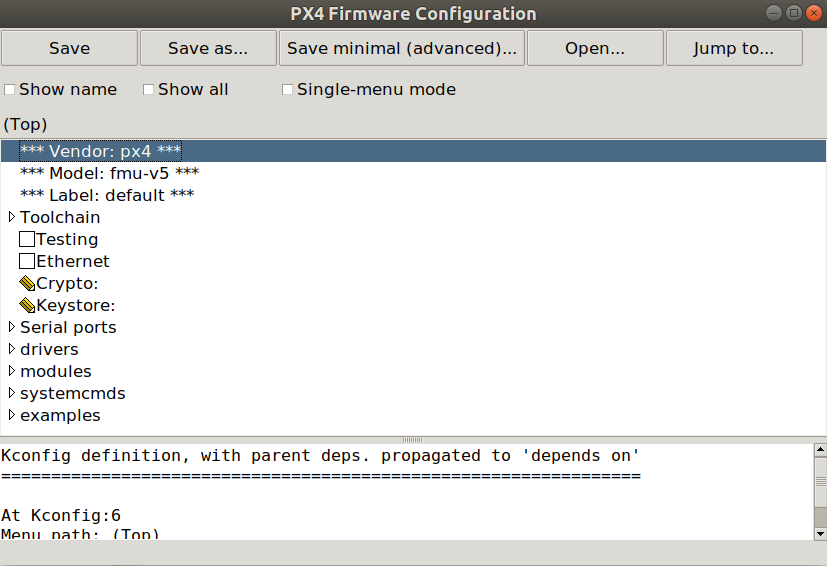
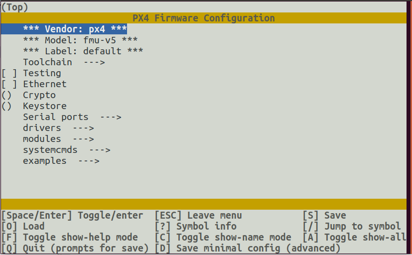

# PX4 Board Configuration (Kconfig)

The PX4 Autopilot firmware can be configured at build time to adapt it for specialized applications (fixedwing, multicopter, rover or more), to enable new and experimental features (such as RTPS or UAVCANv1) or to save flash & RAM usage by disabling some drivers and subsystems.
This configuration is handled through *Kconfig*, which is the same [configuration system used by NuttX](../hardware/porting_guide_nuttx.md#nuttx-menuconfig-setup).

The configuration options (often referred as "symbols" by the *kconfig* language) are defined in `Kconfig` files under the **/src** directory. 

## PX4 Kconfig Symbol Naming Convention

By convention, symbols for modules/drivers are named based on the module folder path.
For example, the symbol for the ADC driver at `src/drivers/adc/board_adc` must be named `DRIVERS_ADC_BOARD_ADC`.

To add symbols for driver/module specific options, the naming convention is the module name followed by the option name.
For example `UAVCAN_V1_GNSS_PUBLISHER` which is an option `GNSS_PUBLISHER` for the `UAVCAN_V1` module.
The options have to be guarded behind an `if` statement to ensure that the options are only visible when the module itself is enabled.

Full example:

```
menuconfig DRIVERS_UAVCAN_V1
	bool "UAVCANv1"
	default n
	---help---
		Enable support for UAVCANv1

if DRIVERS_UAVCAN_V1
    config UAVCAN_V1_GNSS_PUBLISHER
        bool "GNSS Publisher"
        default n
endif #DRIVERS_UAVCAN_V1
```

:::note
Builds will silently ignore any missing or miss-spelled modules in the  `*.px4board` configuration file.
:::

## PX4 Kconfig Label Inheritance

Each PX4 board must have a `default.px4board` configuration and can have an optional `bootloader.px4board configuration`.
However you can add also separate configurations under a different label e.g. `rtps.px4board`.
Note that by default the configuration of `rtps.px4board` inherits all settings set in `default.px4board`.
When changing the `rtps.px4board` it only stores the delta of the Kconfig keys that are different compared to `default.px4board`, this is useful to simplify configurations management

:::note
When modifying a Kconfig key in `default.px4board` it will be modified in all derivative configurations of the same board that had the same config as well.
:::

## PX4 Menuconfig Setup

To modify the PX4 board configuration, you can use the [menuconfig](https://pypi.org/project/kconfiglib/#menuconfig-interfaces) tool.
This can be launched using the PX4 build shortcuts:
```
make px4_fmu-v5_default boardconfig
make px4_fmu-v5_default boardguiconfig
```

The command line and GUI interfaces are shown below.





*Kconfiglib* and *menuconfig* come with the *kconfiglib* python package, which is installed by the normal [ubuntu.sh](https://github.com/PX4/PX4-Autopilot/blob/release/1.13/Tools/setup/ubuntu.sh) installation script.
If *kconfiglib* is not installed, you can do so using the command: `pip3 install kconfiglib`
