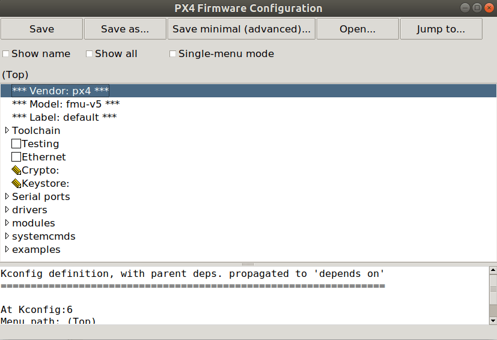

# PX4 Board Porting Guide configuration

The PX4 Autopilot firmware can be configured at build time to adapt them for specialized applications (fixedwing, multicopter, rover or more), to enable new and experimental features such as RTPS or UAVCANv1 or to save flash & ram usage by disabling some drivers and subsystems. This configuration is handled through Kconfig, which is the same [configuration system used by NuttX](https://docs.px4.io/master/en/hardware/porting_guide_nuttx.html#nuttx-menuconfig-setup) .

The configuration options (often reffered as symbols by the kconfig language) are defined in `Kconfig` files under the src directory. 

## PX4 Kconfig symbol naming convention

The symbol itself follows the naming convention of the path of module/driver for example the ADC driver at `src/drivers/adc/board_adc` symbol must be defined as `DRIVERS_ADC_BOARD_ADC`. Symbols for driver/module specific options should omit the path, use the name of the module and depend on the symbol  for example

```
menuconfig DRIVERS_UAVCAN_V1
	bool "UAVCANv1"
	default n
	---help---
		Enable support for UAVCANv1

if DRIVERS_UAVCAN_V1
    config UAVCAN_V1_GNSS_PUBLISHER
        bool "GNSS Publisher"
        default n
endif #DRIVERS_UAVCAN_V1
```

## PX4 Menuconfig Setup

To modify the PX4 board configuration, you can use the [menuconfig](https://pypi.org/project/kconfiglib/#menuconfig-interfaces) using the PX4 shortcuts:
```
make px4_fmu-v5_default boardconfig
make px4_fmu-v5_default boardguiconfig
```

The interfaces shown below




Kconfiglib and menuconfig comes with the kconfiglib python package, which comes with [ubuntu.sh](https://github.com/PX4/PX4-Autopilot/blob/master/Tools/setup/ubuntu.sh) installation script. If kconfiglib is not installed please install using `pip3 install kconfiglib`
