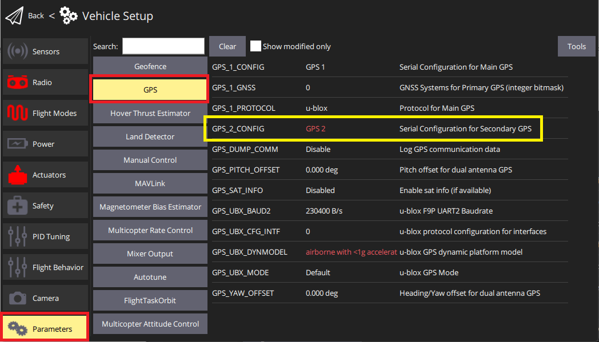

# Magnetometer (Compass)

<!-- 
PX4 supports global navigation satellite systems (GNSS) (including GPS, GLONASS, Galileo, BeiDou, QZSS and SBAS) using receivers that communicate via the u-blox, MTK Ashtech or Emlid protocols, or via UAVCAN.
It also supports [Real Time Kinematic (RTK)](../gps_compass/rtk_gps.md) and **Post-Processing Kinematic (PPK)** GPS Receivers, which extend GPS systems to centimetre-level precision.

PX4 can be used with the following compass parts (magnetometers): Bosch BMM 150 MEMS (via I2C bus), HMC5883 / HMC5983 (I2C or SPI), IST8310 (I2C) and LIS3MDL (I2C or SPI).
Up to 4 internal or external magnetometers can be connected, though only one will actually be used as a heading source.

The system automatically chooses the best available compass based on their _priority_ (external magnetometers have a higher priority than internal magnetometers).
If the primary compass fails in-flight, it will failover to the next one.
If it fails before flight, arming will be denied.

:::tip
When using [Pixhawk-series](../flight_controller/pixhawk_series.md) flight controllers, we recommend using a *combined GPS + Compass* mounted as far away from the motor/ESC power supply lines as possible - typically on a pedestal or wing (for fixed-wing).
The internal compass *may* be useful on larger vehicles (e.g. VTOL) where it is possible to reduce electromagnetic interference by mounting the Pixhawk a long way from power supply lines.
On small vehicles an external compass is almost always required.
:::

## Supported GNSS and/or Compass

PX4 should work with any unit that communicates via the u-blox, MTK Ashtech or Emlid protocols, or via UAVCAN.

### GNSS & Compass

This list contains GNSS units (most of which also have a compass).
These have been tested by the PX4 dev team, or which are popular within the PX4 community.

Device | GPS | Compass | [RTK](../gps_compass/rtk_gps.md) | [GPS Yaw Output](#configuring-gps-as-yaw-heading-source) | [Dual F9P GPS Heading](../gps_compass/u-blox_f9p_heading.md) | PPK
:--- | :---: | :---:  | :---:  | :---:  | :---: | :---:
[ARK GPS](https://arkelectron.com/product/ark-gps/) | M9N  | ICM42688p | | | |
[ARK RTK GPS](https://arkelectron.com/product/ark-rtk-gps/) | F9P  | ICM42688p | &check; | | &check; |
[Avionics Anonymous UAVCAN GNSS/Mag](https://www.tindie.com/products/avionicsanonymous/uavcan-gps-magnetometer/) | SAM-M8Q | MMC5983MA | | | |
[CUAV NEO 3 GPS](../gps_compass/gps_cuav_neo_3.md) | M9N | IST8310 | | | |
[CUAV NEO 3 Pro GPS](../gps_compass/gps_cuav_neo_3pro.md) |  M9N | RM3100 |  | | |
[CUAV NEO 3X GPS](../gps_compass/gps_cuav_neo_3x.md) |  M9N| RM3100 | | | |
[CUAV C-RTK GPS](../gps_compass/rtk_gps_cuav_c-rtk.md) | M8P/M8N | &check; | &check; | | |
[CUAV C-RTK 9Ps GPS](../gps_compass/rtk_gps_cuav_c-rtk-9ps.md) | F9P | RM3100 | &check; | | &check; |
[CUAV C-RTK2 PPK/RTK GNSS](../gps_compass/rtk_gps_cuav_c-rtk.md) | F9P | RM3100 | &check; | | | &check;
[CubePilot Here2 GNSS GPS (M8N)](../gps_compass/gps_hex_here2.md) | M8N | ICM20948 | | | |
[CubePilot Here+ RTK GPS](../gps_compass/rtk_gps_hex_hereplus.md) | M8P | HMC5983 | &check; | | |
[CubePilot Here3 CAN GNSS GPS (M8N)](https://www.cubepilot.org/#/here/here3) | M8P | ICM20948 | &check; | | |
[Drotek DP0804](https://store-drotek.com/920-DP0804.html) (and other [Drotek u-blox GPS/Compasses](https://store-drotek.com/index.php?controller=search&s=ublox+compass)) | M9N | LIS3MDL | | | |
[Drotek SIRIUS RTK GNSS ROVER (F9P)](https://store-drotek.com/911-sirius-rtk-gnss-rover-f9p.html) | F9P | RM3100 | &check; | | &check; |
[Emlid Reach M+](https://emlid.com/reach/)  - PX4 only supports "ordinary" GPS with this module. RTK support is expected in the near future. | &check; | &cross; | | | |&check;
[Femtones MINI2 Receiver](../gps_compass/rtk_gps_fem_mini2.md) | FB672, FB6A0 | &check; | &check; | | |
[Freefly RTK GPS](../gps_compass/rtk_gps_freefly.md) | F9P | IST8310 | &check; | | |
[Holybro DroneCAN M8N GPS](../dronecan/holybro_m8n_gps.md) | M8N | BMM150 | | | |
[Holybro Micro M8N GPS](https://holybro.com/products/micro-m8n-gps) | M8N | IST8310 | | | |
[Holybro Nano Ublox M8 5883 GPS](https://holybro.com/products/nano-m8-5883-gps-module) | UBX-M8030 | QMC5883 | | | |
[Holybro M8N GPS](../gps_compass/gps_holybro_m8n_m9n.md) | M8N | IST8310 | | | |
[Holybro M9N GPS](../gps_compass/gps_holybro_m8n_m9n.md) | M9N | IST8310 | | | |
[Holybro DroneCAN M9N GPS](https://holybro.com/products/dronecan-m9n-gps) | M9N | BMM150 | | | |
[Holybro H-RTK F9P Ultralight](https://holybro.com/products/h-rtk-f9p-ultralight) | F9P | IST8310 | &check; | | &check;|
[Holybro H-RTK F9P Helical or Base](../gps_compass/rtk_gps_holybro_h-rtk-f9p.md) | F9P | IST8310 | &check; | | &check;|
[Holybro DroneCAN H-RTK F9P Helical](https://holybro.com/products/dronecan-h-rtk-f9p-helical) | F9P | BMM150  | &check; | | &check;|
[Holybro H-RTK F9P Rover Lite](../gps_compass/rtk_gps_holybro_h-rtk-f9p.md) | F9P | IST8310 | &check; | | |
[Holybro DroneCAN H-RTK F9P Rover](https://holybro.com/products/dronecan-h-rtk-f9p-rover) | F9P | BMM150  | &check; | | &check; |
[Holybro H-RTK M8P GNSS](../gps_compass/rtk_gps_holybro_h-rtk-m8p.md) | M8P | IST8310 | &check; | | |
[Holybro H-RTK Unicore UM982 GPS](../gps_compass/rtk_gps_holybro_unicore_um982.md) | UM982 | IST8310 | &check; | &check; | |
[Hobbyking u-blox Neo-M8N GPS with Compass](https://hobbyking.com/en_us/ublox-neo-m8n-gps-with-compass.html?gclid=Cj0KCQjwqM3VBRCwARIsAKcekb3ojv1ZhLz1-GuvCsUuGT8ZZuw8meMIV_I6pgUCj6DJRzHBY9OApekaAgI5EALw_wcB&gclsrc=aw.ds&___store=en_us) | M8N | &check; | | | |
[LOCOSYS Hawk A1 GNSS receiver](../gps_compass/gps_locosys_hawk_a1.md) | MC-1612-V2b | optional | &cross; | | | 
[LOCOSYS Hawk R1](../gps_compass/rtk_gps_locosys_r1.md) | MC-1612-V2b |  | &cross; | | | 
[LOCOSYS Hawk R2](../gps_compass/rtk_gps_locosys_r2.md) | MC-1612-V2b | IST8310 | &cross; | | | 
[mRo GPS u-blox Neo-M8N Dual Compass](https://store.mrobotics.io/product-p/m10034-8308.htm) | M8N | LIS3MDL, IST8308 | | | |
[mRo u-blox ZED-F9 RTK L1/L2 GPS](https://store.mrobotics.io/product-p/m10020d.htm) | F9P | &cross; | &check; | | &check; |
[Septentrio AsteRx-RIB](../gps_compass/septentrio_asterx-rib.md) |        AsteRx        | &check; | &check; | &check; | Septentrio dual antenna heading | &check; |
[Septentrio mosaic-go](../gps_compass/septentrio_mosaic-go.md) | mosaic X5 / mosaic H | &check; | &check; | &check; | Septentrio dual antenna heading | &check; |
[Sky-Drones SmartAP GPS](../gps_compass/gps_smartap.md) | M8N | HMC5983, IST8310, LIS3MDL | | | |
[SparkFun GPS-RTK2 Board - ZED-F9P](https://www.sparkfun.com/products/15136) | F9P |  &cross; | &check; | | &check; |
[Trimble MB-Two](../gps_compass/rtk_gps_trimble_mb_two.md) | F9P | &cross; | &check; | &check; | | |
[Zubax GNSS 2](https://zubax.com/products/gnss_2) | MAX-M8Q | LIS3MDL | | | |

Notes:

- &check; or a specific part number indicate that a features is supported, while &cross; or empty show that the feature is not supported.
  "?" indicates "unknown".
- Where possible and relevant the part name is used (i.e. &check; in the GPS column indicates that a GPS module is present but the part is not known).
- [Avionics Anonymous UAVCAN Magnetometer](https://www.tindie.com/products/avionicsanonymous/uavcan-magnetometer/) and [Holybro DroneCAN RM3100 Compass/Magnetometer](https://holybro.com/collections/gps-rtk-systems/products/dronecan-rm3100-compass) is a compass (not a GPS).
- Some RTK modules can only be used in a particular role (base or rover), while others can be used interchangeably.
- The list may omit some discontinued hardware that is still supported.
  For example [CubePilot Here+ RTK GPS](../gps_compass/rtk_gps_hex_hereplus.md) is discontinued and may be removed from the list in a future release.
  The original *Here* has already been removed.
  Check earlier versions if a discontinued module is not mentioned here.

### Compass/Magnetometer (Only)

This list contains compasses (magnetometers) without GNSS.

Device | Compass | DroneCan
:--- | :---: | :---: 
[Avionics Anonymous UAVCAN Magnetometer](https://www.tindie.com/products/avionicsanonymous/uavcan-magnetometer/) | ? | 
[Holybro DroneCAN RM3100 Compass/Magnetometer](https://holybro.com/products/dronecan-rm3100-compass) | RM3100 |  &check;

Note:

- &check; or a specific part number indicate that a features is supported, while &cross; or empty show that the feature is not supported.
  "?" indicates "unknown".
  
## Hardware Setup

Instructions for connecting the GPS (and compass, if present) are usually provided by the manufacturer (at least for more common [Autopilot Hardware](../flight_controller/README.md)).

[Pixhawk Series](../flight_controller/pixhawk_series.md) controllers typically have a clearly labeled port for connecting the GPS, and the compass is connected to either the I2C or SPI port/bus (depending on the device).

The [ARK GPS](../dronecan/ark_gps.md), [ARK RTK GPS](../dronecan/ark_rtk_gps.md), [Zubax GNSS 2](https://zubax.com/products/gnss_2), [CUAV C-RTK2](../gps_compass/rtk_gps_cuav_c-rtk.md), [CubePilot Here3 CAN GNSS GPS (M8N)](https://www.cubepilot.org/#/here/here3), and [Avionics Anonymous GNSS/Mag](https://www.tindie.com/products/avionicsanonymous/uavcan-gps-magnetometer/) can also be connected via [DroneCAN](../dronecan/README.md).

:::warning
Pay attention to pinout when connecting the GPS module.
While these are all software-compatible, there are several different pin orderings.
:::

## GNSS Configuration

The "standard" GPS configuration is provided below.
Additional device-specific configuration may be provided in PX4 or manufacturer device documentation (e.g. [Trimble MB-Two > Configuration](../gps_compass/rtk_gps_trimble_mb_two.md#configuration)).

:::warning
The GPS protocol expected by PX4 defaults to u-blox (by default other GPS types like Trimble, Emlid, MTK, will not be detected)
The protocol can be configured with [GPS_x_PROTOCOL](../advanced_config/parameter_reference.md#GPS_1_PROTOCOL).
:::

### Configuring the Primary GPS

GPS configuration on Pixhawk is handled transparently for the user - simply connect the GPS module to the port labeled **GPS** and everything should work.

:::note
The default [Serial Port Configuration](../peripherals/serial_configuration.md#default_port_mapping) works for most devices.
If you are using the *Trimble MB-Two* you will need to modify the configuration to explicitly set the rate to 115200 baud.
:::

### Configuring a Secondary GPS (Dual GPS System)

To use a secondary GPS, attach it to any free port, and then perform a [Serial Port Configuration](../peripherals/serial_configuration.md) to assign [GPS_2_CONFIG](../advanced_config/parameter_reference.md#GPS_2_CONFIG) to the selected port.

The following steps show how to configure a secondary GPS on the `TELEM 2` port in *QGroundControl*:

1. [Find and set](../advanced_config/parameters.md) the parameter [GPS_2_CONFIG](../advanced_config/parameter_reference.md#GPS_2_CONFIG) to **TELEM 2**.
   - Open *QGroundControl* and navigate to the **Vehicle Setup > Parameters** section.
   - Select the **GPS** tab (1), then open the [GPS_2_CONFIG](../advanced_config/parameter_reference.md#GPS_2_CONFIG) parameter (2) and select *TELEM 2* from the dropdown list (3).
     
1. Reboot the vehicle in order to make the other parameters visible.
1. Select the **Serial** tab, and open the [SER_TEL2_BAUD](../advanced_config/parameter_reference.md#SER_TEL2_BAUD) parameter (`TELEM 2` port baud rate): set it to *Auto*.
  

After setting up the second GPS port:
1. Configure the ECL/EKF2 estimator to blend data from both GPS systems.
   For detailed instructions see: [Using the ECL EKF > Dual Receivers](../advanced_config/tuning_the_ecl_ekf.md#dual-receivers).

### Configuring GPS as Yaw/Heading Source

GPS can be used as a source for yaw fusion when using modules where *yaw output is supported by the device* (e.g. [Trimble MB-Two](../gps_compass/rtk_gps_trimble_mb_two.md)) or when using some [RTK GPS Setups with Dual u-blox F9P](../gps_compass/u-blox_f9p_heading.md).

When using GPS for yaw fusion you will need to configure the following parameters:

Parameter | Setting
--- | ---
[GPS_YAW_OFFSET](../advanced_config/parameter_reference.md#GPS_YAW_OFFSET) |  The angle made by the *baseline* (the line between the two GPS antennas) relative to the vehicle x-axis (front/back axis, as shown [here](../config/flight_controller_orientation.md#calculating-orientation)).
[EKF2_GPS_CTRL](../advanced_config/parameter_reference.md#EKF2_GPS_CTRL) | Set bit position 3 "Dual antenna heading" to `1` (i.e. add 8 to the parameter value).

:::tip
If using this feature, all other configuration should be setup up as normal (e.g. [RTK Positioning](../gps_compass/rtk_gps.md#positioning-setup-configuration)).
:::

## Compass Configuration

Compass calibration is covered in: [Compass Configuration](../config/compass.md).
The process is straightforward and will autodetect, [set default rotations](../advanced_config/parameter_reference.md#SENS_MAG_AUTOROT), calibrate, and prioritise, all connected magnetometers.

## Developer Information

- GPS/RTK-GPS
  - [RTK-GPS](../advanced/rtk_gps.md)
  - [GPS driver](../modules/modules_driver.md#gps)
  - [DroneCAN Example](../dronecan/README.md)
- Compass
  - [Driver source code](https://github.com/PX4/PX4-Autopilot/tree/main/src/drivers/magnetometer) (Compasses)

-->