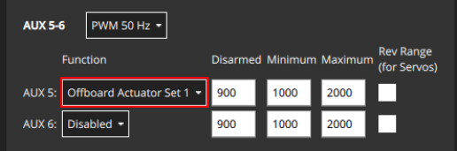
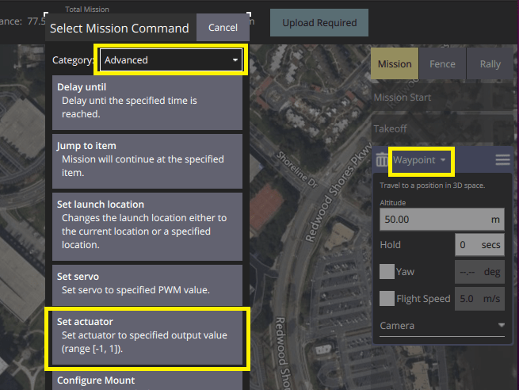
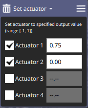

# Payloads and Cameras

PX4 supports a wide range of payloads and cameras.

Payloads are connected to [Fight Controller outputs](../getting_started/px4_basic_concepts.md#outputs-motors-servos-actuators), and can generally be triggered automatically in missions, or manually using RC passthrough, mapping to a joystick, or MAVLink/MAVSDK commands.

:::note
Payloads (actuators) can be tested in the [pre-arm state](../getting_started/px4_basic_concepts.md#arming-and-disarming), which disables motors but allows actuators to move.
This may be safer than testing when the vehicle is armed.
:::

## Mapping Drones

Mapping drones use cameras to capture images at time or distance intervals during surveys.

MAVLink cameras that support the [MAVLink Camera Protocol](https://mavlink.io/en/services/camera.html) provide the best integration with PX4 and QGroundControl.
The MAVSDK provides simple APIs to use this protocol for both [standalone camera operations](https://mavsdk.mavlink.io/main/en/cpp/api_reference/classmavsdk_1_1_camera.html) and in [missions](https://mavsdk.mavlink.io/main/en/cpp/api_reference/structmavsdk_1_1_mission_1_1_mission_item.html#structmavsdk_1_1_mission_1_1_mission_item_1a0299fbbe7c7b03bc43eb116f96b48df4).

Cameras can also be connected directly to a flight controller using PWM or GPI outputs.
PX4 supports the following set of MAVLink commands/mission items for cameras that are connected to the flight controller:

- [MAV_CMD_DO_SET_CAM_TRIGG_INTERVAL](https://mavlink.io/en/messages/common.html#MAV_CMD_DO_SET_CAM_TRIGG_INTERVAL) - set time interval between captures.
- [MAV_CMD_DO_SET_CAM_TRIGG_DIST](https://mavlink.io/en/messages/common.html#MAV_CMD_DO_SET_CAM_TRIGG_DIST) - set distance between captures
- [MAV_CMD_DO_TRIGGER_CONTROL](https://mavlink.io/en/messages/common.html#MAV_CMD_DO_TRIGGER_CONTROL) - start/stop capturing (using distance or time, as defined using above messages).

The following topics show how to *connect* and configure a camera:

- [Camera Triggering](../peripherals/camera.md) from flight controller PWM or GPIO outputs, or via MAVLink. 
- [Camera Capture](../peripherals/camera.md#camera-capture) feedback via hotshoe input.


## Cargo Drones (Package Delivery)

Cargo drones commonly use grippers, winches, and other mechanisms to release packages at their destinations.

PX4 supports _package delivery in missions_ using a [gripper](../peripherals/gripper.md).
Grippers can also be triggering using the [MAV_CMD_DO_GRIPPER](https://mavlink.io/en/messages/common.html#MAV_CMD_DO_GRIPPER) MAVLink command, or manually via a Joystick button.

For setup and usage information see:

- [Gripper](../peripherals/gripper.md)
- [Flying > Package Delivery Mission Planning](../flying/package_delivery_mission.md)

:::note
Support for winches and other release mechanisms is also intended.

If you need to perform cargo delivery using hardware that is not yet integrated, you can use [Generic Actuator Control](#generic-actuator-control).
:::

## Surveillance, Search & Rescue

Surveillance and Search & Rescue drones have similar requirements to mapping drones.
The main differences are that, in addition to flying a planned survey area, they typically need good standalone control over the camera for image and video capture, and they may need to be able to work during both day and night

Use a camera that supports the [MAVLink Camera Protocol](https://mavlink.io/en/services/camera.html) as this supports image and video capture, zooming, storage management, multiple cameras on the same vehicle and switching between them, etc.
These cameras can be controlled either manually from QGroundControl or via MAVSDK (for both [standalone camera operations](https://mavsdk.mavlink.io/main/en/cpp/api_reference/classmavsdk_1_1_camera.html) and in [missions](https://mavsdk.mavlink.io/main/en/cpp/api_reference/structmavsdk_1_1_mission_1_1_mission_item.html#structmavsdk_1_1_mission_1_1_mission_item_1a0299fbbe7c7b03bc43eb116f96b48df4)).
See [Camera triggering](../peripherals/camera.md) for information on how to configure your camera to work with MAVLink.

:::note
Cameras connected directly to the flight controller _only_ support camera triggering, and are unlikely to be suitable for most surveillance/search work.
:::

A search and rescue drone may also need to carry cargo, for example, emergency supplies for a stranded hiker.
See [Cargo Drones](#cargo-drones-package-delivery) above for information about payload delivery.

## Agricultural Drones/Crop Spraying

Agricultural drones are commonly used for mapping crop health and pest detection and animal management (herding, tracking, etc.).
These cases are similar to the [mapping](#mapping-drones) and [surveillance, search & rescue](#surveillance-search-rescue) cases above.
While specific crops/animals may need specialist cameras, the integration with PX4 is the same.

Agricultural drone may also be used for crop spraying.
In this case the sprayer must be controlled as a [generic actuator](#generic-actuator-control):

- The [Generic Actuator Control with MAVLink](#generic-actuator-control-with-mavlink) section explains how you can connect flight controller outputs to your sprayer so that they can be controlled using MAVLink.
  Most sprayers provide controls to activate/deactivate a pump; some also allow control over the rate of flow or the spray field (i.e. by controlling the nozzle shape, or using a spinner to distribute the payload).
- You can define the area to spray using a [Survey pattern](https://docs.qgroundcontrol.com/master/en/PlanView/pattern_survey.html), or you can define the grid to fly using waypoints.
  In either case, it is important to ensure that the vehicle flight path and altitude provide adequate coverage for your particular spray being used.
- You should add a ["Set actuator" mission item](#generic-actuator-control-in-missions) to your mission before and after the survey pattern in order to enable and disable the sprayer.


## Generic Actuator Control

You can connect arbitrary hardware to unused PX4 outputs and control it using [RC Control](#generic-actuator-control-with-rc) or [MAVLink](#generic-actuator-control-with-mavlink) (either as commands or in a [mission](#generic-actuator-control-in-missions)).

This is useful when you need to use a payload type for which there is no associated MAVLink command, or that is not supported by PX4.

:::note
Prefer using integrated hardware and hardware-specific MAVLink commands to generic actuator control when possible.
Using integrated hardware allows optimised mission planning and behaviour.
:::

### Generic Actuator Control with MAVLink

[MAV_CMD_DO_SET_ACTUATOR](https://mavlink.io/en/messages/common.html#MAV_CMD_DO_SET_ACTUATOR) can be used to set the value of up to 6 actuators (at a time).
This command can be used in [missions](#generic-actuator-control-in-missions) by creating a "Set actuator" mission item, or as a stand alone command.

The outputs that are to be controlled are specified in the [Actuators](../config/actuators.md#actuator-outputs) configuration screen by assigning the functions `Offboard Actuator Set 1` to `Offboard Actuator Set 6` to the desired [actuator outputs](../config/actuators.md#actuator-outputs).



`MAV_CMD_DO_SET_ACTUATOR` `param1` to `param6` control the outputs mapped by `Offboard Actuator Set 1` to `Offboard Actuator Set 6` respectively.

For example, in the image above, the `AUX5` output is assigned the function `Offboard Actuator Set 1` function.
To control the actuator attached to `AUX5` you would set the value of `MAV_CMD_DO_SET_ACTUATOR.param1`.

<!-- PX4 v1.14 bug https://github.com/PX4/PX4-Autopilot/issues/21966 -->

### Generic Actuator Control with RC

Up to 6 autopilot PWM or CAN outputs can be controlled using RC channels.
The outputs that are to be controlled are specified in the [Actuators](../config/actuators.md#actuator-outputs) configuration screen by assigning the functions `RC AUX 1` to `RC AUX 6` to the desired [actuator outputs](../config/actuators.md#actuator-outputs).

To map a particular RC channel to an output function `RC AUX n` (and hence it's assigned output) you use the [RC_MAP_AUXn](../advanced_config/parameter_reference.md#RC_MAP_AUX1) parameter that has the same `n` number.

For example, to control an actuator attached to AUX pin 3 (say) you would assign the output function `RC AUX 5` to the output `AUX3`.
You could then use set the RC channel to control the `AUX3` output using `RC_MAP_AUX5`.

### Generic Actuator Control in Missions

To use generic actuator control in a mission you must first [configure the outputs that you want to control using MAVLink](#generic-actuator-control-with-mavlink).

Then in *QGroundControl* you can set the value of actuator outputs in a mission using the **Set actuator** mission item (this adds a [MAV_CMD_DO_SET_ACTUATOR](https://mavlink.io/en/messages/common.html#MAV_CMD_DO_SET_ACTUATOR) to the uploaded mission plan).

It is important to note that with generic actuator control, neither *QGroundControl* or PX4 know anything about the hardware being triggered.
When processing the mission item, PX4 will simply set the outputs to the specified values and then immediately proceed to the next mission item.
If the hardware requires time to activate and you need to pause at the current waypoint for this to happen, then you will need to plan the mission with additional items to achieve the desired behaviour.

:::note
This is one reason why integrated hardware is preferred!
It allows missions to be written generically, with any hardware-specific behaviour or timing managed by the flight stack configuration.
:::

To use a generic actuator in a mission:

1. Create a waypoint mission item where you want the actuator command.
1. Change the waypoint mission item to a "Set actuator" mission item:

   

   - Select the header on the waypoint mission editor to open the **Select Mission Command** editor.
   - Select the category **Advanced**, and then the **Set actuator** item (if the item is not present, try a more recent version of *QGroundControl* or a daily build).
     This will change the mission item type to "Set actuator".

1. Select the actuators that are connected and set their values (these are normalized between -1 and 1).

   

### MAVSDK (Example script)

The following [MAVSDK](https://mavsdk.mavlink.io/main/en/index.html) [example code](https://github.com/mavlink/MAVSDK/blob/main/examples/set_actuator/set_actuator.cpp) shows how to trigger payload release using the MAVSDK Action plugin's [`set_actuator()`](https://mavsdk.mavlink.io/main/en/cpp/api_reference/classmavsdk_1_1_action.html#classmavsdk_1_1_action_1ad30beac27f05c62dcf6a3d0928b86e4c) method.

The `set_actuator()` index values map to the MAVLink payload outputs defined for your airframe.

:::note
MAVSDK sends the [MAV_CMD_DO_SET_ACTUATOR](https://mavlink.io/en/messages/common.html#MAV_CMD_DO_SET_ACTUATOR) MAVLink command under the hood.
:::

```cpp
#include <mavsdk/mavsdk.h>
#include <mavsdk/plugins/action/action.h>
#include <chrono>
#include <cstdint>
#include <iostream>
#include <future>

using namespace mavsdk;

void usage(const std::string& bin_name)
{
    std::cerr << "Usage :" << bin_name << " <connection_url> <actuator_index> <actuator_value>\n"
              << "Connection URL format should be :\n"
              << " For TCP : tcp://[server_host][:server_port]\n"
              << " For UDP : udp://[bind_host][:bind_port]\n"
              << " For Serial : serial:///path/to/serial/dev[:baudrate]\n"
              << "For example, to connect to the simulator use URL: udp://:14540\n";
}

int main(int argc, char** argv)
{
    if (argc != 4) {
        usage(argv[0]);
        return 1;
    }

    const std::string connection_url = argv[1];
    const int index = std::stod(argv[2]);
    const float value = std::stof(argv[3]);

    Mavsdk mavsdk;
    const ConnectionResult connection_result = mavsdk.add_any_connection(connection_url);

    if (connection_result != ConnectionResult::Success) {
        std::cerr << "Connection failed: " << connection_result << '\n';
        return 1;
    }

    std::cout << "Waiting to discover system...\n";
    auto prom = std::promise<std::shared_ptr<System>>{};
    auto fut = prom.get_future();

    // We wait for new systems to be discovered, once we find one that has an
    // autopilot, we decide to use it.
    mavsdk.subscribe_on_new_system([&mavsdk, &prom]() {
        auto system = mavsdk.systems().back();

        if (system->has_autopilot()) {
            std::cout << "Discovered autopilot\n";

            // Unsubscribe again as we only want to find one system.
            mavsdk.subscribe_on_new_system(nullptr);
            prom.set_value(system);
        }
    });

    // We usually receive heartbeats at 1Hz, therefore we should find a
    // system after around 3 seconds max, surely.
    if (fut.wait_for(std::chrono::seconds(3)) == std::future_status::timeout) {
        std::cerr << "No autopilot found, exiting.\n";
        return 1;
    }

    // Get discovered system now.
    auto system = fut.get();

    // Instantiate plugins.
    auto action = Action{system};

    std::cout << "Setting actuator...\n";
    const Action::Result set_actuator_result = action.set_actuator(index, value);

    if (set_actuator_result != Action::Result::Success) {
        std::cerr << "Setting actuator failed:" << set_actuator_result << '\n';
        return 1;
    }

    return 0;
}
```


