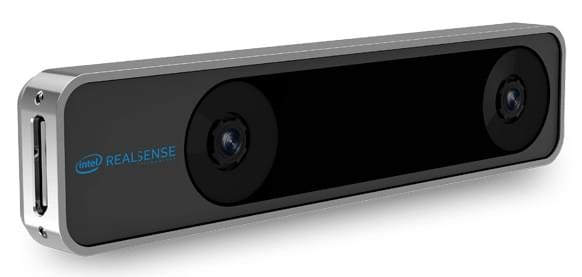

# T265 Intel Realsense Tracking Camera (VIO)

The [Intel Realsense Tracking Camera T265](https://www.intelrealsense.com/tracking-camera-t265/) provides odometry information that can be used for [VIO](../computer_vision/visual_inertial_odometry.md), augmenting or replacing other positioning systems on PX4.

> **Tip** This camera is recommended, and is used in the [Visual Inertial Odometry (VIO) > Supported Setup](../computer_vision/visual_inertial_odometry.md#supported_setup).

## Purchase Link

[Intel® RealSense™ Tracking Camera T265](https://store.intelrealsense.com/buy-intel-realsense-tracking-camera-t265.html) (store.intelrealsense.com)

## Setup Instructions

The instructions in [Visual Inertial Odometry (VIO)](../computer_vision/visual_inertial_odometry.md) (and [VIO bridge ROS node](https://github.com/Auterion/VIO_bridge)) explain how to set up VIO with ROS using this camera.

In particular, note that this camera is sensitive to high frequency vibrations!
Soft-mounting is recommended.

