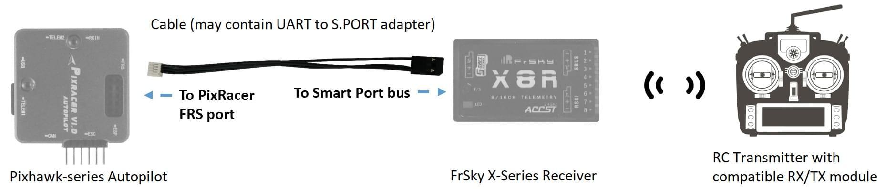

# FrSky Telemetry

FrSky telemetry allows you to access vehicle [telemetry/status](#messages) information on a compatible RC transmitter.

Available [telemetry is listed here](#messages), and includes: flight mode, battery level, RC signal strength, speed, altitude etc. Some transmitters can additionally provide audible and vibration feedback, which is particularly useful for low battery and other failsafe warnings.

PX4 supports both [S.Port](#s_port) (new) and D (old) FrSky telemetry ports. 

## Hardware Setup

A typical hardware setup is shown below. 

It includes:

* An [FrSky-compatible RC transmitter](#transmitters) like the FrSky Taranis X9D Plus.
* An [FrSky telemetry-capable receiver](#receivers) like the XSR and X8R.
* A cable to connect the flight controller telemetry port to the FrSky receiver (this is separate from the connection for RC channels).

With the exception of [Pixracer](../flight_controller/pixracer.md), Pixhawk-series UART ports and receiver telemetry ports are incompatible, and must (usually) be connected via an adapter. 

> **Tip** Usually it is cheaper and easier to buy a [ready made cable](#ready_made_cable) that contains this adapter and has the appropriate connectors for the autopilot and receiver. Creating a [DIY cable](#diy_cables) requires electronics assembly expertise.

### Ready-Made Cables {#ready_made_cable}

Ready-made cables (which include the required adapters) are available from:
* [Craft and Theory](http://www.craftandtheoryllc.com/telemetry-cable). Versions are available with DF-13 compatible *PicoBlade connectors* (for FMUv2/3DR Pixhawk, FMUv2/HKPilot32) and *JST-GH connectors* (for FMUv3/Pixhawk 2 "The Cube" and FMUv4/PixRacer v1).

  

  
## PX4 Configuration

The typical port used for FrSky telemetry is TELEM2. This can be enabled by [setting](../advanced_config/parameters.md) the [SYS_COMPANION](../advanced_config/parameter_reference.md#SYS_COMPANION) parameter to 10.

The following boards have dedicated zero-configuration FrSky ports:

* [Pixhawk 3 Pro](../flight_controller/pixhawk3_pro.md) TELEM4 port: No additional software configuration is needed when connecting to this port.
* [Pixracer](../flight_controller/pixracer.md) FrSky port: No additional software configuration is needed (once connected FrSky telemetry auto-starts and detects D or S mode). 

> **Tip** You can still use TELEM2 on the above boards (by setting the `SYS_COMPANION` parameter). If you wish to use any other port you will need to modify the firmware.

## Compatible RC Transmitters {#transmitters}

You will need an RC transmitter that can receive the telemetry stream. Popular alternatives include:
* FrSky Taranis X9D Plus (recommended)
* FrSky Taranis X9D
* FrSky Taranis X9E
* FrSky Taranis Q X7
* Turnigy 9XR Pro

The transmitter must be bound to your receiver and be running customised scripts to display the telemetry (see following sections).

### Taranis - LuaPilot Setup

Compatible Taranis receivers (e.g. X9D Plus) running OpenTX 2.1.6 or newer can use the LuaPilot script to display received telemetry, as shown in the screenshot below.

Instructions for installing the script can be found here: [LuaPilot Taranis Telemetry script > Taranis Setup OpenTX 2.1.6 or newer](http://ilihack.github.io/LuaPilot_Taranis_Telemetry/)

If you open the `LuaPil.lua` script with a text editor, you can edit the configuration. Suggested modifications include:
* `local BattLevelmAh = -1` - Use the battery level calculation from the vehicle
* `local SayFlightMode = 0` - There are no WAV files for the PX4 flight modes

## Telemetry Messages {#messages}

FrySky Telemetry can transmit most of the more useful status information from PX4. S-Port and D-Port receivers transmit different sets of messages, as listed the following sections.

### S-Port {#s_port}

S-Port receivers transmit the following messages (from [here](https://github.com/iNavFlight/inav/blob/master/docs/Telemetry.md#available-smartport-sport-sensors)):

- **AccX, AccY, AccZ:** Accelerometer values.
- **Alt:** Barometer based altitude, relative to home location.
- **ASpd:** True air speed (from pitot sensor).
- **A4:** Average cell value. 
  > **Warning** Unlike FLVSS and MLVSS sensors, you do not get actual lowest value of a cell, but an average: `(total lipo voltage) / (number of cells)`
- **Curr:** Actual current consumption (Amps).
- **Fuel:** Remaining battery percentage if `battery_capacity` variable set and variable `smartport_fuel_percent = ON`, mAh drawn otherwise.
- **GAlt:** GPS altitude, sea level is zero.
- **GPS:** GPS coordinates.
- **GSpd:** Current horizontal ground speed, calculated by GPS.
- **Hdg:** Heading (degrees - North is 0°).
- **VFAS:** Actual battery voltage value (Voltage FrSky Ampere Sensor).
- **VSpd:** Vertical speed (cm/s).
- **Tmp1:** Flight mode, sent as 5 digits. 

  Number is sent as ABCDE detailed below. The numbers are additive (for example: if digit C is 6, it means both position hold and altitude hold are active).
   
  - **A:** 1 = Flaperon mode, 2 = Auto tune mode, 4 = Failsafe mode.
  - **B:** 1 = Return to home, 2 = waypoint mode, 4 = Headfree mode.
  - **C:** 1 = Heading hold, 2 = Altitude hold, 4 = Position hold.
  - **D:** 1 = Angle mode, 2 = Horizon mode, 4 = Passthrough mode.
  - **E:** 1 = OK to arm, 2 = arming is prevented, 4 = armed.
- **Tmp2:** GPS lock status, accuracy, home reset trigger, and number of satellites. Number is sent as ABCD detailed below. Typical minimum GPS 3D lock value is 3906 (GPS locked and home fixed, HDOP highest accuracy, 6 satellites).
  - **A:** 1 = GPS fix, 2 = GPS home fix, 4 = home reset (numbers are additive).
  - **B:** GPS accuracy based on HDOP (0 = lowest to 9 = highest accuracy).
  - **C:** Number of satellites locked (digit C & D are the number of locked satellites).
  - **D:** Number of satellites locked (if 14 satellites are locked, C = 1 & D = 4).
- **0420:** Distance to GPS home fix (metres).

### D-port

D-Port receivers transmit the following messages (from [here](http://shipow.github.io/cleanflight-web/docs/telemetry.html)):

- **AccX, AccY, AccZ:** Accelerometer values.
- **Alt:** Barometer based altitude, init level is zero.
- **Cels:** Average cell voltage value (battery voltage divided by cell number).
- **Curr:** Actual current consumption (Amps).
- **Fuel:** Remaining battery percentage if capacity is set, mAh drawn otherwise.
- **Date:** Time since powered.
- **GAlt:** GPS altitude, sea level is zero.
- **GPS:** GPS coordinates.
- **GSpd:** Current speed, calculated by GPS.
- **Hdg:** Heading (degrees - North is 0°).
- **RPM:** Throttle value if armed, otherwise battery capacity. Note that blade number needs to be set to 12 in Taranis.
- **Tmp1:** Baro temp if available, gyro otherwise.
- **Tmp2:** Number of sats. Every second, a number > 100 is sent to represent GPS signal quality.
- **VFAS:** Actual battery voltage value (Voltage FrSky Ampere Sensor).
- **Vspd:** Vertical speed (cm/s).

## FrSky Telemetry Receivers {#receivers}

Pixhawk/PX4 supports D (old) and S (new) FrSky telemetry. The table belows all FrSky receivers that support telemetry via a D/S.PORT (in theory all of these should work). 

> **Tip** Note that the X series receivers listed below are recommended (e.g. XSR, X8R). The R and G series have not been tested/validated by the test team, but should work.

Receiver | Range | Combined output | Digital telemetry input | Dimensions | Weight
--- | --- | --- | --- | --- | ---
D4R-II | 1.5km | CPPM (8) | D.Port | 40x22.5x6mm | 5.8g
D8R-XP | 1.5km | CPPM (8) | D.Port | 55x25x14mm | 12.4g
D8R-II Plus | 1.5km | no | D.Port | 55x25x14mm | 12.4g
X4R | 1.5km | CPPM (8) | Smart Port | 40x22.5x6mm | 5.8g
X4R-SB | 1.5km | S.Bus (16) | Smart Port | 40x22.5x6mm | 5.8g
X6R / S6R | 1.5km | S.Bus (16) | Smart Port | 47.42×23.84×14.7mm | 15.4g
X8R / S8R | 1.5km | S.Bus (16) | Smart Port | 46.25 x 26.6 x 14.2mm | 16.6g
XSR / XSR-M | 1.5km | S.Bus (16) / CPPM (8) | Smart Port | 26x19.2x5mm | 3.8g
RX8R | 1.5km | S.Bus (16) | Smart Port | 46.25x26.6x14.2mm | 12.1g
RX8R PRO | 1.5km | S.Bus (16) | Smart Port | 46.25x26.6x14.2mm | 12.1g
R-XSR | 1.5km | S.Bus (16) / CPPM (8) | Smart Port | 16x11x5.4mm | 1.5g
G-RX8 | 1.5km | S.Bus (16) | Smart Port + integrated vario | 55.26*17*8mm | 5.8g
R9 | 10km | S.Bus (16) | Smart Port | 43.3x26.8x13.9mm | 15.8g
R9 slim | 10km | S.Bus (16) | Smart Port | 43.3x26.8x13.9mm | 15.8g

> **Note** The above table originates from http://www.redsilico.com/frsky-receiver-chart and FrSky [product documentation](https://www.frsky-rc.com/product-category/receivers/).

## DIY Cables {#diy_cables}

It is possible to create your own cables. You will need connectors that are appropriate for your autopilot (e.g. *JST-GH connectors* for FMUv3/Pixhawk 2 "The Cube" and FMUv4/PixRacer v1, and DF-13 compatible *PicoBlade connectors* for older autopilots).

The Pixracer includes electronics for converting between S.PORT and UART signals, 
but for other boards you will need a UART to S.PORT adapter. 
These can be sourced from:
* [FrSky FUL-1](https://www.frsky-rc.com/product/ful-1/): [unmannedtech.co.uk](https://www.unmannedtechshop.co.uk/frsky-transmitter-receiver-upgrade-adapter-ful-1/)
* SPC: [getfpv.com](http://www.getfpv.com/frsky-smart-port-converter-cable.html), [unmannedtechshop.co.uk](https://www.unmannedtechshop.co.uk/frsky-smart-port-converter-spc/) 

More information about the connections for different boards is given below.

### Pixracer to S-port Receivers

Connect the Pixracer FrSky TX and RX lines together (solder the wires together) to the X series receiver's S.port pin. GND need not be attached as this will have been done when attaching to S.Bus (normal RC connection).

The S-port connection is shown below (using the provided I/O Connector).

### Pixracer to D-port Receivers

> **Tip** The vast majority of users now prefer to use S.PORT.

Connect the Pixracer FrSky TX line (FS out) to the receiver's RX line. Connect the Pixracer FrSky RX line (FS in) to the receivers TX line. GND need not be connected as this will have been done when attaching to RC/SBus (for normal RC). 

<!-- Image would be nice -->

### Pixhawk Pro

[Pixhawk 3 Pro](../flight_controller/pixhawk3_pro.md) can be connected to TELEM4 (no additional software configuration is needed). You will need to connect via a UART to S.PORT adapter board, or a [ready-made cable](#ready_made_cable).

### Other Boards {#pixhawk_v2}

Most other boards connect to the receiver for FrSky telemetry via the TELEM2 UART. This includes, for example: [Pixhawk 1](../flight_controller/pixhawk.md), [mRo Pixhawk](../flight_controller/mro_pixhawk.md), Pixhawk2. 

You will need to connect via a UART to S.PORT adapter board, or a [ready-made cable](#ready_made_cable).

<!-- ideally add diagram here -->

## Additional Information

For additional information, see the following links:
* [FrSky Taranis Telemetry](https://github.com/Clooney82/MavLink_FrSkySPort/wiki/1.2.-FrSky-Taranis-Telemetry)
* [Taranis X9D: Setting Up Telemetry](https://www.youtube.com/watch?v=x14DyvOU0Vc) (Video Tutorial)
* [Px4 FrSky Telemetry Setup with Pixhawk2 and X8R Receiver](http://discuss.px4.io/t/px4-frsky-telemetry-setup-with-pixhawk2-and-x8r-receiver/6362) (DIY Cables)
